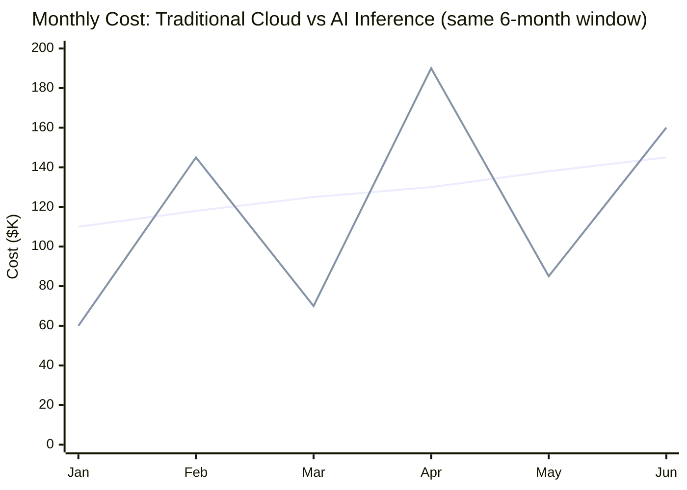

The FinOps Foundation's 2026 State of FinOps report put a number on something most of us had already felt in our monthly reviews: GPU and AI inference spend overtook general cloud infrastructure as the top cost concern for finance and engineering leadership, for the first time since the survey started tracking it. That's not a marginal shift — general cloud compute had held that top spot for years, through the entire era of "cloud cost optimization" as its own industry. AI spend didn't just join the list of concerns. It jumped the queue.

I've sat in enough of these budget reviews now to know why the shift feels different from every other cost conversation engineering leadership has had. It isn't that the dollar amounts are necessarily bigger than a company's core cloud bill — for a lot of orgs they aren't, yet. It's that the traditional forecasting muscle finance teams built over a decade of cloud cost management stops working when you point it at AI spend, and nobody built the replacement muscle in time.



## Why traditional cloud cost is a smooth line

General cloud compute cost, for most workloads, tracks something you can forecast: traffic. More requests, more instances, more cost, roughly linearly, roughly predictably. A finance team can look at last quarter's growth rate, apply it to next quarter's projected traffic, and land within a few percentage points of the actual bill. That's the entire basis of the cloud cost forecasting discipline FinOps built over the last decade — cost as a function of a single, slow-moving, well-understood variable.

That model assumes the unit cost of doing the work doesn't change much month to month. For traditional compute, it mostly doesn't. For AI inference, it does, constantly, and the variables that move it aren't things a growth-rate extrapolation captures at all.

## Why AI cost is a spiky line for the same "traffic"

Two requests that count identically in a traffic dashboard — "one API call" — can differ in cost by 50x or more, and the difference has nothing to do with request volume. It comes from:

- **Prompt length** — a request with 500 tokens of context costs a fraction of one with 50,000 tokens of context, and the same feature can drift from one to the other as a RAG pipeline's retrieval window grows or a conversational agent's history goes unpruned.
- **Output length** — a model asked to summarize in three sentences costs differently than the same model asked to write a full report, and a lot of production prompts don't tightly bound output length.
- **Model tier chosen per request** — if your architecture routes between a cheap fast model and a frontier model based on task complexity (and it should), the same "one request" line item in a traffic count can be a $0.001 call or a $0.40 call depending on which branch the router took.
- **Retry and error rates** — a flaky downstream dependency or a validation gate that rejects and retries doesn't show up in a traffic count as anything unusual, but it multiplies token spend for that traffic.

None of these variables correlate with request count the way instance-hours correlate with traffic. A team can ship a feature, keep request volume flat month over month, and still see a 3x cost swing because someone changed a system prompt, a RAG pipeline started retrieving more chunks, or a routing threshold got adjusted. Finance teams applying a linear forecast to that pattern get blindsided, repeatedly, and it erodes trust in engineering's cost estimates faster than almost anything else I've watched happen in a budget cycle.

## The forecasting problem this creates

This is the actual mechanism behind the FinOps Foundation's finding, in my experience running these reviews: it's not that AI is expensive in absolute terms everywhere yet. It's that AI cost is *unpredictable* in a way finance teams have no existing playbook for. A CFO can tolerate a cost center that's expensive and stable. A CFO struggles to plan around a cost center that's expensive and swings 2-3x month to month for reasons that don't map to any business metric they're tracking.

```python
# What a traditional linear forecast gets wrong for AI spend
def forecast_naive(monthly_spend_history: list[float], months_ahead: int) -> float:
    growth_rate = (monthly_spend_history[-1] / monthly_spend_history[0]) ** (1 / len(monthly_spend_history)) - 1
    return monthly_spend_history[-1] * (1 + growth_rate) ** months_ahead

# Six months of real AI spend, same traffic volume throughout
history = [58_000, 145_000, 71_000, 189_000, 84_000, 161_000]
naive_forecast = forecast_naive(history, 1)
print(f"Naive linear forecast for next month: ${naive_forecast:,.0f}")
# Actual next month, driven by a context-window change nobody flagged as a cost event: $210,000
# The forecast error here isn't a rounding problem. It's a wrong model of what drives the number.
```

A growth-rate extrapolation on that series produces a number that's essentially noise — the underlying driver isn't growth, it's workload composition, and composition isn't in the input data at all.

## The organizational response: a distinct discipline, not a folded-in line item

The pattern I've watched take hold across the orgs I work with, and the one the FinOps Foundation's data backs up, is that AI cost governance is becoming its own discipline with its own tooling and ownership, rather than a line item inside general cloud FinOps. That's a deliberate choice, not an accident of org-chart inertia. General cloud FinOps tooling — the dashboards, the anomaly detectors, the showback reports — was built assuming cost varies with infrastructure footprint. AI cost varies with workload composition at the request level, which needs visibility down to the token, not the instance.

Practically, that means: cost attribution has to happen at the API gateway or SDK layer, not the cloud billing layer, because that's the only place prompt length, model tier, and output length are visible before they're aggregated into an opaque monthly invoice line. It means anomaly detection has to run in near-real-time against request-level data, not month-end against an invoice. And it means someone — a person or a small team, not a shared responsibility everyone assumes someone else is covering — owns this as their actual job.

That's the thread the rest of this series pulls on. Getting cost visibility right starts with billing data you can actually compare across providers, which is what the FOCUS 1.4 standard is for and what tomorrow's post covers. From there: how to roll out that visibility to teams without triggering the resentment a badly sequenced chargeback rollout produces, how to catch a runaway cost anomaly in the hours it's happening instead of the month it's invoiced, how real budget enforcement works at the gateway level, how chargeback turns visibility into an actual accountability structure, and finally who owns each piece of that system once it's built. GPU spend earned the top spot on the FinOps concern list because it broke the old playbook. The rest of this series is the new one.
