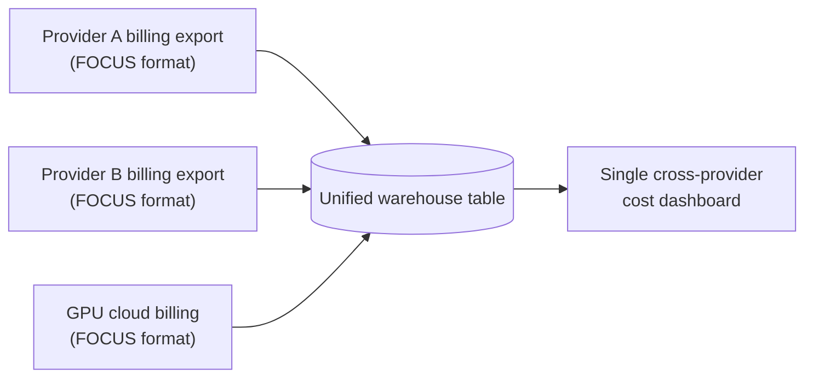

Before FOCUS, building a single "here's what we spend on AI" dashboard across two model providers and a GPU cloud meant three CSV exports, three different column schemas, three different definitions of what counts as a "billing period," and an engineer spending a week writing reconciliation logic that broke every time a provider tweaked their export format. I lived through that week more than once. It's not hard work, it's just tedious, error-prone, and entirely non-differentiating — nobody's competitive advantage comes from having cleverly reverse-engineered a billing CSV.



## The pre-FOCUS problem

Every AI provider and cloud GPU vendor rolled its own billing export. One provider's export gave you a row per API key per day with a `total_tokens` column that bundled input and output together. Another gave you a row per model per hour with input and output split, but priced output in a different currency-rounding convention. A GPU cloud vendor billed by the GPU-second, with utilization and idle time folded into one line, no token concept at all because token-based billing doesn't apply to raw compute rental.

None of these disagreements were about the underlying facts — cost is cost — they were about representation. But representation differences are exactly what breaks a SQL join. You couldn't `UNION` these tables without first writing a translation layer per provider, and that translation layer needed updating every time a vendor changed their export schema, which happened without warning often enough to make this a standing maintenance burden rather than a one-time integration.

## What FOCUS 1.4 actually standardizes

FOCUS — the FinOps Open Cost and Usage Specification — started as a cross-cloud billing standard for traditional infrastructure, and its 1.4 release (June 2026) extended the schema to cover AI-specific billing concepts explicitly, which is the version that matters for this series. What it standardizes:

- **`ChargeCategory`** — a controlled vocabulary (`Usage`, `Purchase`, `Tax`, `Credit`, `Adjustment`) so a discount credit from one provider and a discount credit from another land in the same bucket instead of needing provider-specific parsing rules.
- **`BillingPeriodStart` / `BillingPeriodEnd`** — explicit period boundaries in a single timestamp format, replacing the mix of "billing month," "invoice date," and "usage date" that different vendors used to mean different things.
- **`ResourceType` / `ServiceName`** — a normalized resource taxonomy that covers both token-based model usage and GPU-hour compute rental under a common structure, with provider-specific detail preserved in extension fields rather than in the core schema.
- **`ConsumedQuantity` / `ConsumedUnit`** — the usage amount and its unit (tokens, GPU-hours, requests) as separate typed fields, so a query can group by unit type without string-parsing a combined field.
- **`BilledCost` / `EffectiveCost`** — billed cost (what's on the invoice) separated from effective cost (after commitment discounts, credits, negotiated rates), which matters enormously for AI spend given how common negotiated enterprise pricing and committed-use discounts are for model API contracts.

## Building the ingestion pipeline

The practical implementation is boring in the best way — that's the point of a standard. Each provider's FOCUS export lands in object storage, gets loaded into a warehouse table with a consistent schema, and from that point on every dashboard query is provider-agnostic:

```sql
-- Unified FOCUS-normalized billing table, populated from
-- multiple providers' FOCUS 1.4 exports via a scheduled load job
CREATE TABLE finops.focus_billing (
    provider_name        VARCHAR,
    charge_category       VARCHAR,
    billing_period_start  DATE,
    billing_period_end    DATE,
    resource_type         VARCHAR,
    service_name           VARCHAR,
    consumed_quantity     DECIMAL(18,4),
    consumed_unit         VARCHAR,
    billed_cost           DECIMAL(18,6),
    effective_cost        DECIMAL(18,6),
    tags                   JSON
);

-- Cross-provider AI spend for a given month, normalized to one schema
SELECT
    provider_name,
    resource_type,
    SUM(effective_cost) AS total_effective_cost,
    SUM(consumed_quantity) AS total_consumed
FROM finops.focus_billing
WHERE charge_category = 'Usage'
  AND billing_period_start >= '2027-01-01'
  AND billing_period_start <  '2027-02-01'
  AND resource_type IN ('AIModelUsage', 'GPUCompute')
GROUP BY provider_name, resource_type
ORDER BY total_effective_cost DESC;
```

That query runs identically whether provider A is Anthropic, provider B is a different model vendor, and the GPU line comes from a cloud vendor's dedicated inference capacity billing. Before FOCUS, this was three separate queries against three separate schemas, stitched together in application code. After FOCUS, it's one query against one table. The dashboard built on top of it doesn't need a special case for each new vendor you add — you write the load job once, and every downstream query keeps working.

## What FOCUS doesn't solve

FOCUS standardizes the *export format*. It does not standardize the underlying *pricing model*, and conflating the two is the mistake I see teams make right after adopting it. One provider prices per input/output token. Another prices per GPU-hour of reserved capacity regardless of utilization. A third prices per request with tiered flat rates by model class. FOCUS gives you `ConsumedQuantity` and `ConsumedUnit` as separate fields specifically because the units genuinely differ — tokens, GPU-hours, and requests aren't fungible, and no billing standard can make them fungible by fiat.

That means real cross-provider cost comparison still needs a normalization step on top of FOCUS: converting everything to a common unit, most usefully cost per 1M effective tokens, even for GPU-hour-billed capacity (dividing effective cost by measured throughput over the period to back into an effective per-token rate). That normalization is workload-specific and needs to live in your dashboard logic, not in the billing standard — FOCUS gets you clean, comparable raw data; you still have to decide how to compare it.

> Don't let "FOCUS-compliant" become a checkbox that lets you skip the actual cost-per-unit-of-work analysis. It removes the data wrangling problem. It does not remove the pricing model comparison problem.
{: .prompt-warning }

## Adoption status and what to do if a vendor doesn't support it yet

As of late 2026, the major model API providers and the large cloud GPU vendors publish FOCUS 1.4-compatible exports, either natively or through their cost management console's export options — check under "billing export format" or "cost and usage report" settings, since the option is frequently buried and not enabled by default. Smaller or newer AI infrastructure vendors lag here; if a vendor you depend on doesn't support FOCUS exports yet, the FinOps Foundation maintains a vendor request process through its FOCUS working group, and in my experience citing a specific enterprise contract's renewal timeline in that request moves it up a vendor's roadmap faster than a generic feature ask does.

Get the billing data standardized first. It's the foundation the rest of this series builds on — you can't do showback, anomaly detection, or chargeback with any confidence if the underlying cost data can't be trusted to mean the same thing across every provider it comes from.
