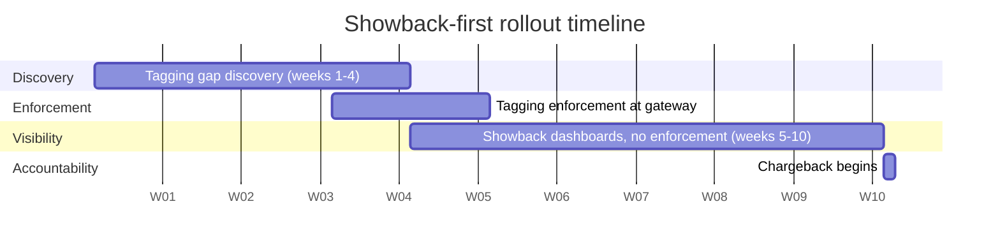

The fastest way to poison an AI cost governance rollout is to send a team their first-ever cost breakdown in the same email that tells them their budget for next quarter got cut because of it. I've watched this happen — a FinOps team, eager to show progress, skips straight to chargeback because the data pipeline from the FOCUS-normalized billing (post 2 of this series) is technically ready. The team on the receiving end has never seen this data before, has no idea whether the number is high or low relative to their peers, and has no reason to trust it's even attributed correctly. The predictable response isn't cost discipline. It's an argument about data accuracy that stalls the whole program for a quarter, and a quiet incentive to route requests around whatever's being measured.



## Why chargeback-first fails

Chargeback means real budget deduction — a number that shows up against a team's actual P&L. Holding a team accountable for a number they've never had visibility into before feels like an ambush, and people respond to ambushes defensively, not constructively. The two failure modes I see most often: teams dispute the attribution methodology instead of engaging with the underlying spend (sometimes legitimately, since first-pass tagging is often wrong), and teams that can't easily dispute it instead start gaming whatever's being measured — routing requests through an untagged path, splitting a workload across multiple API keys to stay under a threshold, or quietly building a shadow AI integration that never touches the governed gateway at all. None of that reduces waste. It just makes waste harder to see, which is a regression from where you started.

Showback breaks this by separating two things that chargeback conflates: *seeing your spend* and *being held accountable for your spend*. Give teams the first without the second for long enough that visibility becomes normal, unremarkable, something they've already used to fix a few obvious problems on their own — and by the time accountability arrives, it's confirming a number they already understand rather than introducing a surprise.

## Phase 1: the tagging-gap discovery

Before any dashboard goes in front of a team, find out how much of your AI spend can actually be attributed to anyone. In every rollout I've run, this number is worse than expected — somewhere between a quarter and half of total AI spend typically has no team, project, or cost-center tag attached to it at the point the request hits the gateway or the direct provider API.

```sql
-- Percentage of AI spend with no team attribution, last 30 days
SELECT
    ROUND(
        100.0 * SUM(CASE WHEN team_id IS NULL OR team_id = 'unknown' THEN effective_cost ELSE 0 END)
        / NULLIF(SUM(effective_cost), 0),
    1) AS pct_untagged_spend,
    SUM(CASE WHEN team_id IS NULL OR team_id = 'unknown' THEN effective_cost ELSE 0 END) AS untagged_cost_usd
FROM finops.focus_billing b
LEFT JOIN finops.request_tags t ON b.request_id = t.request_id
WHERE billing_period_start >= CURRENT_DATE - INTERVAL '30 days';
```

A remediation checklist that's worked for me, roughly in order:

- **Inventory every path that can call a model API** — the governed gateway, but also any direct API key issued before the gateway existed, any notebook environment with its own credentials, any third-party SaaS tool with its own AI add-on billed separately.
- **Require a team/project tag at credential issuance**, not after the fact — new API keys don't get issued without a tag; existing untagged keys get a deprecation date.
- **Attribute historical spend where possible** by cross-referencing API key ownership records, even imperfectly — an 80%-confident retroactive tag beats an honest "unknown" when you're trying to build team trust in the numbers.
- **Set a hard cutover date** after which untagged spend is flagged for the requesting team's engineering lead to resolve, rather than silently absorbed into a shared "other" bucket that never gets fixed.

## Phase 2: enforcing the tagging schema at the gateway

Once you know the gap, close it at the point of request, not after the fact in the data pipeline. A tagging schema needs to be simple enough that engineers don't route around it out of friction:

```python
REQUIRED_TAGS = ["team_id", "project_id", "environment", "cost_center"]

def validate_request_tags(headers: dict) -> tuple[bool, str | None]:
    missing = [tag for tag in REQUIRED_TAGS if not headers.get(f"x-{tag.replace('_', '-')}")]
    if missing:
        return False, f"Missing required tags: {', '.join(missing)}"
    return True, None

# Enforced at the gateway before any request reaches a model provider
def handle_request(request):
    valid, error = validate_request_tags(request.headers)
    if not valid:
        raise GatewayRejection(status=400, detail=error)
    # environment restricted to a known set keeps downstream dashboards from
    # fragmenting into ad-hoc strings like "prod", "Production", "PROD-1"
    if request.headers["x-environment"] not in {"dev", "staging", "prod"}:
        raise GatewayRejection(status=400, detail="environment must be dev, staging, or prod")
    return forward_to_provider(request)
```

Four tags, enforced consistently, cover the allocation questions that come up repeatedly later in this series: `team_id` and `cost_center` drive chargeback allocation, `project_id` gives you feature-level breakdown inside a team's spend, and `environment` keeps non-production experimentation from inflating a team's production cost picture — a team running a heavy eval suite in staging shouldn't see that spend land in the same bucket as their live traffic.

## Phase 3: showback with no enforcement

For a defined window — I've found 4-6 weeks to be enough time for a team to actually act on what they see without dragging the program out — each team gets a dashboard showing their own spend, broken down by project and model tier, with peer comparison where it's meaningful (anonymized, or by team size bucket, to avoid it reading as a ranking exercise). No budget cap. No throttling. No penalty for being high.

This is where most of the genuine waste reduction in a showback rollout actually happens, and it happens voluntarily. Teams routinely find their own anomalies during this window — an unpruned conversation history, a debug flag left routing everything to the frontier model, a batch job someone forgot was still running nightly — and fix them without anyone telling them to, because the incentive is curiosity and ownership rather than fear of a penalty. That self-correction is the entire value of sequencing showback before chargeback: it gets the easy waste out of the system before the accountability structure has to deal with what's left.

## Phase 4: chargeback begins

Only after teams have lived with visibility for the full showback window does chargeback (post 6 of this series) start deducting from actual budgets. By this point the numbers aren't a surprise, the attribution methodology has already survived a few weeks of scrutiny without teams finding fatal errors in it, and the obvious waste has mostly already been cleaned up — so what chargeback is actually holding teams accountable for is real, considered spend rather than easily-fixed mistakes nobody had a chance to catch.

## A realistic quarter

Compressed into a single quarter: weeks 1-4 for tagging-gap discovery, running in parallel with gateway enforcement rollout; weeks 5-10 for showback with no enforcement; chargeback begins in week 11 or 12, timed to align with the start of the next budget period rather than landing mid-cycle. That's roughly ten to twelve weeks from a standing start to real accountability — slower than a team eager to show cost control results wants to move, and reliably faster in practice than the alternative, which is a chargeback-first rollout that stalls for a quarter arguing about data trust and has to restart from showback anyway.
