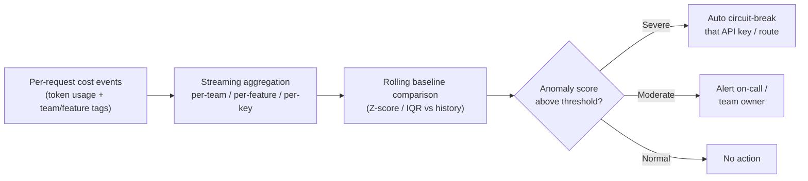

A retry loop with no backoff, hammering a frontier model every time a downstream validation step rejects its output, can burn five figures in a weekend before anyone's looking at a dashboard. I've seen this exact failure twice — once from a bug, once from a well-intentioned "just retry until it passes the schema check" pattern that nobody thought to bound. Both times, the first person to notice was whoever opened the monthly invoice, three to five weeks after the spend actually happened. By then the question isn't "how do we stop this" — it already stopped or is still running — the question is "how do we explain this to finance," which is a much worse conversation to be having.



## What this needs to catch

Four failure scenarios show up repeatedly enough to design specifically around:

- **Retry loops with no ceiling** — a validation gate rejects output, the caller retries against the same expensive model, and without a max-retry count or exponential backoff with a cap, this can run indefinitely against a bad input that will never pass validation.
- **Unbounded context growth** — a conversational agent that appends every turn to history without ever pruning or summarizing older context. Cost per turn creeps upward silently because nothing about the request *rate* changes, only the token count per request, which a traffic-based dashboard won't surface.
- **Routing bugs** — a model router (from the routing pattern covered in the December cost economics post) misclassifies a batch of simple requests as complex, sending traffic that should've gone to a cheap model to a frontier one instead. The bug is often small — a threshold off by one, a feature flag left on in the wrong environment — but the cost multiplier is not.
- **Anomalously long outputs** — a prompt injection, an adversarial input, or just a model that gets stuck in a repetitive generation pattern and produces an output far past what the task calls for. Output tokens are typically priced higher than input tokens, so this category is disproportionately expensive per incident.

## Why monthly invoice review is too late

Cost data arriving once a month, aggregated to a single line, means the earliest point of detection is structurally weeks after the fact — and by the nature of most of these failure modes, "weeks after the fact" means the anomaly ran for the entire intervening period, not just for a moment. A retry loop that started on a Friday night and nobody caught until the following invoice ran for the better part of a month. The fix for that isn't a better monthly report. It's not looking at cost monthly for this purpose at all.

## The real-time approach

Stream per-request cost events — token counts, model tier, and the team/feature tags established in the showback rollout (post 3) — into a time-series store as they happen, and run statistical anomaly detection against a rolling baseline at multiple granularities simultaneously: per-team, per-feature, per-API-key. Granularity matters here more than the specific statistical method. An anomaly that's invisible at the org level (a single team's spend spiking, buried inside total organizational spend that looks flat) is often glaringly obvious at the per-key level, which is exactly why aggregate-only monitoring misses these until they're large.

The statistical method itself can stay simple — a rolling Z-score or an IQR-based outlier test against recent history outperforms anything more sophisticated for this use case, mostly because the failure modes above produce sustained, unambiguous deviations rather than subtle ones. The hard part isn't the math. It's tuning the threshold so a single legitimately expensive request (a genuinely long document a user pasted in) doesn't fire an alert, while a sustained deviation from baseline does.

```python
import time
import redis
import statistics

r = redis.Redis(host="localhost", port=6379, decode_responses=True)

BASELINE_WINDOW_MINUTES = 60 * 24 * 7  # 7 days of history per key
Z_SCORE_ALERT_THRESHOLD = 4.0
Z_SCORE_CIRCUIT_BREAK_THRESHOLD = 8.0

def record_cost_event(key_id: str, cost_usd: float):
    bucket = int(time.time() // 300)  # 5-minute buckets
    redis_key = f"cost:{key_id}:{bucket}"
    r.incrbyfloat(redis_key, cost_usd)
    r.expire(redis_key, BASELINE_WINDOW_MINUTES * 60)

def get_recent_buckets(key_id: str, n_buckets: int) -> list[float]:
    now_bucket = int(time.time() // 300)
    values = []
    for i in range(1, n_buckets + 1):
        v = r.get(f"cost:{key_id}:{now_bucket - i}")
        values.append(float(v) if v else 0.0)
    return values

def check_anomaly(key_id: str) -> dict:
    history = get_recent_buckets(key_id, n_buckets=2016)  # 7 days of 5-min buckets
    if len(history) < 100 or statistics.stdev(history) == 0:
        return {"anomaly": False, "reason": "insufficient_baseline"}

    mean = statistics.mean(history)
    stdev = statistics.stdev(history)
    current = float(r.get(f"cost:{key_id}:{int(time.time() // 300)}") or 0.0)
    z_score = (current - mean) / stdev

    if z_score >= Z_SCORE_CIRCUIT_BREAK_THRESHOLD:
        return {"anomaly": True, "severity": "critical", "z_score": z_score, "action": "circuit_break"}
    elif z_score >= Z_SCORE_ALERT_THRESHOLD:
        return {"anomaly": True, "severity": "warning", "z_score": z_score, "action": "alert"}
    return {"anomaly": False, "z_score": z_score}
```

That baseline is deliberately narrow — one API key's own 7-day history, not a cross-org baseline — because "normal" cost behavior varies enormously between a low-traffic internal tool and a high-volume customer-facing feature, and comparing one against the other's baseline produces nothing but noise. Run `check_anomaly` on a schedule (every 5-minute bucket, against every active key) rather than only on demand, so detection latency is bounded by the bucket size, not by someone remembering to look.

## Tuning against noise

The threshold split above — alert at Z ≥ 4, circuit-break at Z ≥ 8 — isn't arbitrary; it came from watching false-positive rates on real traffic. A single expensive request barely moves a 5-minute bucket's aggregate against a week of history, so Z-scores from one-off spend rarely clear 4. A sustained pattern — the retry loop, the routing bug — pushes multiple consecutive buckets well past it, and consecutive-bucket persistence is worth requiring explicitly (two or three buckets in a row above threshold, not just one) to avoid alerting on a single noisy sample.

```python
def is_sustained_anomaly(key_id: str, consecutive_required: int = 3) -> bool:
    recent_results = [check_anomaly(key_id) for _ in range(consecutive_required)]
    return all(r.get("anomaly") for r in recent_results)
```

## Alert-only versus auto-mitigate

Not every anomaly warrants automatic action, and over-aggressive auto-mitigation creates its own incident category — a legitimate traffic spike getting circuit-broken mid-launch is its own kind of expensive. The split that's worked in practice: alert-only for moderate anomalies (Z-score in the warning band), routed to the owning team with enough detail to self-diagnose quickly — which model, which feature tag, what the deviation looks like relative to baseline. Reserve automatic circuit-breaking for severe, unambiguous cases — a single API key suddenly responsible for spend 50x its normal rate, sustained across multiple buckets, is not a pattern that shows up from legitimate traffic growth; growth is gradual, this kind of spike isn't.

When circuit-breaking does trigger, it should degrade gracefully rather than hard-fail — route to a cheaper fallback model or return a rate-limit response the caller can retry with backoff, rather than a silent full outage for that key. And it needs an unambiguous, fast override path back to full service once a human confirms the anomaly was a false positive, because the cost of a wrongly-tripped circuit breaker on a real production path is measured in outage minutes, and outage minutes are worse than the spend the breaker was trying to prevent.
