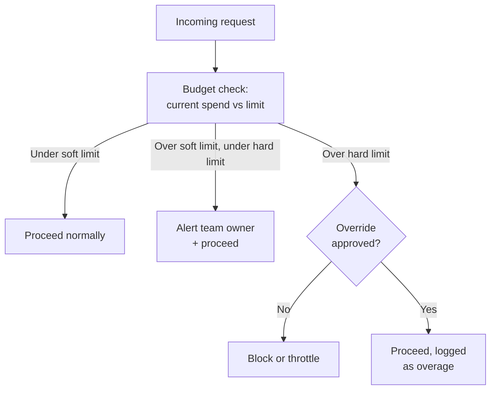

A spreadsheet budget is a wish, not a control. I've reviewed plenty of AI cost governance plans that had a beautifully maintained sheet — team, monthly allocation, running total — updated by hand at the end of each month from the invoice. It told you, accurately, exactly how badly a team had overspent, four weeks after the overspend happened and with zero mechanism that would have stopped a single dollar of it. A budget only means something if something enforces it at the moment a request is about to be made, not at the moment someone reconciles a bill.



## Building on the gateway, going deeper on the budget logic

The November governance series covered the LLM gateway pattern generally — routing, policy enforcement, per-team spend limits as one feature among several. This post is about the budgeting logic specifically, because "check budget, reject if over" turns out to have enough real design decisions inside it to be worth its own treatment.

## Soft limits and hard limits

A single hard cutoff is the wrong default for most teams — it turns every legitimate spike in usage into an outage. Two thresholds, configurable per project's actual risk tolerance, work better:

- **Soft limit** (typically 80% of the period budget) triggers an alert to the team owner. Requests keep proceeding. This is a warning shot, not a control — its entire job is making sure nobody is surprised by what's coming.
- **Hard limit** (100%, or whatever ceiling the team and finance agreed to) triggers throttling or an outright block, depending on the project's configured policy — a customer-facing production feature might throttle to a reduced rate rather than block outright, while an internal experimentation project might block cleanly, because the cost of an internal tool pausing is much lower than the cost of a production feature degrading.

```python
import redis
from dataclasses import dataclass
from enum import Enum

r = redis.Redis(host="localhost", port=6379, decode_responses=True)

class BudgetAction(Enum):
    PROCEED = "proceed"
    PROCEED_WITH_ALERT = "proceed_with_alert"
    THROTTLE = "throttle"
    BLOCK = "block"

@dataclass
class ProjectBudgetPolicy:
    project_id: str
    period_budget_usd: float
    soft_limit_pct: float = 0.80
    hard_limit_action: str = "block"  # "block" or "throttle"

def check_budget(project_id: str, policy: ProjectBudgetPolicy) -> BudgetAction:
    current_spend = float(r.get(f"budget:spend:{project_id}") or 0.0)
    ratio = current_spend / policy.period_budget_usd

    if ratio >= 1.0:
        return BudgetAction.THROTTLE if policy.hard_limit_action == "throttle" else BudgetAction.BLOCK
    if ratio >= policy.soft_limit_pct:
        return BudgetAction.PROCEED_WITH_ALERT
    return BudgetAction.PROCEED

def record_spend(project_id: str, cost_usd: float):
    r.incrbyfloat(f"budget:spend:{project_id}", cost_usd)
```

The gateway calls `check_budget` before forwarding a request, and calls `record_spend` after the request completes with the actual measured cost — not an estimate made before the call, since actual output length (and therefore actual cost) isn't known until the response comes back. Estimating pre-request and reconciling post-request is the accurate version of this; if your gateway only tracks estimated cost, drift accumulates and the budget number stops matching the invoice.

## Budget periods aren't one-size-fits-all

Monthly is the default because it matches how most finance teams think about budgets generally, and it's the right choice for continuous production traffic — steady usage, predictable review cadence. It's the wrong shape for other common workload patterns:

- **Batch or quarterly jobs** — a data reprocessing job that runs once a quarter and burns a large chunk of spend in a single week needs a budget period that matches its actual cadence, not a monthly ceiling that either blocks it mid-run or sits mostly unused for two and a half months.
- **Project-based work with a defined end date** — a fixed-scope initiative benefits from a total project budget with no period reset at all, since "did we stay under budget for the whole engagement" is the real question, not "did we stay under budget this particular month."
- **Bursty experimentation** — a research or eval-heavy workload that runs in short, intense bursts often fits better with a rolling window (spend over the trailing 30 days, recalculated daily) than a fixed calendar-month reset, since a fixed reset creates a predictable end-of-month rush to use up remaining budget before it disappears.

```python
@dataclass
class BudgetPeriod:
    period_type: str  # "calendar_month", "rolling_30d", "fixed_total", "custom"
    period_budget_usd: float
    start_date: str | None = None
    end_date: str | None = None
```

Matching the period type to the workload up front avoids a recurring argument later about whether a budget breach is real or just an artifact of a bad period boundary.

## Rollover rules and the incentive effects

Does unused budget carry into the next period, or reset to zero? Both choices are defensible, and they produce different behavior, which is the actual reason to pick deliberately rather than by default.

**No rollover** (use it or lose it) creates a mild incentive to spend up to the ceiling near period-end, since unused budget provides no future benefit — the classic end-of-fiscal-year spending pattern, reproduced monthly. It's simple to reason about and simple to forecast, which is its main advantage.

**Full rollover** removes that incentive entirely but creates a different problem: a team that under-spends for months can accumulate a large reserve and then spend it in a way that looks like a severe anomaly against their recent baseline, which conflicts with the anomaly detection approach from the previous post unless the anomaly detector is rollover-aware.

**Partial rollover** (commonly capped at 20-25% of a period's budget) is the compromise that's worked best for me — it removes the sharpest edge of the use-it-or-lose-it incentive without letting reserves build up large enough to distort anomaly baselines or create an unplanned spending event.

## The overage request path

A hard limit with no exception path just means legitimate, well-justified spend gets blocked at the worst possible moment — usually during an incident, a launch, or a customer escalation, since those are exactly the situations where usage spikes for good reasons. Build the exception path before you need it under pressure:

```python
@dataclass
class OverageRequest:
    project_id: str
    requested_amount_usd: float
    justification: str
    requested_by: str
    approver_role: str  # e.g., "eng_manager", "finops_lead"

def request_overage(req: OverageRequest) -> str:
    request_id = f"overage:{req.project_id}:{int(time.time())}"
    r.hset(request_id, mapping={
        "amount": req.requested_amount_usd,
        "justification": req.justification,
        "requested_by": req.requested_by,
        "status": "pending",
    })
    notify_approver(req.approver_role, request_id)
    return request_id

def approve_overage(request_id: str, approver: str):
    r.hset(request_id, "status", "approved")
    r.hset(request_id, "approved_by", approver)
    project_id = request_id.split(":")[1]
    amount = float(r.hget(request_id, "amount"))
    r.incrbyfloat(f"budget:limit_override:{project_id}", amount)
```

The important design point: overage approval should be fast — minutes, not a ticket queue measured in days — or teams will route around the budget system entirely rather than wait on it, which defeats the entire point of having enforcement in the first place. A budget control that's slower to work through than routing around it isn't a control.

## Who sets the number

The org-design question sits underneath all of this: who actually decides a project's budget figure. Three patterns I've seen work, each suited to a different level of org maturity. Finance sets a single top-line AI budget for the org, and engineering leadership allocates it across teams based on roadmap priority — simplest, works well when the AI platform team (from the org structure discussion in the December series) has good visibility into what each team needs. A pure negotiation model, where each team proposes its own budget against its roadmap and finance approves or pushes back — more accurate per-team, slower, and needs a FinOps function with enough credibility to arbitrate disputes. Or a hybrid, which is where most mature orgs land: finance sets the top-line number and a floor/ceiling band per team size, and teams negotiate within that band with their engineering leadership. None of these is "correct" in the abstract — the right one depends on how much the org already trusts its own AI cost forecasting, which is exactly the muscle the rest of this series is building.

Budgets set once and never revisited drift out of relevance within a quarter, as roadmaps shift and model pricing changes underneath them. Whichever pattern you use, put a revisit cadence on the calendar — quarterly is the common default — rather than leaving budget review to happen only when someone complains.
