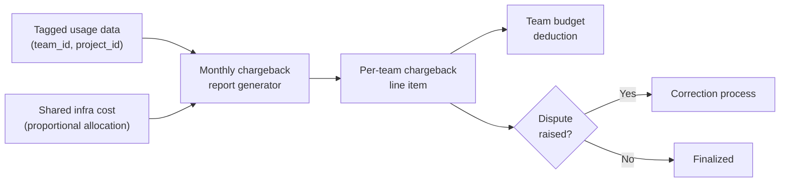

Showback (post 3 of this series) gets teams to *see* their spend. Chargeback is the step after that, where the number stops being informational and starts actually coming out of a team's budget the way headcount or any other real cost does. It's a small procedural change — a report that used to say "for your awareness" now says "this deducted from your Q2 allocation" — but it changes how people relate to the number completely, which is exactly why sequencing it after a showback window matters as much as it does.



## The allocation accuracy problem

Direct spend is the easy part. A team's tagged API calls through the gateway — established by the tagging enforcement in the showback rollout — attribute cleanly, dollar for dollar, to the `team_id` and `project_id` that made the request. That's most of your total AI spend in a well-instrumented org, and it needs no allocation logic beyond a straight sum.

The hard part is shared infrastructure. A shared vector database serving RAG retrieval for four different product teams' features. A fine-tuned model, trained once and hosted once, serving three teams' features from the same deployed endpoint. These costs don't arrive pre-tagged by team, because the infrastructure genuinely is shared — there's no single "owner" request to attribute a GPU-hour of shared model serving to.

Usage-proportional splitting is the approach that's held up best in practice: allocate shared cost to each consuming team in proportion to their measured usage of the shared resource over the same billing period. It's not perfectly precise — a team making simple, cheap queries against a shared vector store pays the same proportional share per query as a team making expensive ones unless the allocation weights by actual resource consumption rather than raw query count — but it's defensible, auditable, and every team can independently verify their own usage number, which matters enormously for a team's willingness to accept the resulting bill without a fight.

## Implementation

Monthly chargeback reports get generated from the FOCUS-normalized billing data (post 2) joined against the tagging schema (post 3), with shared costs split proportionally and folded into each team's total:

```sql
-- Direct, tagged spend per team
WITH direct_costs AS (
    SELECT
        team_id,
        SUM(effective_cost) AS direct_cost
    FROM finops.focus_billing b
    JOIN finops.request_tags t ON b.request_id = t.request_id
    WHERE billing_period_start >= '2027-02-01' AND billing_period_start < '2027-03-01'
      AND resource_type != 'SharedInfrastructure'
    GROUP BY team_id
),

-- Total usage of each shared resource, per team, for proportional splitting
shared_usage AS (
    SELECT
        resource_id,
        team_id,
        SUM(consumed_quantity) AS team_usage
    FROM finops.shared_resource_usage
    WHERE usage_period_start >= '2027-02-01' AND usage_period_start < '2027-03-01'
    GROUP BY resource_id, team_id
),

shared_totals AS (
    SELECT resource_id, SUM(team_usage) AS total_usage
    FROM shared_usage
    GROUP BY resource_id
),

shared_cost_per_resource AS (
    SELECT resource_id, SUM(effective_cost) AS total_cost
    FROM finops.focus_billing
    WHERE resource_type = 'SharedInfrastructure'
      AND billing_period_start >= '2027-02-01' AND billing_period_start < '2027-03-01'
    GROUP BY resource_id
),

allocated_shared_costs AS (
    SELECT
        su.team_id,
        SUM(su.team_usage / st.total_usage * sc.total_cost) AS allocated_shared_cost
    FROM shared_usage su
    JOIN shared_totals st ON su.resource_id = st.resource_id
    JOIN shared_cost_per_resource sc ON su.resource_id = sc.resource_id
    GROUP BY su.team_id
)

SELECT
    COALESCE(d.team_id, s.team_id) AS team_id,
    COALESCE(d.direct_cost, 0) AS direct_cost,
    COALESCE(s.allocated_shared_cost, 0) AS allocated_shared_cost,
    COALESCE(d.direct_cost, 0) + COALESCE(s.allocated_shared_cost, 0) AS total_chargeback
FROM direct_costs d
FULL OUTER JOIN allocated_shared_costs s ON d.team_id = s.team_id
ORDER BY total_chargeback DESC;
```

Each team's monthly chargeback line is the sum of their directly-tagged spend plus their proportional share of every shared resource they consumed — a report their finance or budget owner can pull into whatever budget tracking system the org already uses, generated on a schedule rather than assembled by hand.

## The gaming risk

Chargeback creates a real financial incentive for a team to look cheaper than it actually is, and that incentive shows up in two predictable forms: under-reporting usage (harder to do once tagging is enforced at the gateway, but not impossible if there's any untagged path left), and routing around the governed path entirely — the shadow AI risk that showed up in the December org-patterns retrospective as a failure mode of fully decentralized AI adoption. A team facing a chargeback bill it doesn't like has a genuine incentive to spin up a direct API integration with its own credentials, outside the gateway, where nothing gets tagged and nothing gets charged back — at least until someone notices the untagged spend showing up in the discovery process from post 3, by which point a quarter of ungoverned spend has already accumulated with none of the security, compliance, or cost benefits the governed path was providing.

The fix for this isn't more enforcement pressure on the chargeback side — that just pushes harder on the exact incentive causing the problem. It's making the governed path clearly the easier one to use: a gateway that's faster to integrate against than a raw provider API, model access and routing already configured so a team doesn't have to build that themselves, budget alerts that help a team stay ahead of their number instead of only punishing them after the fact. Teams route around governance when governance is friction with no offsetting benefit. They don't route around it when it's genuinely the path of least resistance.

## Review cadence and disputes

Chargeback numbers should go through the same review rigor as any other line item on a team's budget — reviewed at the same cadence, questioned when something looks off, not treated as an untouchable output of an automated pipeline just because the pipeline is sophisticated. Build a dispute process before you need it:

- A team flags a chargeback line they believe is wrong, with the specific request IDs or time window in question.
- The FinOps function investigates against the underlying FOCUS-normalized data and tagging records — most disputes turn out to be a tagging gap (a request that should have been attributed elsewhere) rather than a calculation error, since the SQL itself is deterministic once the inputs are right.
- Corrections apply as an adjustment line in the following month's report rather than retroactively rewriting a finalized report, which keeps the audit trail clean and matches how finance teams generally expect budget corrections to work.

A dispute process that teams actually trust is what keeps chargeback from re-triggering the same defensive, gaming-prone response that a badly sequenced rollout produces in the first place — the whole point of getting here through showback first was to arrive at a chargeback number nobody's surprised by. Keeping that trust means treating a raised dispute as a legitimate data quality signal, not as a team trying to talk its way out of a bill.
