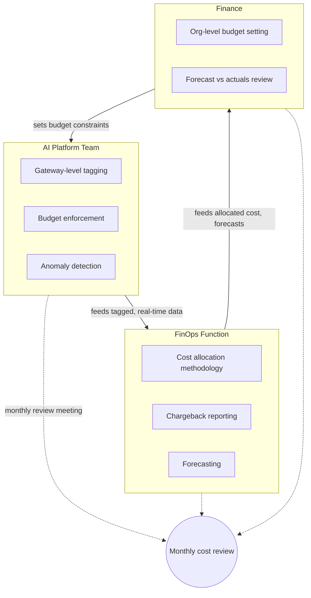

Every piece of this week's series — the FOCUS-normalized billing, the showback rollout, the anomaly detector, the budget enforcement, the chargeback report — can exist as working code and still fail as a program, if nobody owns it as their actual job. I've watched this happen: a gateway with beautiful tagging enforcement, an anomaly detector that fires correctly, a chargeback pipeline that runs on schedule, and still a cost incident that takes three weeks to notice because the alert went to a shared channel nobody's job description says they have to watch. Tooling doesn't run itself. Ownership does the running.



## The three-way ownership split

**The AI platform team** — the same hub-and-spoke platform team from the org-structure discussion in the December series, whose job is building infrastructure that lets product teams build safely rather than building product features itself — owns the technical implementation covered in the earlier posts this week: gateway-level tagging enforcement, budget soft/hard limit enforcement, and the real-time anomaly detection pipeline. This is infrastructure work, squarely inside what that team already owns for the gateway generally. If your org doesn't have a dedicated AI platform team yet, this ownership defaults to whoever currently owns the LLM gateway — but it needs to be an explicit, named responsibility, not an assumption that whoever built the gateway will keep maintaining its cost-control features indefinitely as an unstated side duty.

**A FinOps function** — either a dedicated AI FinOps role or, more commonly in orgs I've worked with, a traditional cloud FinOps team extending its scope to cover AI spend — owns the cost allocation methodology (the proportional shared-cost splitting from the chargeback post), the chargeback reporting pipeline itself, and forecasting. This is deliberately not the same team as the platform team, even though the two work from the same underlying data: the platform team's job is making sure the data is accurate and the enforcement mechanisms work; the FinOps function's job is turning that data into numbers finance and team leads can actually act on. Collapsing these into one team tends to produce a team that's good at one half of the job and treats the other half as an afterthought.

**Finance** owns budget-setting at the org level — the total AI budget for the year or quarter — and owns reviewing the FinOps function's forecasts against actual spend, flagging when the gap between the two is wide enough to warrant investigation. Finance doesn't own the technical mechanics of any of this, and shouldn't need to; their interface into the system is the forecast and the actuals, not the gateway configuration.

## The review cadence that keeps this from decaying

Ownership on an org chart decays into ownership in name only without a forcing function that makes it visible when it's not being exercised. A standing monthly cost review meeting, with representation from all three groups, is that forcing function. A useful standing agenda:

```markdown
## Monthly AI Cost Review — Agenda Template

1. **Anomalies from the past period**
   - What fired, what was the root cause, was it resolved same-week or did it
     linger to month-end
   - Any false positives — threshold tuning needed?

2. **Budget utilization by team**
   - Teams at or near soft limits — do their budgets need revisiting next
     quarter, or was this a one-off spike?
   - Any overage requests approved this period, and why

3. **Forecast accuracy**
   - Last month's forecast vs actual — variance and driver
   - Adjustments to the forecasting model based on this period's learnings

4. **Chargeback disputes**
   - Open disputes and their status
   - Any recurring dispute pattern pointing at a tagging or allocation gap

5. **Upcoming changes that affect cost**
   - Planned feature launches, model tier changes, new shared infrastructure
     coming online next period
```

The anomaly review item is the one I'd protect above all the others if a meeting is running short. It's the direct measure of whether the system built across this week's posts is actually working: an anomaly caught and resolved within the same week it occurred is a functioning system. An anomaly discovered at month-end review, after the fact, means the real-time detection either didn't fire or fired to a channel nobody was accountable for watching — and that's a gap worth fixing before the next incident, not a one-off to shrug off.

## Forecasting AI spend differently than infra spend

Post 1 of this series covered why AI cost varies with workload composition — prompt length, output length, model tier, retry rate — rather than with traffic the way traditional infrastructure cost does. That variance means a forecast built by extrapolating last quarter's trend line, which works reasonably well for general cloud infrastructure, produces forecasts for AI spend that are confidently wrong.

A forecasting approach that's held up better in practice starts from planned changes rather than historical trend: what feature launches are scheduled next quarter and what's their expected request volume and prompt/output profile; what model tier changes are planned (a migration from one model generation to a cheaper or more expensive successor); what routing threshold changes are on the roadmap that would shift traffic between model tiers. Each of these is a discrete, identifiable event with an estimable cost impact, and summing their impacts against a stable baseline produces a materially better forecast than a trend line does, precisely because AI cost moves in response to these discrete decisions rather than gradually with traffic.

```python
def forecast_with_planned_changes(baseline_monthly_cost: float, planned_changes: list[dict]) -> float:
    forecast = baseline_monthly_cost
    for change in planned_changes:
        impact = change["estimated_monthly_delta_usd"]
        forecast += impact
        print(f"{change['description']}: {'+'if impact >= 0 else ''}{impact:,.0f}")
    return forecast

planned_changes = [
    {"description": "New RAG feature launch (est. 200K req/mo, 3K tokens avg)", "estimated_monthly_delta_usd": 18_000},
    {"description": "Model tier migration on classification route", "estimated_monthly_delta_usd": -6_500},
    {"description": "Routing threshold tightened, more traffic to small model", "estimated_monthly_delta_usd": -4_000},
]

forecast = forecast_with_planned_changes(baseline_monthly_cost=145_000, planned_changes=planned_changes)
print(f"Forecast next month: ${forecast:,.0f}")
```

This still isn't perfect — an unplanned change (the retry loop from the anomaly detection post) won't show up in a forecast built from planned changes, which is exactly why forecasting and anomaly detection are complementary, not substitutes for each other. Forecasting handles what you know is coming. Anomaly detection handles what you didn't plan for.

## A RACI for the key activities

| Activity | AI Platform Team | FinOps Function | Finance |
|---|---|---|---|
| Gateway tagging enforcement | R/A | C | I |
| Per-project budget setting | C | C | A |
| Anomaly detection & response | R/A | I | I |
| Chargeback report generation | C | R/A | I |
| Chargeback dispute resolution | C | R/A | I |
| Org-level AI budget setting | I | C | R/A |
| Spend forecasting | C | R/A | A |
| Forecast vs actuals review | I | C | R/A |

R = Responsible, A = Accountable, C = Consulted, I = Informed. The pattern worth noticing in this table: the platform team is Responsible/Accountable only for the pieces that are genuinely technical implementation, the FinOps function owns everything that's about turning data into decisions, and finance is Accountable only for the two activities that are genuinely budget-authority decisions rather than mechanics. Nobody in this table is Accountable for something they don't have the operational visibility to actually be accountable for — which is the RACI mistake I see most often, usually finance ending up nominally accountable for anomaly response when they have no path to actually seeing an anomaly happen in real time.

## The maturity signal

Everything in this series — the standardized billing, the showback rollout, the anomaly detection, the budget enforcement, the chargeback pipeline, and this operating model — is in service of one outcome that's simple to state and genuinely hard to reach: a cost anomaly gets caught and resolved within the same week it occurs, as a routine, unremarkable part of how the org runs, not as a fire drill discovered at month-end when someone opens an invoice they weren't expecting. GPU spend became the top FinOps concern in 2026 because most orgs weren't there yet. Building toward it isn't one project with an end date — it's the operating model that keeps working after the initial build is done, which is the only part of this that actually matters six months from now.
