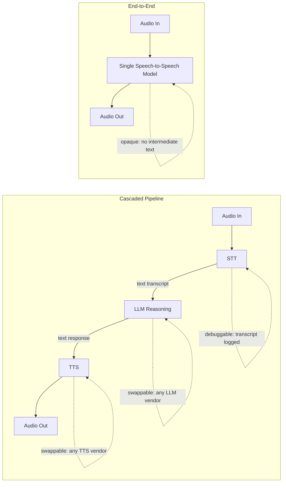

I've had some version of this conversation with three different teams in the last two months: "why aren't we just using an end-to-end speech model, isn't that the whole point of 2026?" It's a fair question, because the demos are genuinely impressive — a single model listening to raw audio and speaking raw audio back, no visible seams, prosody that reacts to what you just said. Then we get into the actual requirements — call logging, content moderation, the ability to swap a underperforming component without retraining anything — and the conversation ends with a cascaded pipeline every time. Not because end-to-end is bad. Because production has needs that a black box doesn't satisfy yet.

This is the architectural fork every voice AI project starts at, so it's worth being precise about what each side actually buys you.

## Two architectures, one decision that shapes everything downstream

A cascaded pipeline runs three independently trained models in sequence: speech-to-text turns the caller's audio into a transcript, an LLM reasons over that transcript and produces a text response, and text-to-speech turns that response back into audio. Each stage is a separate service call, each stage has its own model, its own vendor options, and its own failure modes.

An end-to-end model collapses all three into one — audio in, audio out, no text in between (or text used only as an internal, inaccessible intermediate representation the model never exposes). The theoretical appeal is real: no serialization loss going from speech to text and back, prosody and emotional tone can flow through the model instead of getting flattened into a transcript and reconstructed from scratch, and the latency floor is lower because you're not paying for three separate network round-trips and three separate model inference calls.

## Why cascaded still wins the production argument

The pitch for end-to-end is latency and naturalness. The pitch against it, in practice, comes down to three things I keep running into on real projects.

**You get a transcript for free, and you need one anyway.** Every enterprise voice deployment I've worked on needs a text transcript somewhere — for compliance logging, for content moderation before a response goes out, for QA review, for feeding a downstream CRM or ticketing system. A cascaded pipeline produces that transcript as a natural byproduct of the STT stage. An end-to-end model doesn't produce one at all unless you bolt a separate transcription pass onto the same audio, which means you're running STT anyway, just not in the hot path — and now you have two potentially divergent records of what was actually said.

**Each stage is independently upgradable.** STT model quality, LLM reasoning quality, and TTS naturalness all move at different paces and come from different vendors doing better work at different times. With a cascaded pipeline, when a better STT model ships, you swap that one component and keep everything else. When an end-to-end model's reasoning is behind the frontier LLMs but its voice quality is ahead, you're stuck taking the whole package or none of it. I've never seen an end-to-end vendor lead on all three dimensions simultaneously, and I don't expect that to change soon — the incentive to specialize is too strong.

**Debuggability and control at the point where it matters most.** When a cascaded agent gives a wrong answer, I can look at the transcript and immediately tell whether STT mis-heard the caller, the LLM reasoned incorrectly over a correct transcript, or TTS mangled a correct response. That's a normal debugging loop — read the intermediate state, isolate the fault. With an end-to-end model, a bad response is a black box: was it a hearing problem or a reasoning problem? You often can't tell, and you definitely can't fix just the part that's broken.

## Where end-to-end genuinely has the edge

I don't want to undersell this, because the tradeoff is real, not manufactured. End-to-end models have a lower theoretical latency floor since they skip the round-trips and the STT-to-LLM-to-TTS handoffs. They also handle things a cascaded pipeline structurally can't: reacting to a laugh, a sigh, or a change in tone that a text transcript strips out entirely, and producing emotionally appropriate prosody that isn't reconstructed from flat text after the fact. For a genuinely open-ended consumer conversation experience where naturalness is the whole product, that matters.

What end-to-end doesn't yet have, in my experience evaluating the current generation of these models, is production-grade reliability at the reasoning layer — tool use, structured output, and multi-turn task tracking are all more mature in text-first LLMs than in the reasoning component bundled into a speech-to-speech model. You're trading debuggability and reasoning maturity for latency and prosody, and for most enterprise use cases that's the wrong trade today.

## The call I'd make, and the one I keep making

Default to cascaded when auditability, moderation, and control over individual component quality matter — which is most enterprise voice work: support triage, appointment scheduling, structured data collection, anything regulated. Revisit end-to-end for latency-critical, prosody-critical consumer voice UX once the tooling around observability and reasoning quality catches up — and it is catching up, just not there yet as of this writing.

The mistake I'd actively warn against is picking end-to-end because the demo felt more impressive, without pricing in that you're giving up the transcript, the swappability, and the ability to root-cause a bad call. That's a real cost, and it shows up in production, not in a demo.
