A 2-second delay in a chat interface is invisible. The user is typing, reading, thinking — a couple seconds before the response streams in barely registers. The same 2-second delay in a phone call is excruciating. Natural human conversation has response gaps in the 200-500ms range; anything past about a second starts to feel like the other party is confused, distracted, or the line dropped. This is the single biggest thing that trips up teams moving from chat agents to voice agents: the latency budget that felt generous for text is broken for voice, and you find out the hard way, in a demo, when the silence after the caller finishes speaking starts to feel like it's never going to end.

```mermaid
gantt
    dateFormat X
    axisFormat %Lms
    title Latency Budget: Non-Streaming vs Streaming Cascaded Pipeline
    section Non-streaming
    STT wait for full utterance :ns1, 0, 300
    LLM generates full response :ns2, after ns1, 900
    TTS synthesizes full audio  :ns3, after ns2, 700
    section Streaming
    STT partial transcripts     :s1, 0, 250
    LLM first token              :s2, 200, 300
    TTS first audio chunk        :s3, 350, 150
```



## Where the milliseconds go in a cascaded pipeline

Every stage in a cascaded voice pipeline adds latency, and in a naive implementation those latencies stack sequentially: STT has to finish transcribing before the LLM starts reasoning, the LLM has to finish generating before TTS starts synthesizing. Three stages, each waiting for the previous one to fully complete, and you're looking at 2-3 seconds before the caller hears anything back — which lines up with the slow end of what's being reported across leading voice stacks in 2026, somewhere around 2.98 seconds time-to-first-token for the least optimized setups.

The fast end of that range, around 0.78 seconds, isn't coming from a fundamentally different set of models. It's coming from a fundamentally different pipeline design — one where every stage streams, and the stages overlap instead of waiting on each other.

**STT latency** is the time from the caller finishing (or pausing in) speech to a usable transcript being available. A non-streaming STT setup waits for silence detection to confirm the utterance is over, then transcribes the whole thing — cheap to implement, adds hundreds of milliseconds of pure waiting. A streaming STT setup emits partial transcripts continuously as the caller speaks, so by the time they stop talking, the transcript is already mostly assembled.

**LLM time-to-first-token** is the gap between the transcript being ready and the model starting to produce output. This is where model tier choice matters more for voice than almost anywhere else in AI engineering — a frontier reasoning model optimized for complex multi-step tasks is the wrong choice for a voice agent handling a scheduling request, because every extra hundred milliseconds of TTFT is felt directly by a human waiting on the phone. Favor a faster, smaller model tier for the conversational turn-taking layer, and reserve heavier models for backend tasks that don't sit in the latency-critical path.

**TTS time-to-first-audio** is the gap between text being available and audio starting to play. A non-streaming TTS setup waits for the full response text before synthesizing any audio — if the LLM wrote three sentences, TTS waits for all three before producing a single sample. Streaming TTS starts synthesizing audio from the first sentence, or even the first clause, while the LLM is still generating the rest.

## Streaming end to end — the pattern that actually gets you under a second

The architectural insight that separates the fast implementations from the slow ones is straightforward: don't treat the three stages as three sequential batch jobs. Treat them as three concurrent streams, each consuming the previous stage's output incrementally.

```python
import asyncio

async def streaming_voice_turn(audio_stream):
    transcript_queue = asyncio.Queue()
    llm_token_queue = asyncio.Queue()

    async def stt_stage():
        async for partial_transcript in stt_client.stream(audio_stream):
            await transcript_queue.put(partial_transcript)
        await transcript_queue.put(None)  # sentinel: utterance complete

    async def llm_stage():
        # Wait only for the final transcript segment needed to start reasoning,
        # not for a fully "closed" turn signal from a separate VAD pass.
        final_transcript = await collect_final_transcript(transcript_queue)
        async for token in llm_client.stream_completion(final_transcript):
            await llm_token_queue.put(token)
        await llm_token_queue.put(None)

    async def tts_stage():
        buffer = ""
        async for token in consume(llm_token_queue):
            buffer += token
            # Flush to TTS at sentence boundaries, not at end-of-response —
            # this is the single change that buys the most perceived latency.
            if buffer.strip().endswith((".", "?", "!")):
                async for audio_chunk in tts_client.stream_synthesize(buffer):
                    yield audio_chunk
                buffer = ""
        if buffer:
            async for audio_chunk in tts_client.stream_synthesize(buffer):
                yield audio_chunk

    stt_task = asyncio.create_task(stt_stage())
    llm_task = asyncio.create_task(llm_stage())
    async for chunk in tts_stage():
        yield chunk
    await asyncio.gather(stt_task, llm_task)
```

The load-bearing detail here is the sentence-boundary flush in `tts_stage`. Waiting for the LLM's full response before calling TTS at all is the single most common mistake I see in early voice agent implementations, and it alone can add a second or more of dead air, because TTS synthesis time scales with text length and none of it can start until generation finishes. Flushing at sentence boundaries means TTS is producing audio for the first sentence while the LLM is still generating the second and third.

## What separates 0.78s from 2.98s

Having looked at a handful of these pipelines now, the gap isn't primarily about which vendor's individual models are fastest — it's architectural. The slow end is almost always a pipeline where each stage waits for the previous stage's complete output: STT waits for a full silence-confirmed utterance, the LLM waits for that complete transcript and generates a complete response before returning anything, and TTS waits for that complete response before synthesizing. The fast end streams at every handoff and overlaps stage execution wherever the data dependency allows it.

A secondary factor is model tier — a voice-tuned, smaller, faster LLM variant will beat a general-purpose frontier model on TTFT by a meaningful margin, often enough on its own to move a pipeline from the slow half of that range to the fast half. Given how much conversational voice interactions actually need (turn-taking, moderate reasoning, function calls into simple backend systems) rather than deep multi-step reasoning, that trade is usually the right one.

If you're building a voice agent and you haven't measured TTFT at each stage independently, that's the first thing to instrument — you can't optimize a number you're not watching, and "the agent feels slow" is a much worse debugging signal than "TTS TTFA is 900ms and everything else is fine."
