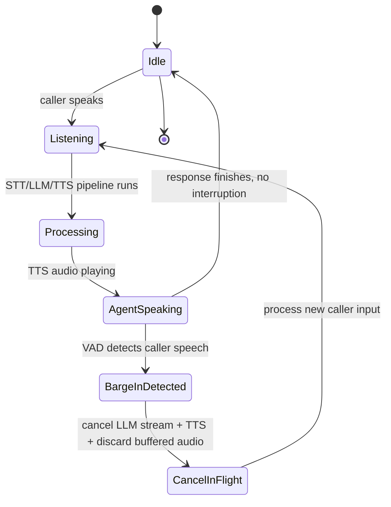

The fastest way to make a voice agent feel fake, even one with excellent latency and a natural-sounding voice, is to have it keep talking after the caller starts talking over it. Humans interrupt each other constantly — to correct a wrong assumption, to say "wait, no" before the agent finishes explaining the wrong thing, to just acknowledge and move things along. A voice agent that barrels through its scripted response regardless of what the caller is doing isn't just annoying, it actively breaks the illusion of a conversation and turns it into "wait for the machine to finish talking." Handling this correctly — barge-in — is one of the more deceptively hard pieces of a cascaded voice pipeline, because it requires cleanly canceling work that's already in flight across three separate stages.



## Why this is hard specifically in a cascaded pipeline

In an end-to-end model, interruption handling is (in principle) something the model itself can be trained to do — attend to new incoming audio and adjust output accordingly. In a cascaded pipeline, it's your infrastructure's job, and there are three separate things that all need to stop cleanly at the same moment: the LLM generation that's still streaming tokens, the TTS synthesis that's still producing audio from those tokens, and the audio playback that's already sending previously-synthesized chunks to the caller's line. Miss any one of the three and you get a glitch — the agent's voice stutters, cuts out mid-word, or worse, keeps going for another sentence after the caller has already started talking.

The trigger for all of this is voice activity detection (VAD) running continuously on the inbound audio stream, even while the agent's own TTS output is playing. VAD's job here is narrow: detect the onset of caller speech energy above a threshold, distinguished from the agent's own audio (which shouldn't be looping back into the same detection path if your audio routing is set up correctly) and from background noise.

## The state machine

I've found it easiest to reason about barge-in as an explicit state machine rather than a pile of conditionals scattered through the pipeline code, because the number of things happening concurrently (LLM stream, TTS stream, audio playback, inbound VAD) makes ad hoc handling error-prone. The states: idle, listening (caller is speaking, pipeline hasn't started yet), processing (STT/LLM/TTS running to produce a response), agent speaking (TTS audio is playing to the caller), and a transient barge-in-detected state that triggers cancellation and returns to listening.

```python
import asyncio
from enum import Enum, auto

class VoiceState(Enum):
    IDLE = auto()
    LISTENING = auto()
    PROCESSING = auto()
    AGENT_SPEAKING = auto()

class VoiceSession:
    def __init__(self):
        self.state = VoiceState.IDLE
        self.llm_task: asyncio.Task | None = None
        self.tts_task: asyncio.Task | None = None
        self.playback_task: asyncio.Task | None = None

    async def on_vad_speech_detected(self, audio_chunk):
        if self.state == VoiceState.AGENT_SPEAKING:
            if self._is_real_interruption(audio_chunk):
                await self._handle_barge_in()
        elif self.state in (VoiceState.IDLE, VoiceState.LISTENING):
            self.state = VoiceState.LISTENING
            await self._buffer_for_stt(audio_chunk)

    async def _handle_barge_in(self):
        # Cancel every in-flight stage before touching state or new input.
        for task in (self.llm_task, self.tts_task, self.playback_task):
            if task and not task.done():
                task.cancel()
        await asyncio.gather(
            *(t for t in (self.llm_task, self.tts_task, self.playback_task) if t),
            return_exceptions=True,
        )
        await self.audio_output.flush_unplayed_buffer()
        self.state = VoiceState.LISTENING

    def _is_real_interruption(self, audio_chunk) -> bool:
        # Minimum-duration gate: a single short "mhm" or a cough shouldn't
        # tear down an in-progress response. Require sustained voiced energy.
        return self.vad.sustained_speech_duration_ms(audio_chunk) > self.min_interrupt_ms
```

The cancellation itself has to reach all three tasks — canceling the LLM stream alone leaves TTS still synthesizing from whatever text it already received, and canceling TTS alone leaves the audio playback layer still draining a buffer of already-synthesized audio the caller doesn't want to hear anymore. `flush_unplayed_buffer` matters as much as the task cancellation — a common bug is canceling the generation stages correctly but leaving a few hundred milliseconds of already-buffered audio still queued for playback, which shows up as the agent getting cut off mid-syllable a beat after the caller has already started talking, instead of immediately.

## Not every sound is an interruption

The naive version of this — trigger a full cancel on any VAD hit while the agent is speaking — produces its own failure mode: the agent stops talking every time the caller coughs, breathes audibly, or says a quick "mhm" or "right" as a backchannel acknowledgment (which humans do constantly without intending to take the floor). Tuning VAD sensitivity and adding a minimum sustained-speech-duration threshold before treating something as a real interruption, as in `_is_real_interruption` above, is what separates a voice agent that responds naturally to genuine interruptions from one that's jumpy and keeps getting derailed by background noise.

There's no universal threshold that works for every deployment — a quiet office phone line tolerates a lower bar than a caller on a noisy street, and getting this right generally means tuning against real call recordings from your actual use case, not a clean studio test set. I'd start somewhere around 200-300ms of sustained voiced energy as a floor and adjust from there based on false-positive and false-negative rates you observe in production traffic.

## Test this on purpose, because it's the first thing that breaks in a demo

Interruption handling is exactly the kind of scenario that's easy to skip in a test suite — it doesn't show up if your test harness sends the agent a clean utterance and waits for a clean response — and exactly the kind of thing that becomes visibly, embarrassingly broken the first time someone tries it live, because live humans interrupt constantly and unpredictably. Any voice agent test plan needs explicit interruption scenarios: interrupt during the first second of the response, interrupt mid-sentence, interrupt right as TTS finishes but before playback catches up, and a battery of "not actually an interruption" cases (coughs, backchannels, silence gaps) to make sure the agent doesn't fire false positives. Skipping this category of test is the single most common reason a voice agent that looked solid in scripted testing falls apart the first time it meets a real, talkative caller.
