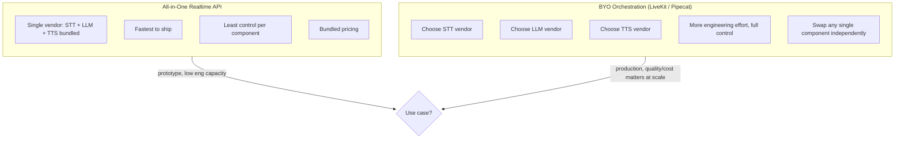

Every voice agent project I've scoped hits the same fork within the first week: do we build on a single vendor's all-in-one realtime API, or do we assemble our own pipeline from separately chosen STT, LLM, and TTS components? Both are legitimate answers depending on what you're actually building, and I've watched teams get burned in both directions — one that spent three months building a bespoke orchestration layer for what turned out to be a two-week MVP, and another that shipped on a bundled realtime API and then hit a wall when they needed a specific TTS voice quality the vendor couldn't match.



## The two paths

**Path one: an all-in-one realtime API.** OpenAI's Realtime API is the reference example here — a single WebSocket connection where you send audio in and get audio out, with the STT-reasoning-TTS pipeline (or, depending on the underlying model, something closer to end-to-end) handled entirely by the vendor. You write orchestration logic for your business use case — function calling, conversation flow, escalation rules — but the voice pipeline itself is a black box you configure with a system prompt and a voice selection, not a set of components you assemble.

**Path two: bring-your-own orchestration.** Frameworks like LiveKit Agents or Pipecat give you the plumbing — WebRTC or telephony audio ingress, turn-taking coordination, streaming glue code — but you choose every model in the pipeline yourself: a specific STT provider for transcription accuracy on your domain's vocabulary, a specific LLM for the reasoning stage (with the freedom to pick a smaller, faster model tier as covered in the latency post in this series), and a specific TTS provider like ElevenLabs for voice quality and persona control. You own the integration work between them, and you own keeping that integration current as any one component's API changes.

## Decision framework

The honest framework I use with teams: default to the all-in-one realtime API when you're prototyping, validating a use case, or the team doesn't have dedicated capacity to own a multi-vendor integration long-term. It gets a working voice agent in front of users in days, not weeks, and for a lot of MVPs that speed is worth more than component-level optimization you haven't earned the right to need yet.

Move to BYO orchestration when voice quality or cost at scale becomes a real constraint — which tends to happen right around the point a prototype becomes a funded production product. At that point, a specific TTS voice that matches your brand, an STT provider tuned for your industry's vocabulary (medical terminology, financial jargon, whatever your callers actually say), or a cost structure that doesn't scale linearly with a bundled per-minute rate all start to matter in ways a single-vendor API can't flex to accommodate.

## The same agent, two ways

Here's the shape of the difference in code. This isn't meant as a drop-in — the exact SDK calls will drift as these APIs evolve — but the structural contrast holds.

```python
# Path 1: all-in-one realtime API
import websockets
import json

async def realtime_voice_agent(audio_stream):
    async with websockets.connect(REALTIME_API_URL, extra_headers=AUTH_HEADERS) as ws:
        await ws.send(json.dumps({
            "type": "session.update",
            "session": {
                "instructions": "You are a scheduling assistant. Keep responses brief.",
                "voice": "alloy",
                "tools": [SCHEDULING_TOOL_SCHEMA],
            },
        }))
        async for chunk in audio_stream:
            await ws.send(chunk)  # raw audio, vendor handles STT/LLM/TTS internally
        async for message in ws:
            event = json.loads(message)
            if event["type"] == "response.audio.delta":
                yield event["delta"]  # audio out, no visibility into intermediate stages
```

```python
# Path 2: BYO orchestration with LiveKit-style agent framework
from livekit.agents import AgentSession, stt, llm, tts

async def byo_voice_agent(room):
    session = AgentSession(
        stt=stt.DeepgramSTT(model="nova-3", language="en"),           # chosen for accuracy
        llm=llm.AnthropicLLM(model="claude-haiku-4-5"),                 # chosen for latency
        tts=tts.ElevenLabsTTS(voice_id=BRAND_VOICE_ID, streaming=True), # chosen for persona fit
        turn_detection="vad",
    )
    session.on("interrupted", lambda: session.cancel_current_generation())
    await session.start(room=room, instructions=SCHEDULING_INSTRUCTIONS)
```

The first version is fewer lines and no component-level decisions to make. The second version is more code, but every model in the pipeline is a named, independently swappable choice — if Deepgram ships a better model next quarter, or if a cheaper LLM tier gets good enough for this use case, that's a one-line change, not a vendor migration.

## Cost, and where the crossover happens

Bundled realtime API pricing is typically a single per-minute (or per-token, audio-inclusive) rate that covers the whole pipeline — simple to reason about, but you're paying the vendor's margin on every component including ones a specialist provider might do cheaper or better. Component-by-component pricing means you pay STT, LLM, and TTS separately, each at whatever rate that specific vendor offers, and you can independently choose a cheaper model tier for the stage that doesn't need frontier quality — the LLM reasoning stage for a simple scheduling agent, for instance, rarely needs a top-tier model, while the TTS stage might justify paying a premium for voice quality.

In my experience the crossover tends to show up once call volume gets past the range where engineering time to build and maintain a BYO pipeline is clearly paid back by the per-minute savings and the flexibility to swap in a cheaper component for the stage that doesn't need premium quality — for most teams that's somewhere after the prototype phase, once volume and the product's actual quality bar are both known rather than guessed at.

## Lock-in is a real cost, not just a philosophical one

The thing that doesn't show up in either the code comparison or the cost model: a bundled realtime API ties your entire voice UX quality — accent handling, voice naturalness, reasoning quality — to one vendor's roadmap. If a competitor ships a materially better TTS voice next year, a BYO stack swaps that component in a sprint. A single-vendor realtime API customer waits for that vendor to catch up, or migrates the whole pipeline, which by that point has become a much bigger project than it would have been to build with swappable components from day one. That's not a reason to avoid the all-in-one path — it's a reason to be deliberate about which path you're on and to revisit the decision once your use case outgrows "prototype."
