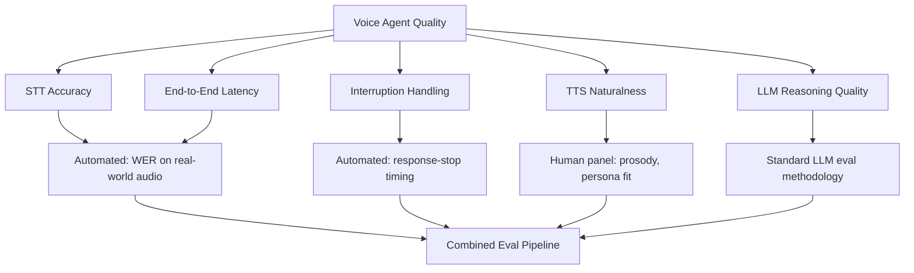

I've run enough agent evals at this point to know the standard playbook reasonably well — faithfulness, answer relevancy, tool-call correctness, all scored against a curated test set, mostly automatable, mostly text in and text out. The first time I tried to apply that exact playbook to a voice agent, it fell apart within a day, because half of what makes a voice agent good or bad never touches the text layer at all. A transcript can be perfectly faithful to the source audio and the response can be perfectly relevant, and the call can still feel broken because the agent talked over the caller, or took two full seconds of dead air before responding, or the TTS voice sounded flat and robotic reading back a phone number.



## What carries over, and what doesn't

The LLM reasoning stage in a cascaded voice pipeline is still an LLM doing text-in, text-out work, so the standard eval methodology — faithfulness against retrieved context, relevancy of the response to the transcript, correctness of any tool calls the agent made — still applies directly at that layer. If the reasoning quality is bad, it'll show up the same way it does in a text agent, and you evaluate it the same way.

What has no text equivalent is everything downstream and upstream of that reasoning stage: whether the words the LLM reasoned over were actually the words the caller said, whether the response came back fast enough to feel like a conversation rather than a hold queue, whether the agent handled being talked over correctly, and whether the voice reading the response back sounded like something a caller would trust rather than something that makes them hang up. None of that is captured by a text-quality metric, and treating a voice agent eval as "the text eval plus a vibe check on the audio" undersells how much of the actual caller experience lives outside the transcript.

## The four dimensions that need their own measurement

**STT accuracy under real conditions.** Word error rate (WER) on a clean, quiet, native-accent benchmark tells you almost nothing about how the agent will perform on an actual support line, where callers have accents the training data underrepresented, call from noisy environments, and use domain-specific vocabulary — product names, account numbers, medical or financial terms — that a general-purpose STT model wasn't tuned for. The only WER number worth tracking is one measured against audio that looks like your real traffic, which means building a test set from real (consented) call recordings in your domain, not downloading a public benchmark and calling it done.

**End-to-end latency, measured continuously.** The TTFT figures from earlier in this series (roughly 0.78s-2.98s depending on pipeline design) are a launch-time snapshot, not a permanent guarantee. Latency drifts — a vendor changes their infrastructure, your prompt grows as you add more context to the system message, a new function call adds a round trip. Latency needs to be an always-on production metric with alerting, not a number you check once before shipping and never revisit.

**Interruption handling correctness.** Did the agent stop producing audio within an acceptable window (I'd target well under 300ms) after a genuine barge-in was detected, and did it correctly ignore non-interruption noise like backchannels and coughs, per the tuning covered earlier in this series? This is measurable with recorded test calls that deliberately interrupt at specific points and check the timestamp the agent's audio output actually stopped.

**TTS naturalness and persona appropriateness.** This is the one dimension in the list that resists automation the most. Prosody scoring models exist, but in my experience they're not yet reliable enough to fully replace a human ear for judging whether a voice sounds natural, whether pacing is appropriate for the content (a phone number read too fast is a real, common failure), and whether the voice matches the persona you intended. This one still needs a human evaluation panel, at least periodically — automated metrics can flag drift or regression, but a panel is what tells you whether the voice actually sounds right.

## Building a test set from reality, not a studio

The mistake I've seen more than once is building a voice eval test set out of synthesized or studio-recorded clean audio, because it's easy to generate and doesn't require going through consent processes for real call data. It also tests almost nothing about how the agent performs in production, because production audio is never clean — background noise, cross-talk, phone line compression artifacts, and genuine accent diversity are the norm, not the exception.

```python
# Sketch of an eval pipeline combining automated metrics and a human panel
def run_voice_eval(test_calls: list[RecordedCall]) -> EvalReport:
    automated_results = []
    for call in test_calls:
        stt_result = stt_client.transcribe(call.audio)
        wer = word_error_rate(stt_result.transcript, call.ground_truth_transcript)
        latency = measure_ttft(call.audio)
        interruption_score = evaluate_barge_in_timing(call) if call.has_interruption else None
        automated_results.append(AutomatedResult(call.id, wer, latency, interruption_score))

    # Human panel samples a subset for naturalness — not every call, but enough
    # to catch regressions, stratified across voice/persona/accent conditions.
    panel_sample = stratified_sample(test_calls, n=50)
    naturalness_scores = human_panel.score(panel_sample, rubric=NATURALNESS_RUBRIC)

    return EvalReport(automated_results, naturalness_scores)
```

The test set itself should deliberately span accents, background noise levels, and interruption scenarios that match your actual caller population — pulled from consented real call recordings wherever possible, with the same privacy rigor as any other production audio collection.

## Monitoring doesn't stop at launch

The dimensions above aren't a one-time pre-launch checklist — they're what an ongoing production monitoring program samples continuously. Pulling a stratified sample of live call audio for periodic human review (accuracy spot-checks, naturalness drift, interruption-handling regressions after a model or prompt change) catches the kind of slow degradation that a launch-day eval never will, because production traffic composition shifts over time in ways a static test set doesn't capture. That sampling needs to run under the same consent and data-handling standards as any other collection of caller audio — worth treating as a compliance requirement, not just an engineering nice-to-have.
