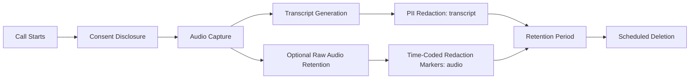

Every AI governance framework I've helped a team stand up was written with text in mind first — retention policies, PII redaction, audit logging, all built around the assumption that the underlying data is a string you can search, redact, and reason about with fairly standard tooling. Voice breaks that assumption in three specific ways, and every one of them has caught a team off guard at least once in my experience: audio can be biometric data depending on jurisdiction, call recording consent laws vary in ways that actively conflict between jurisdictions, and redacting audio is a fundamentally harder problem than redacting text.



## Why voice is a distinct privacy category

**Biometric concerns.** A recorded voice sample can, in some jurisdictions and under some regulatory frameworks, be treated as biometric identifying data in the same category as a fingerprint or a face scan — because voiceprint identification is a real, working technology and a sufficiently large recorded sample can be used to identify or verify a specific person. This isn't universal law, but the trend in emerging AI regulation is toward treating voice with more caution than plain text precisely because of this identifiability angle, and it's worth checking whether whatever regulatory frameworks apply to your deployment have voice-specific provisions before assuming your existing text-based data policy covers audio too.

**Consent law varies by jurisdiction, and not in a way that lets you pick one policy and apply it everywhere.** In the US alone, most states are "one-party consent" (only one party to the call needs to know it's being recorded — which is typically satisfied by you, the recording party, knowing), but a meaningful number of states are "two-party" or "all-party consent," where every participant needs to be informed and, depending on interpretation, needs to affirmatively agree. A voice AI deployment that operates across state or national lines needs consent handling that accounts for the strictest applicable jurisdiction, not the most permissive one, unless you're deliberately routing consent logic differently per caller location — which is itself extra engineering work worth budgeting for up front rather than discovering you need after a compliance review.

**Audio is much harder to redact than text.** Removing a sensitive utterance from a text transcript is a find-and-replace or a regex pass — mechanically trivial, even if getting the detection right is its own hard problem. Removing the same utterance from an audio file means either silencing or bleeping a specific time range (technically straightforward once you know the range, but it destroys information a human reviewer might have needed for quality purposes) or discarding the audio recording entirely and keeping only the redacted transcript. There's no equivalent of a clean in-place text redaction for audio — every approach trades off something.

## Implementing consent as a real gate, not fine print

The disclosure — "this call may be recorded and processed by an AI system" — is table stakes and most teams get that part right by default because it's the part regulators check for most visibly. The part that gets treated as a checkbox rather than a genuine gate is what happens after the disclosure plays: does the system actually wait for and respond to a caller who says "I don't consent" or hangs up, or does it just play the disclosure and proceed regardless? A disclosure that's legally present but functionally decorative is a real compliance risk, not a hypothetical one, and it's worth explicitly testing the "caller declines" path the same way you'd test any other conversation branch.

```python
async def handle_call_start(call):
    await play_disclosure(call, DISCLOSURE_SCRIPT)
    consent_response = await listen_for_consent_response(
        call, timeout_seconds=8, accept_silence_as_consent=False,
    )
    if consent_response == ConsentResult.DECLINED:
        await route_to_human_agent_or_end_call(call, reason="consent_declined")
        return
    if consent_response == ConsentResult.NO_RESPONSE:
        # Don't silently proceed — an ambiguous non-response is not consent.
        await re_prompt_or_escalate(call)
        return
    call.consent_recorded_at = utc_now()
    await begin_ai_pipeline(call)
```

The `accept_silence_as_consent=False` default there is deliberate — treating an unclear or absent response as implicit consent is exactly the kind of shortcut that turns a functioning consent gate into a fine-print formality, and it's the detail most likely to get missed under deadline pressure.

## Data handling: what to keep, what to redact, how long

The three retention postures I've seen teams land on, roughly in order of how much data risk they carry:

- **Transcript only, PII-redacted, no raw audio retained.** Lowest risk, easiest to make compliant, and sufficient for most operational needs (QA review, dispute resolution, model improvement) since a transcript captures the content of the call even without the audio. This is the right default absent a specific reason to keep audio.
- **Transcript plus raw audio, retained for a bounded period, with PII redaction applied to the transcript and time-coded redaction markers applied to the audio** for playback tooling to skip or bleep sensitive segments. This is heavier to build — the redaction markers need to be generated (typically from the same PII-detection pass run against the transcript, mapped back to audio timestamps) and your playback tooling needs to honor them — but it's sometimes genuinely required, for instance when a quality review process needs to hear tone and prosody, not just read text.
- **Full raw audio retained indefinitely with no redaction.** I'd treat this as a posture that needs an explicit, documented business justification and legal sign-off, not a default — the exposure if that data is ever breached or subpoenaed is categorically worse than either of the other two options, and most use cases don't actually need it.

Retention periods should be as short as the operational need actually requires — the audit trail and data governance patterns that apply to any AI system apply here too, just with audio as an additional data type layered on top of whatever your general AI data governance policy already covers.

## The regulatory trend worth tracking

Voice-specific provisions are starting to show up in AI regulation as their own category, distinct from general data privacy law — biometric-adjacent identification concerns, recording consent, and synthetic voice disclosure (making sure callers know they're talking to an AI, not a human) are all areas where the rules are still actively forming. If your team is building a voice product, assign someone to track this on an ongoing basis rather than treating it as a one-time compliance review — "we checked once at launch" is not going to age well as this space matures.

## A practical checklist

- Explicit, tested consent disclosure at call start, with a real branch for decline or non-response
- Jurisdiction-aware consent logic if you operate across regions with different recording consent laws
- A documented decision on retention posture (transcript-only, transcript-plus-audio, or full audio) with a business justification for anything beyond transcript-only
- PII redaction on transcripts as a standard pipeline step, not an afterthought
- Time-coded redaction markers if raw audio is retained, honored by every downstream tool that plays audio back
- A retention period tied to actual operational need, not "keep everything forever by default"
- Ownership assigned for tracking voice-specific regulatory developments as they emerge
