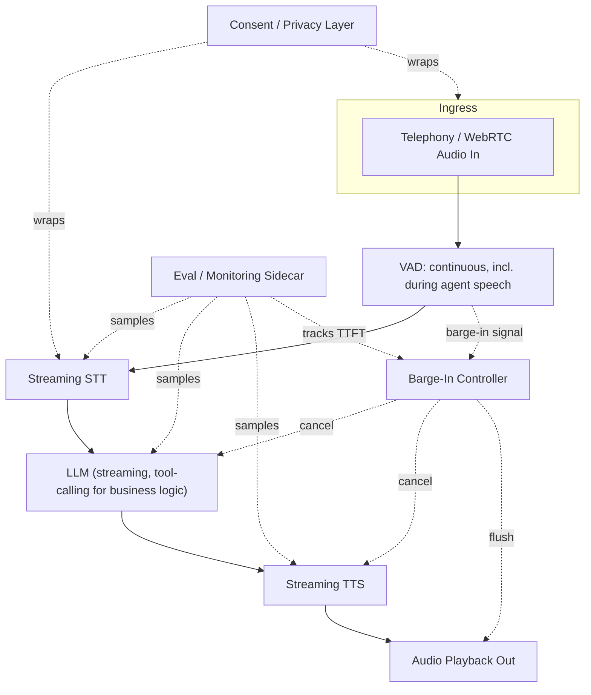

Six posts this week, each on one piece of a voice agent: why cascaded architecture still beats end-to-end for production (post one), how to hit a sub-second latency budget by streaming every stage (post two), how to handle a caller talking over the agent without the pipeline falling apart (post three), whether to build on an all-in-one realtime API or assemble your own stack (post four), how to evaluate quality across dimensions text-only evals miss (post five), and what voice-specific privacy obligations look like (post six). None of those pieces exist in isolation in an actual deployment — they're all load-bearing parts of one system, and the interactions between them matter as much as any individual piece. This post is the reference architecture that ties them together, plus the operational realities that don't fit neatly into any single earlier post.

## The reference stack, component by component

**Ingress and consent.** Telephony or WebRTC audio arrives, and the very first thing that happens — before any AI processing touches the audio — is the consent disclosure and gate covered in post six. This isn't a formality bolted on afterward; it has to sit structurally in front of everything else, because any architecture that captures audio before confirming consent has already created the compliance problem it was supposed to avoid.

**VAD and streaming STT.** Voice activity detection runs continuously on the inbound stream, both to trigger the initial listening state and — critically — to keep watching for barge-in even while the agent's own TTS is playing, per post three. STT streams partial transcripts as the caller speaks rather than waiting for a full utterance, which is the first of the latency wins from post two.

**LLM with tool calling.** The reasoning stage is a streaming LLM call, sized to a model tier that favors latency over maximum reasoning depth for the conversational turn-taking layer (post two's core argument), with function/tool calling wired up for whatever business logic the agent actually needs to perform — looking up an appointment slot, pulling account status, escalating to a human queue. This is also where standard LLM evaluation methodology applies directly, per post five.

**Streaming TTS.** Synthesis starts at sentence boundaries as the LLM produces text, not after the full response is generated, which is the other major latency win. Voice quality and persona here are exactly the dimension post four's build-vs-buy decision is really about — a bundled realtime API gives you a voice, a BYO stack gives you the voice you specifically chose.

**Barge-in controller.** Sits alongside VAD, LLM, and TTS as the component that owns cancellation — when VAD detects a genuine interruption (filtered through the minimum-duration threshold from post three), it cancels the in-flight LLM stream, cancels TTS synthesis, and flushes any buffered-but-unplayed audio, then returns the pipeline to a listening state.

**Eval and monitoring sidecar.** Running continuously, not just at launch — sampling STT word error rate against real traffic conditions, tracking TTFT at each stage, checking interruption-handling timing, and periodically routing audio to a human panel for naturalness review, all per post five. This sidecar is what turns "we tested this before launch" into "we know how this is performing right now."

## Component choice, tied back to the build-vs-buy call

Whether this reference architecture runs on a BYO orchestration framework (LiveKit, Pipecat) with independently chosen STT/LLM/TTS vendors, or largely delegates to a single all-in-one realtime API, is the decision from post four — and it shapes how much of this diagram you're actually building versus configuring. A BYO stack means implementing the barge-in controller, the streaming glue between stages, and the eval sidecar's per-stage hooks yourself. An all-in-one API means much of that lives inside the vendor's black box, and your job is closer to configuration and monitoring than component engineering — a legitimate choice for the reasons covered in that post, just a different amount and kind of work.

## Operational considerations that don't fit neatly into any single earlier post

**Scaling is a different model than stateless request/response.** Every active call is a long-lived, stateful connection — a WebSocket or WebRTC session that persists for the duration of the call, holding conversation state, audio buffers, and in-flight generation tasks. That's a fundamentally different scaling problem than a stateless HTTP API where you can throw more instances behind a load balancer and let any instance handle any request. Concurrent call capacity is bounded by how many of these stateful sessions a given instance can hold open simultaneously, and autoscaling needs to account for session affinity — you can't casually route a mid-call audio chunk to a different instance than the one holding that call's state. This is closer to the operational model of a game server or a chat WebSocket service than a typical REST API, and teams coming from stateless API scaling experience tend to underestimate this the first time.

**Incident response for voice-specific failures doesn't show up in a standard uptime dashboard.** A voice pipeline can be "up" by every conventional health check — services responding, error rates flat — while producing garbled audio for callers on a specific codec, or while STT accuracy has quietly degraded for a specific accent group because of a model update somewhere upstream. Neither of those trips a standard uptime alert. Voice-specific monitoring needs its own signal set: audio quality metrics (not just "did the request succeed"), STT confidence score distributions sliced by whatever caller segmentation you can infer, and a fast path for a human to escalate "the agent sounds wrong" reports that wouldn't otherwise generate a page.

## The honest assessment, closing out the series

Voice AI in 2026 and into 2027 is genuinely production-viable for well-scoped use cases — support triage, appointment scheduling, structured data collection over the phone, first-line intake before a human handoff. I've seen these work reliably, at latencies and quality levels that don't feel like talking to a broken system, when the architecture treats streaming and interruption handling as first-class requirements rather than afterthoughts.

It is still rough at the edges for genuinely open-ended natural conversation at the quality bar of a skilled human agent — the kind of call where the caller doesn't know exactly what they need yet, where tone and empathy matter as much as information retrieval, where a good human agent improvises in ways current voice pipelines, cascaded or end-to-end, don't yet do reliably. That gap is closing, but it's not closed, and scoping a voice agent project honestly means being clear about which side of that line your use case falls on before you commit to an architecture. The reference design in this post gets you a solid, production-grade voice agent for the well-scoped case. It doesn't, yet, get you a replacement for your best human agent on the hard calls — and pretending otherwise is how these projects end up over-promised in the pitch deck and under-delivered in the first month of production traffic.
