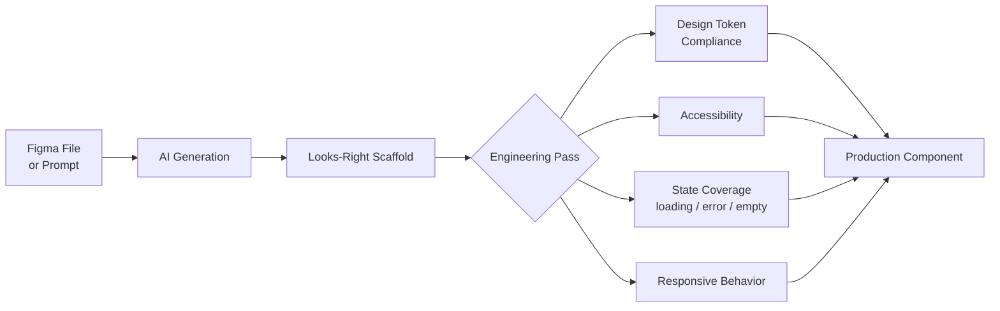

Every design-to-code demo follows the same script: drop in a Figma frame or a screenshot, wait a few seconds, and watch a pixel-accurate component materialize. It's a genuinely good demo. I've run this workflow on real product work for the better part of a year now, across a couple of these tools, and the honest summary is: the first 80% of visual fidelity shows up in seconds, and the remaining 20% — the part that determines whether the component is actually shippable — is still entirely on the engineer. Nobody selling these tools leads with that, so it's worth saying plainly before this series gets into the specifics of how to close that gap.

## What these tools are genuinely good at

Three things, consistently, across every design-to-code tool I've tried:

**Visual first-pass accuracy.** Given a clean design file, the layout, spacing, and typography of the generated component usually matches the mockup closely enough that a stakeholder glancing at it in a browser wouldn't spot the difference. That's not nothing — getting from a static design to something clickable used to take an afternoon of manual markup.

**Boilerplate for well-worn patterns.** Login forms, pricing cards, settings panels, navigation bars — anything that's been built a thousand times before comes out close to usable, because the model has seen a thousand implementations of exactly this shape.

**Fast throwaway prototypes.** For a stakeholder review, a hackathon, or validating a UX direction before committing engineering time, generation is a legitimate speedup. Nobody's shipping the prototype to production, so the gaps below don't matter yet.

## What they consistently get wrong

**Accessibility.** This is the biggest and most consistent gap. Generated components routinely ship with no `aria-label` on icon-only buttons, no keyboard focus management on custom dropdowns, no `role` attributes on anything that isn't a native HTML element. The reason is structural, not a bug that'll get patched next release: a design mockup carries no accessibility information. There's nothing in a Figma frame that says "this needs to be operable with a keyboard" — it's a visual artifact. A generation tool optimizing for visual match against that input has no signal to preserve accessibility because there was never any accessibility in the source to begin with.

**Design system integration.** Ask a design-to-code tool to generate a button and, unless you've told it otherwise, it invents its own button — its own padding scale, its own shade of blue, its own hover transition. It has no idea your team has a `<Button>` component with five variants already living in `@yourorg/ui`. The generated code looks plausible in isolation and is completely disconnected from the system you actually maintain. I'll get into grounding strategies for this specifically in the next post — it's fixable, but not automatically.

**State management and edge cases.** A design file shows one state: the happy path, populated with realistic-looking sample data. It doesn't show what the card looks like with a name that's 40 characters long, what happens while the list is loading, what the empty state looks like when a user has no items yet, or what an error state renders when the API call fails. None of that exists in the source material, so none of it shows up in the generated output. Every one of these has bitten me in review — a beautifully generated table component with no concept of "what if `items` is `undefined`."

**Responsive behavior beyond the one viewport shown.** Most design files show a single breakpoint — usually desktop, sometimes mobile, rarely both. The generated component matches that viewport well and does something unpredictable at every other width, because the model has no information about how the design is supposed to adapt.

## The honest framing: scaffold, not finished component

The useful mental model here is the same one that's already standard for AI-generated backend code, covered earlier on this blog — [treat the output as something requiring a real review pass](/posts/ai-generated-code-testing-strategy/), not a finished deliverable. A backend PR with green tests and 94% coverage still needs a human asking "does this actually handle the edge cases," because the model's blind spots in the implementation tend to be the same blind spots in what it thought to test. Generated frontend components have the equivalent problem, expressed visually instead of logically: the output *looks* finished because it's rendered and pixel-accurate, which makes it easy to skip the scrutiny a less polished-looking scaffold would obviously invite.

That's the actual risk with design-to-code tooling right now — not that it's bad, but that it's convincing enough to bypass review it still needs.

## A workflow that accounts for the gap

The pattern I've settled into, and the one this series builds on:

1. **Generate** — get the visual scaffold from the design file or prompt. Fast, cheap, a legitimate starting point.
2. **Engineering pass** — a deliberate review against a checklist: does this use our design tokens and component library, or did it invent its own? Is it keyboard-navigable and screen-reader sane? Does it handle loading, error, and empty states? Has it been checked at more than one viewport?
3. **Integrate** — merge only after the pass, treating step 2 as non-optional rather than something to skip when the component "already looks right."

Step 2 is where the real engineering time goes, and it's also the step every design-to-code product demo conveniently skips. It's not a knock on the tools — visual generation is a genuinely useful capability. It's a correction to the marketing framing, which implies the loop closes on its own. As of where this space stands in late 2026, it doesn't, for any tool I've tested.

## Where this series goes next

The rest of this week covers the specific practices that make that engineering pass efficient instead of a full rewrite: grounding generation in your actual design system so it stops inventing its own, building accessibility testing that catches what design files never captured, adapting visual regression testing to a higher-churn AI-assisted workflow, a review checklist calibrated to where generated frontend code actually fails, and steering AI-generated component tests toward testing real behavior instead of implementation details. None of it makes the loop close by itself. All of it makes the gap between demo and production considerably smaller.
