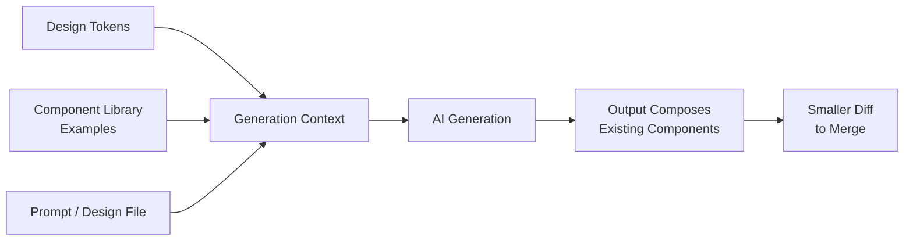

Ask any general-purpose AI tool to generate a settings page and you'll get something that looks like a well-designed settings page — for nobody's product in particular. Rounded corners at a radius that isn't in your token file, a blue that isn't your brand blue, spacing that follows an 8px grid your team abandoned two years ago. It's not wrong, exactly. It's just generic, because the model has no idea your design system exists unless you tell it. [Yesterday's post](/posts/design-to-code-reality-check/) named this as one of the two or three biggest gaps in design-to-code output. This one is about closing it.



## Why generic generation is the default, not a bug

A model trained on the open web has seen an enormous number of Tailwind marketing pages and approximately zero lines of your internal `@yourorg/ui` package. When you ask it to build a card component with no further context, it reaches for the statistically most common pattern in its training data — which is a reasonable-looking generic card, and definitionally not your card. This isn't a quality problem you fix by asking more nicely. It's a context problem: the model can't ground its output in something it was never shown.

## Three grounding strategies, in order of effort

**1. Feed it your design tokens directly.** The cheapest, lowest-effort fix: include your actual token file — colors, spacing scale, typography, radii — as context alongside the generation prompt, rather than trusting the model to infer a plausible palette.

```json
// design-tokens.json — included verbatim in generation context
{
  "color": {
    "brand": { "primary": "#2E5AAC", "primary-hover": "#24468A" },
    "surface": { "default": "#FFFFFF", "muted": "#F4F5F7" },
    "text": { "primary": "#1A1D21", "secondary": "#5C6370" },
    "border": { "default": "#E2E4E8" },
    "state": { "error": "#C4362F", "success": "#1E8A5A", "warning": "#B7791F" }
  },
  "spacing": { "1": "4px", "2": "8px", "3": "12px", "4": "16px", "6": "24px", "8": "32px" },
  "radius": { "sm": "4px", "md": "8px", "lg": "12px" },
  "typography": {
    "body": { "family": "Inter, sans-serif", "size": "14px", "weight": 400 },
    "heading-sm": { "family": "Inter, sans-serif", "size": "18px", "weight": 600 }
  }
}
```

With this in context, a generated card component reaches for `var(--color-surface-default)` and `var(--spacing-4)` instead of `bg-white` and `p-4` with whatever value the model felt like. It's a mechanical change but it eliminates the most common category of "this doesn't look like our product" feedback in review.

**2. Provide real examples from your codebase as few-shot context.** Tokens fix color and spacing. They don't teach the model your composition patterns — how you actually structure a component file, name props, split presentational from container logic. For that, include two or three representative components pulled straight from your repo as few-shot examples.

```tsx
// example-1: Card.tsx — included as few-shot context, not modified
export function Card({ title, children, footer, variant = 'default' }: CardProps) {
  return (
    <div className={cn(cardStyles.base, cardStyles[variant])}>
      <h3 className={cardStyles.title}>{title}</h3>
      <div className={cardStyles.body}>{children}</div>
      {footer && <div className={cardStyles.footer}>{footer}</div>}
    </div>
  );
}
```

Give the model two or three of these, matched to the pattern you're about to ask it to generate, and the output starts using `cn()` the way your codebase does, naming props `variant` instead of `type` because that's what it saw, and structuring the file the way the rest of the repo structures files. This is the single highest-leverage change I've made to generation quality — more so than the token file — because composition style is exactly the thing that's invisible in a design mockup and impossible to infer from general training data.

**3. Expose your component library through an MCP server or generation-time tool.** The highest-investment option, and the one that actually stops the model from reinventing components rather than just styling them to look closer to yours: give the generation tool a way to query your component library's real API — prop names, variants, required children — so it can call `<Button variant="secondary" size="sm">` correctly instead of hand-rolling a `<button>` with inline styles.

```python
# mcp_component_library_server.py — minimal MCP tool exposing your component catalog
from mcp.server import Server
import json

server = Server("component-library")
CATALOG_PATH = "component-catalog.json"  # generated from your Storybook/docs build

@server.tool()
def list_components() -> str:
    """Returns available components with their props and variants."""
    with open(CATALOG_PATH) as f:
        return json.dumps(json.load(f))

@server.tool()
def get_component_usage(name: str) -> str:
    """Returns the real prop signature and a usage example for one component."""
    with open(CATALOG_PATH) as f:
        catalog = json.load(f)
    match = next((c for c in catalog if c["name"] == name), None)
    if not match:
        return json.dumps({"error": f"{name} not found in catalog"})
    return json.dumps(match)
```

This is meaningfully more work — you need a machine-readable catalog of your components, generated and kept current from your Storybook or docs build — but it's the version that actually stops "invented a new Button" from happening at all, rather than making the invented button slightly closer in appearance to the real one.

## The maintenance cost nobody mentions upfront

Every one of these grounding mechanisms decays the moment your design system changes and the context doesn't. A token file that's six months stale during a rebrand produces generated components in your *old* brand colors, confidently. Few-shot examples pulled from a component that got refactored last quarter teach the model a pattern you've since abandoned. This isn't a one-time setup cost — it's an ongoing one, and it needs an owner. In practice, the token file and component catalog should be generated artifacts from your actual design system source of truth (Figma tokens plugin export, Storybook build output), not hand-maintained files someone forgets to update. If you can't automate the regeneration, budget explicit time to refresh it, because silently degraded grounding is worse than no grounding — a stale token file that's *almost* right produces output that passes a casual glance and fails review anyway.

## Measuring whether it's actually working

The proxy metric I've found most useful, and cheap to track automatically: diff size between the AI-generated output and what actually gets merged. Not lines of code in the component itself — lines *changed* by the engineer during review. A high, flat, or rising trend means the grounding isn't doing its job and the engineering pass is closer to a rewrite than a review. A trend that moves down over a few months as you tighten the token file and example set is the real signal that grounding is paying off.

```python
# generation_diff_tracker.py
import subprocess

def diff_lines_since_generation(file_path: str, generation_commit: str) -> int:
    """Lines changed between the AI-generated commit and the final merged version."""
    result = subprocess.run(
        ["git", "diff", "--stat", generation_commit, "HEAD", "--", file_path],
        capture_output=True, text=True,
    )
    # parse the "N insertions, M deletions" summary line
    last_line = result.stdout.strip().splitlines()[-1] if result.stdout.strip() else ""
    return sum(int(n) for n in last_line.split() if n.isdigit())
```

Run this across a rolling window of generated-and-merged components and you get a real, team-specific number instead of a vendor's claim about "production-ready" output. It's the closest thing to ground truth this space currently has.
