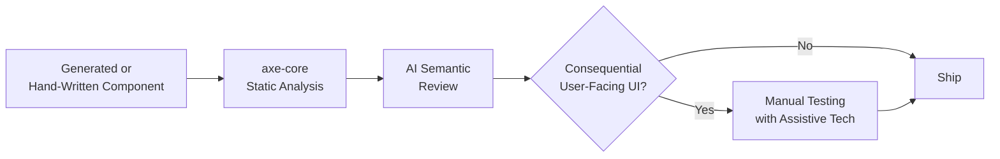

Of everything [the first post in this series](/posts/design-to-code-reality-check/) flagged as a gap in generated frontend code, accessibility is the one that ships silently most often. A missing design token shows up as a visibly wrong color — someone notices in the first five seconds of looking at the component. A missing `aria-label` on an icon button shows up as nothing at all, to anyone not using a screen reader or navigating by keyboard. It passes visual review, passes a casual click-through, and ships. This post is about building a testing layer that catches it before that happens.



## Why accessibility is the requirement generation drops first

It comes back to the same root cause covered in post one: a design file carries no accessibility information. There's no visual signal in a Figma frame indicating "this custom dropdown needs arrow-key navigation and an `aria-expanded` state." Generation tools optimizing for visual match against a design have literally nothing in the source material telling them accessibility matters here — it's not that the model is bad at accessibility, it's that the input it's grounded in never contained it. That means accessibility gaps aren't an occasional miss on hard cases. They're the default outcome on every generated interactive element unless something explicitly counteracts it.

## Layer one: automated static analysis

This part isn't new or AI-specific — axe-core (or a similar rules engine) has been standard practice for structural accessibility checks for years. What's changed is how necessary it's become, given the higher defect rate on AI-generated interactive markup. Running it isn't optional anymore; it's the floor.

```typescript
// a11y-check/axe-ci.ts — run in CI against rendered component stories
import { test, expect } from '@playwright/test';
import AxeBuilder from '@axe-core/playwright';

const COMPONENT_STORIES = [
  '/storybook/iframe.html?id=forms-signupform',
  '/storybook/iframe.html?id=navigation-sidebar',
  '/storybook/iframe.html?id=feedback-toast',
];

for (const storyUrl of COMPONENT_STORIES) {
  test(`accessibility: ${storyUrl}`, async ({ page }) => {
    await page.goto(storyUrl);
    const results = await new AxeBuilder({ page })
      .withTags(['wcag2a', 'wcag2aa', 'wcag21aa'])
      .analyze();

    if (results.violations.length > 0) {
      const summary = results.violations
        .map(v => `[${v.impact}] ${v.id}: ${v.description} (${v.nodes.length} nodes)`)
        .join('\n');
      throw new Error(`Accessibility violations found:\n${summary}`);
    }
  });
}
```

This catches the structural, mechanical stuff reliably: missing `alt` text, insufficient color contrast, form inputs without associated labels, missing `lang` attributes, invalid ARIA usage. It's cheap to run, deterministic, and should gate every PR touching UI, generated or not.

## Layer two: what static analysis can't see

axe-core is a rules engine — it checks the DOM against known patterns. It cannot tell you whether the *interaction* makes sense for someone who can't see the screen. A custom dropdown can pass every axe-core rule (has `role="listbox"`, has `aria-expanded`, has labeled options) and still be genuinely unusable with a keyboard if focus gets trapped, or genuinely confusing for a screen reader user if the announced state doesn't match what's visually happening. That's a semantic judgment, not a structural one, and it's the part static analysis structurally cannot evaluate.

This is where a multimodal LLM review step earns its place — not replacing axe-core, sitting after it, evaluating the things a rules engine has no way to check.

```python
# a11y-semantic-review.py
import anthropic
import json

client = anthropic.Anthropic()

def semantic_a11y_review(component_html: str, component_screenshot_b64: str, interaction_notes: str) -> dict:
    """Evaluates whether a component's interaction pattern makes sense
    for keyboard-only and screen-reader users — beyond what axe-core checks."""
    response = client.messages.create(
        model="claude-opus-4-5",
        max_tokens=600,
        messages=[{
            "role": "user",
            "content": [
                {
                    "type": "text",
                    "text": f"""Review this UI component for accessibility issues that
automated static analysis (axe-core) cannot catch — focus specifically on:

1. Does the keyboard interaction pattern make sense (tab order, arrow keys where
   expected, escape to close, no keyboard traps)?
2. Would the ARIA live region / state announcements match what's visually happening,
   for a screen reader user who can't see the visual state change?
3. Is there any interaction that's only discoverable visually (hover-only reveal,
   color-only status indication) with no non-visual equivalent?

Component HTML:
{component_html}

Interaction notes from the engineer: {interaction_notes}

Respond as JSON: {{"issues": [{{"severity": "high|medium|low", "description": "...",
"wcag_reference": "..."}}], "needs_manual_testing": true|false}}""",
                },
                {"type": "image", "source": {"type": "base64", "media_type": "image/png", "data": component_screenshot_b64}},
            ],
        }],
    )
    text = response.content[0].text if response.content[0].type == "text" else "{}"
    try:
        return json.loads(text[text.index("{"):text.rindex("}") + 1])
    except (ValueError, json.JSONDecodeError):
        return {"issues": [], "needs_manual_testing": True}
```

Wire this into CI as a step that runs after axe-core passes, on any PR touching interactive components, and surfaces its output as a review comment rather than a hard block — the false-positive rate on semantic judgment calls like this is real, and treating it as advisory input for the reviewer is more honest than pretending it's a pass/fail gate.

## The limitation, stated plainly

Automated accessibility testing — axe-core, the semantic review layer above, or any combination of the two — catches maybe 30-40% of the accessibility issues that actually affect a real assistive-technology user in practice. That number comes from how narrow the checks necessarily are: structural rules catch structural problems, and even a good semantic review from an LLM is still inference from HTML and a screenshot, not an actual screen reader session. Things like whether a focus order feels natural during real use, whether an error message actually gets announced at the right moment, whether a complex widget is genuinely operable end-to-end — these need someone using real assistive technology, not a simulation of one.

For anything user-facing and consequential — checkout flows, account settings, anything gating access to a core feature — that manual pass isn't optional, and no amount of automated tooling substitutes for it. The automated layers exist to catch the volume of mechanical issues before they reach a human tester, not to replace the human tester.

## The policy that actually holds up

Require the automated gate — axe-core, non-negotiable — on every PR touching UI, generated or hand-written. Run the semantic review as an advisory signal on interactive components. And be explicit, in writing, that a passing automated gate is not accessibility sign-off. The failure mode I've seen teams walk into is treating "axe-core is green" as equivalent to "this is accessible," which quietly turns a useful 30-40% net into a false sense of complete coverage — worse than no automated testing at all, because it removes the instinct to ever schedule the manual pass.
