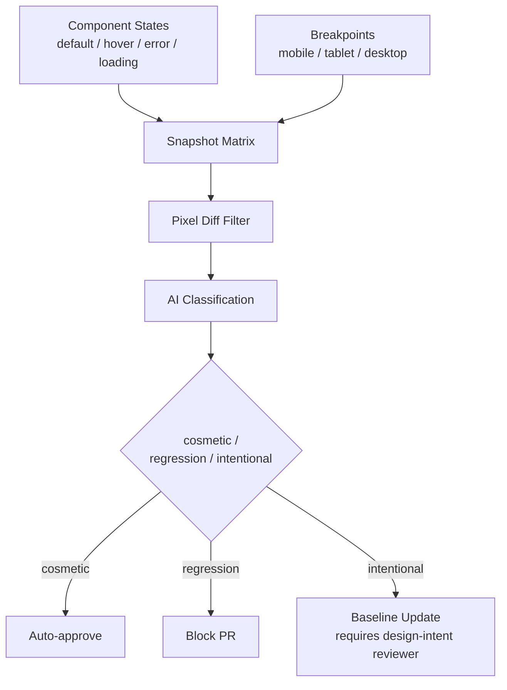

[A post back in December](/posts/visual-testing-ai-layout-regression/) covered the core problem with pixel-diff visual testing: it flags dynamic content changes as loudly as it flags real layout breaks, and teams stop trusting a signal that cries wolf that often. Everything in that post still applies here — the two-stage pixel-diff-then-AI-classification architecture doesn't change. What changes in an AI-assisted frontend workflow is the *volume and context* around each diff, and that's worth its own post rather than a footnote.



## Why the higher-churn context matters

When components get regenerated or heavily AI-edited multiple times a week instead of a handful of times a month, two things change from the workflow the December post described:

**Visual diffs happen more often, on more components, from more contributors** — including contributors who generated the change and may not have deep context on why the component looked the way it did before. A pixel-diff alert that would once have gone to the engineer who designed the original interaction now often goes to whoever's PR happened to trigger it, who may be reviewing a component they didn't write the first version of.

**The baseline itself needs to change more often, deliberately.** In a slower-churn codebase, a stable baseline that rarely needs updating is a reasonable assumption. In an AI-assisted workflow where components get regenerated as part of normal iteration, "this is a real, intentional design change" happens far more frequently than "this is a regression" — which means the classification step needs to be genuinely three-way (cosmetic noise / real regression / intentional change), not just two-way, and the process for approving a new baseline needs an owner.

## Component-level, not page-level

The December post tested full pages. For a component-library-driven frontend, the more useful unit is the individual component in each of its states — default, hover, focus, error, loading, disabled — because that's the level at which generation and AI-assisted edits actually operate, and it's also the level at which a regression is cheapest to catch and cheapest to explain in review.

```typescript
// visual-testing/component-states.ts
import { test } from '@playwright/test';
import { compareScreenshots } from './detector'; // same detector from the December post

type ComponentState = {
  name: string;
  setup: (page: any) => Promise<void>;
};

const BREAKPOINTS = [
  { name: 'mobile', width: 375, height: 812 },
  { name: 'tablet', width: 768, height: 1024 },
  { name: 'desktop', width: 1440, height: 900 },
];

const BUTTON_STATES: ComponentState[] = [
  { name: 'default', setup: async () => {} },
  { name: 'hover', setup: async (page) => page.hover('[data-testid=submit-btn]') },
  { name: 'focus', setup: async (page) => page.locator('[data-testid=submit-btn]').focus() },
  { name: 'disabled', setup: async (page) => page.locator('[data-testid=submit-btn]').evaluate(
      (el: HTMLButtonElement) => (el.disabled = true)) },
];

for (const bp of BREAKPOINTS) {
  for (const state of BUTTON_STATES) {
    test(`SubmitButton — ${state.name} @ ${bp.name}`, async ({ page }) => {
      await page.setViewportSize({ width: bp.width, height: bp.height });
      await page.goto('/storybook/iframe.html?id=forms-submitbutton');
      await state.setup(page);

      const snapshotName = `submit-button-${state.name}-${bp.name}`;
      const result = await captureAndCompare(page, snapshotName);

      if (result.status === 'regression') {
        throw new Error(`Regression on SubmitButton [${state.name} @ ${bp.name}]: ${result.description}`);
      }
    });
  }
}
```

Twelve snapshots for one button component — four states across three breakpoints — sounds like a lot until you consider that responsive bugs on generated components are extremely common (more on that below) and interaction states are exactly what a design mockup, and therefore generation, typically skips.

## Three-way classification, and who approves a new baseline

The classification prompt needs a genuine third option beyond cosmetic/regression, because in this workflow "the component intentionally looks different now" is a common, valid outcome — not noise to be suppressed and not a bug to be blocked.

```typescript
// visual-testing/classify-with-intent.ts
async function classifyComponentDiff(
  baselineB64: string, currentB64: string, componentName: string, prTitle: string
): Promise<{ status: 'cosmetic' | 'regression' | 'intentional'; confidence: number; description: string }> {
  const response = await anthropicClient.messages.create({
    model: 'claude-opus-4-5',
    max_tokens: 400,
    messages: [{
      role: 'user',
      content: [
        {
          type: 'text',
          text: `Two screenshots of component "${componentName}", baseline vs current.
PR title (context on intended change): "${prTitle}"

Classify as:
- "cosmetic": dynamic content or rendering noise only, no real visual change.
- "regression": layout broke, element moved/overlapped/disappeared unexpectedly,
  and the PR title gives no indication this was intended.
- "intentional": the visual difference matches what the PR title describes as
  an intended change to this component.

Respond as JSON: {"status": "...", "confidence": 0.0-1.0, "description": "..."}`,
        },
        { type: 'image', source: { type: 'base64', media_type: 'image/png', data: baselineB64 } },
        { type: 'image', source: { type: 'base64', media_type: 'image/png', data: currentB64 } },
      ],
    }],
  });
  const text = response.content[0].type === 'text' ? response.content[0].text : '{}';
  return JSON.parse(text.match(/\{[\s\S]+\}/)?.[0] ?? '{}');
}
```

Feeding the PR title in as context is a meaningful improvement over the December post's version — it gives the classifier a cheap signal for distinguishing "this changed on purpose" from "this changed and nobody meant it to," which matters more here given how often intentional changes occur.

The part that has to stay a process rule, not a technical one: a classification of `intentional` should not, by itself, auto-update the baseline. The baseline update should require sign-off from whoever actually reviewed the design intent behind the change — not just whoever's PR happened to trigger the snapshot comparison. Otherwise you get baseline drift where a well-intentioned but under-informed contributor accepts a diff that looks intentional to the AI classifier but wasn't actually reviewed against the design system.

## Responsive breakpoints are not optional here

The reality-check post that opened this series named this directly: generated components are typically checked against one viewport, because that's all the design file showed. In practice, this is where the most common category of AI-generated frontend bug shows up — a card component that's fine at 1440px and overlaps its own text at 375px, because nothing in generation or in a casual review at desktop width would have caught it. Making the breakpoint matrix a required part of the visual regression suite, not an optional extra, is the single cheapest structural fix for this category of defect. It won't catch everything — a component can pass all three tested breakpoints and still misbehave at an untested width — but it converts "we found out from a user bug report" into "we found out in CI" for the overwhelming majority of cases.
