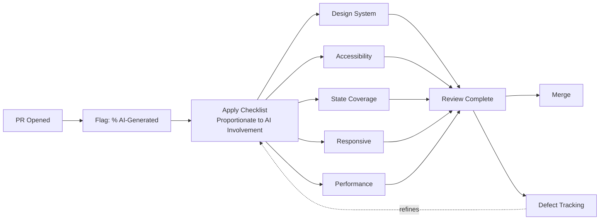

Your team already has a code review checklist, and it's probably fine for what it was built for — naming conventions, test coverage, whether the PR does what the ticket asked. What it almost certainly doesn't have is anything calibrated to the specific ways AI-generated frontend code fails, which cluster in a small, predictable set of categories covered across this series so far: invented styling instead of design system compliance, missing accessibility, missing non-happy-path states, untested viewports. A general checklist catches general problems. This one is built for the failure modes that are specific to this class of code.



## The five categories

**1. Design system compliance** — covered in depth [earlier this week](/posts/component-generation-design-system-integration/). The reviewer question: does this use our existing tokens and component library, or did it invent its own styling? A generated component that looks right but reaches for `#2E5AAC` as a literal hex value instead of `var(--color-brand-primary)` will drift the first time the brand color changes and nobody remembers this component exists.

**2. Accessibility** — the category most likely to pass a visual review and fail a real one. Are interactive elements keyboard-navigable? Do images and icon-only buttons have meaningful (not filler) alt text or aria-labels? Is color contrast sufficient, especially on any custom-styled text the model generated against its own invented palette? Does focus order make sense?

**3. State coverage** — a design mockup shows one state, populated with clean sample data. The reviewer question: has this component's loading, error, and empty states actually been implemented, not just the happy path the design showed? "What does this render if the API call fails" is the single highest-yield review question for generated data-fetching components, because it's almost never covered by the design file the generation was grounded in.

**4. Responsive behavior** — has this been checked at more than the one viewport the design mockup showed? A component that's correct at 1440px and broken at 375px is the most common category of defect this series has flagged, and it's cheap to catch in review with thirty seconds of resizing the browser window if nobody's set up the automated breakpoint matrix from the previous post yet.

**5. Performance** — did generation introduce anything a human wouldn't have: unnecessary re-renders from a missing memoization the model didn't think to add, an oversized bundle addition (a whole date-formatting library pulled in for one relative-time string), unoptimized images embedded instead of referenced. Generated code isn't performance-aware by default any more than it's accessibility-aware by default — same root cause, different symptom.

## A checklist reviewers will actually use

The trap with checklists like this is writing an exhaustive document nobody opens. The version that survives contact with a real PR queue is short enough to paste into a PR template and skim in under a minute.

```markdown
<!-- .github/PULL_REQUEST_TEMPLATE/frontend-ai-assisted.md -->
## AI-Generated Frontend Code Review Checklist

**AI involvement in this PR:** <!-- e.g. "fully generated", "generated + heavy edits", "AI-assisted, mostly hand-written" -->

- [ ] **Design system** — Uses existing tokens/components, not invented styling
- [ ] **Accessibility** — Keyboard-navigable, meaningful alt text/labels, sufficient contrast
- [ ] **States** — Loading, error, and empty states implemented (not just happy path)
- [ ] **Responsive** — Checked at more than one viewport width
- [ ] **Performance** — No obviously unnecessary re-renders, bundle additions, or unoptimized assets

**Notes for reviewer:** <!-- anything generation got wrong that's already been fixed, or that needs a second look -->
```

Five checkboxes, a self-reported AI-involvement field, and a free-text note. It's deliberately not exhaustive — it's the set of questions that catches the failure modes this class of code actually produces, not a restatement of your general review checklist.

## Calibrate to how much of the PR is actually AI-generated

Not every PR touching a frontend file warrants running all five categories at full depth. A one-line copy change assisted by autocomplete doesn't need an accessibility review. A component that's 90% AI-generated from a design file absolutely does. If your team has [code provenance tracking](/posts/ai-code-provenance-tracking/) in place, the AI-generated percentage on a PR is a natural signal for how much weight the checklist should carry — a PR flagged as mostly AI-generated gets the full five-category pass; a PR that's mostly hand-written with a small assisted chunk gets a lighter touch, maybe just the categories relevant to the changed lines. Without provenance tracking, the self-reported field in the template above is a reasonable substitute — less precise, but still better than treating every PR identically regardless of how much of it a model actually wrote.

```python
# checklist_weight.py
def review_depth(ai_generated_pct: float) -> str:
    """Maps AI-generated percentage (from provenance tracking, or self-report)
    to how much of the checklist a reviewer should apply in full."""
    if ai_generated_pct >= 0.7:
        return "full"       # all five categories, careful pass
    elif ai_generated_pct >= 0.3:
        return "standard"   # all five categories, normal pace
    else:
        return "light"      # spot-check the categories relevant to the diff
```

## Measuring whether the checklist is actually catching anything

A checklist that exists but doesn't change outcomes isn't worth the friction it adds to every PR. The way to validate it: track defect escape rate — bugs that reach production — on PRs reviewed with this checklist against PRs that predate it or skipped it, over a full quarter. If checklist-reviewed PRs aren't showing a meaningfully lower escape rate for the specific categories above (accessibility bugs, missing-state bugs, responsive bugs), the checklist isn't doing its job and needs revision, not just continued use out of habit. This is the same discipline worth applying to any process change claiming to improve quality — measure it, don't assume it, and be willing to find out it isn't working.
