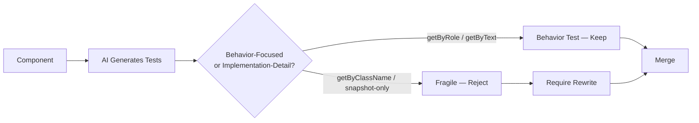

Ask a coding agent to write tests for a component and, left to its own defaults, it will generate something that passes and asserts almost nothing useful — a snapshot test that fails on any refactor whether or not behavior changed, or an assertion that a specific `<div>` carries a specific CSS class. Both pass CI. Neither tells you whether a user can actually complete the interaction the component exists to support. This is the same shared-blind-spot problem [covered for backend code in January](/posts/ai-generated-code-testing-strategy/), showing up in a frontend-specific form: the test suite tests what's easy to assert on, not what actually matters.



## Why generation defaults to implementation details

There's no malice in this, just the path of least resistance. Given a rendered component, the easiest thing for a model to assert on is whatever's structurally present in the output — a class name, a DOM node count, a full-tree snapshot. Asserting on *behavior* — "when a user clicks this, that becomes visible" — requires the model to reason about what the component is actually for, not just what it currently renders. Without explicit steering, generation reaches for the cheaper target, the same way it reaches for generic styling absent design tokens or invents ARIA-free markup absent an accessibility instruction. It's the same root pattern from earlier in this series, applied to tests instead of markup: the model optimizes for whatever signal is easiest to match, and behavior isn't structurally present in a component's source the way its class names are.

## Before and after, same component

Here's a dropdown-select component, and the difference between what unguided generation tends to produce and what a behavior-focused test actually verifies.

```tsx
// CountrySelect.tsx — the component under test
export function CountrySelect({ options, onSelect }: CountrySelectProps) {
  const [open, setOpen] = useState(false);
  const [selected, setSelected] = useState<string | null>(null);

  return (
    <div className="country-select">
      <button
        aria-haspopup="listbox"
        aria-expanded={open}
        onClick={() => setOpen(!open)}
      >
        {selected ?? 'Select a country'}
      </button>
      {open && (
        <ul role="listbox">
          {options.map(opt => (
            <li key={opt.code} role="option" aria-selected={selected === opt.name}
                onClick={() => { setSelected(opt.name); setOpen(false); onSelect(opt.code); }}>
              {opt.name}
            </li>
          ))}
        </ul>
      )}
    </div>
  );
}
```

```tsx
// BEFORE — unguided generation: implementation details, brittle, tests almost nothing real
test('CountrySelect renders correctly', () => {
  const { container } = render(<CountrySelect options={mockOptions} onSelect={jest.fn()} />);
  expect(container.querySelector('.country-select')).toBeInTheDocument();
  expect(container).toMatchSnapshot();
});

test('clicking button sets open class', () => {
  const { container } = render(<CountrySelect options={mockOptions} onSelect={jest.fn()} />);
  fireEvent.click(container.querySelector('button')!);
  expect(container.querySelector('ul')).toBeInTheDocument();
});
```

The first test asserts a class name exists and snapshots the whole tree — it will fail the moment anyone renames `.country-select` during a refactor, even if the component still works perfectly for a user, and it tells the next engineer nothing about what actually broke. The second at least tests something real (the list appears on click) but does it by querying raw DOM nodes rather than the accessibility tree, so it'll also break on structural changes that don't affect behavior — swap the `<ul>` for a `<div role="listbox">` and a perfectly valid change fails a test that had nothing to do with it.

```tsx
// AFTER — behavior-focused: Testing Library queries, resilient to structure, tests the user-facing contract
import { render, screen } from '@testing-library/react';
import userEvent from '@testing-library/user-event';

test('user can open the dropdown and select a country', async () => {
  const user = userEvent.setup();
  const handleSelect = jest.fn();
  render(<CountrySelect options={mockOptions} onSelect={handleSelect} />);

  expect(screen.queryByRole('listbox')).not.toBeInTheDocument();

  await user.click(screen.getByRole('button', { name: /select a country/i }));
  expect(screen.getByRole('listbox')).toBeInTheDocument();

  await user.click(screen.getByRole('option', { name: 'Canada' }));

  expect(screen.getByRole('button', { name: 'Canada' })).toBeInTheDocument();
  expect(screen.queryByRole('listbox')).not.toBeInTheDocument();
  expect(handleSelect).toHaveBeenCalledWith('CA');
});
```

This version queries by role and accessible name — `getByRole('button', { name: /select a country/i })` — which is exactly how a screen reader or a real user navigating by keyboard perceives the component, not how the DOM happens to be structured today. Refactor the markup from `<ul>`/`<li>` to a `<div>`-based custom listbox implementation and this test keeps passing, correctly, as long as the roles and accessible names are preserved. Break the actual behavior — the dropdown doesn't close, or `onSelect` fires with the wrong value — and it correctly fails. That's the property a test suite needs, and it's specifically the property implementation-detail tests lack.

## Steering generation toward this by default

The fix is the same category of move as grounding component generation in your design tokens: give the model explicit context steering it toward the outcome you want, rather than hoping it infers your preference.

```
# test-generation-context.md — included in the prompt/context for any test generation task

When generating component tests, use Testing Library semantic queries
(getByRole, getByLabelText, getByText) — never getByClassName, querySelector,
or full-tree snapshot assertions as the primary test strategy.

Test what a user perceives and can do: what's visible, what's clickable,
what happens after an interaction — not the DOM structure used to achieve it.

A snapshot test may supplement behavior tests but must never be the only
coverage for an interactive component.
```

This is a small piece of context, and it reliably changes generated output the same way a token file changes generated styling — not because the model can't produce behavior-focused tests unprompted, but because nothing in an unguided prompt tells it that's the priority.

## The same discipline as the rest of this year's testing series, plus one addition

[The mutation testing and AI test generation posts from December](/posts/mutation-testing-ai-quality-gate/) established the pattern this should follow: generate, human review before merge, validate coverage claims with mutation testing rather than trusting the coverage percentage on its own. All of that applies here unchanged. The frontend-specific addition is explicit: reject snapshot-only test files outright for anything interactive. A snapshot test is useful as a supplementary regression signal for pure presentational output, but it is not sufficient coverage on its own for a component a user actually clicks, types into, or navigates — it tests "did the output change," not "does this work."

## A CI check that enforces it mechanically

```python
# frontend_test_quality_gate.py
import re
from pathlib import Path

FRAGILE_PATTERNS = [
    r"querySelector\(",
    r"container\.querySelector",
    r"getByClassName|getByTestId\(['\"]",  # over-reliance on test IDs as the *only* query
    r"toMatchSnapshot\(\)",
]

BEHAVIOR_PATTERNS = [
    r"getByRole\(", r"getByLabelText\(", r"getByText\(",
    r"userEvent\.", r"fireEvent\.(click|change|keyDown)",
]

def check_test_file(path: Path) -> list[str]:
    content = path.read_text()
    has_behavior_query = any(re.search(p, content) for p in BEHAVIOR_PATTERNS)
    is_snapshot_only = (
        re.search(r"toMatchSnapshot\(\)", content)
        and not has_behavior_query
    )

    warnings = []
    if is_snapshot_only:
        warnings.append(f"{path}: snapshot-only coverage, no behavior-level interaction test found")
    if not has_behavior_query and "test(" in content:
        warnings.append(f"{path}: no Testing Library semantic queries found — likely testing implementation details")
    return warnings


def check_changed_component_tests(test_files: list[str]) -> bool:
    all_warnings = []
    for f in test_files:
        all_warnings.extend(check_test_file(Path(f)))

    if all_warnings:
        print("Frontend test quality gate — issues found:")
        for w in all_warnings:
            print(f"  {w}")
        print("\nAt least one behavior-level interaction test (Testing Library queries) "
              "is required for new interactive components.")
        return False
    return True
```

Run this against any test file touching a new or modified interactive component, and require it to pass before merge. It's a blunt heuristic — pattern matching, not real semantic understanding of what the tests actually verify — but blunt is fine here, the same way the critical-path test gate from January was deliberately blunt: the goal isn't to grade test quality with precision, it's to guarantee that snapshot-only, implementation-detail-only coverage never quietly becomes the entire safety net for something a real user has to operate.
