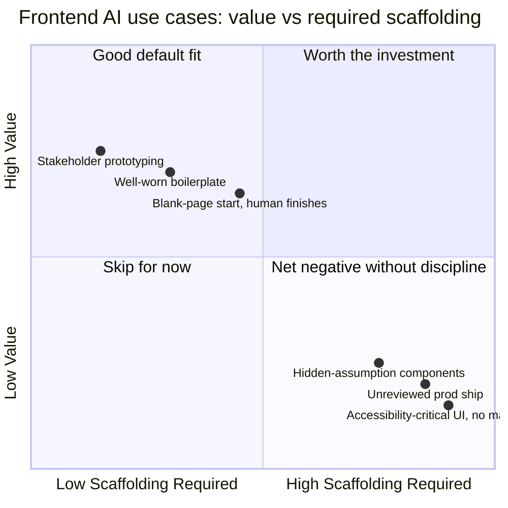

This series opened with a claim I've now spent six posts defending in detail: no design-to-code tool, as of where this space sits in late 2026, closes the loop from design file to production component without a real engineering pass. Everything in between — [grounding generation in your design system](/posts/component-generation-design-system-integration/), [accessibility testing](/posts/ai-accessibility-testing-frontend/), [visual regression tuned for AI-assisted churn](/posts/ai-visual-regression-testing-frontend/), [a review checklist calibrated to how this code actually fails](/posts/ai-frontend-code-review-checklist/), [test generation that checks behavior instead of implementation details](/posts/ai-frontend-testing-generation/) — was about what that engineering pass should actually contain. This closing post is the net assessment: where the investment is clearly worth it, where it currently isn't, and what would have to change for the gap to close for real rather than just get better managed.

## Where it genuinely helps today

**Fast prototyping for stakeholder alignment.** This is the least controversial win in the whole series, and it hasn't gotten weaker with more use — it's gotten more reliable. Turning a design file or a rough description into something clickable, in minutes, for a conversation about direction before real engineering starts, is a legitimate and durable speedup. Nobody's shipping the prototype; the bar for "good enough" is low and the tools clear it comfortably.

**Boilerplate for well-understood patterns.** Forms, CRUD screens, standard list-and-detail layouts — anything the model has seen thousands of correct implementations of comes out close to usable, and the engineering pass on top of it is genuinely lighter than writing it from nothing. This is the case where the grounding techniques from post two do the most work, because a well-worn pattern combined with your actual design tokens and component examples produces output that's frequently just a few edits away from mergeable.

**Killing the blank page, with a human finishing the job.** Starting a new component from a description or a rough mockup, when an engineer is going to thoroughly review, correct, and finish it regardless, is a real net positive. The generation isn't doing the engineering — it's doing the typing that used to precede the engineering. That distinction matters, and it's the one that gets lost when this gets pitched as more than it is.

## Where it currently costs more than it saves

**Fully autonomous design-file-to-merged-component workflows, without a substantial engineering pass.** This is the exact claim the whole series set out to push back on, and nothing across six posts of specific techniques changed the underlying conclusion — it changed what the necessary engineering pass should contain, not whether one is necessary. Treating generated output as done because it looks done is where the defect and rework cost shows up, usually well after the PR that introduced it has been forgotten.

**Accessibility-critical UI without dedicated manual testing.** Post three's honest number stands: automated accessibility testing, AI-assisted or not, catches something like 30-40% of what actually matters to a real assistive-technology user. For a checkout flow, an account settings page, anything gating access to something a user needs — skipping the manual pass because the automated gate is green isn't a shortcut, it's a decision to ship an accessibility posture you haven't actually verified.

**Any component where the generated output's hidden assumptions cost more reviewer time to find than writing it by hand would have taken.** This is the case that's easy to miss and expensive when missed: a component that looks 90% done, invites a light review because it looks done, and is quietly wrong in a way that takes longer to discover during review than the component would have taken to write from scratch. The whole point of the design-system-grounding and checklist work in this series is to shrink how often this happens — but it doesn't happen zero times, and the honest failure mode is treating "looks finished" as a reliable signal of "is finished," which this entire series has argued it isn't.

## What would actually need to change

Three things, in the order I'd rank their impact:

**Deeper design system awareness built into generation tools by default**, rather than requiring the manual grounding covered in post two. Right now, getting a generation tool to respect your tokens and component library is work you do — a token file you maintain, few-shot examples you curate, in the best case an MCP server exposing your real component API. That's a reasonable stopgap, not a destination. The destination is generation tooling that treats "what does this team's design system actually look like" as a first-class input the same way it treats the prompt itself, without a team having to build that bridge by hand.

**Accessibility as a first-class generation constraint, not an afterthought bolted on via post-hoc testing.** Everything in post three exists because accessibility isn't present in the source material generation is grounded in — a design mockup carries no accessibility information, so neither does the output. That's fixable at the tooling layer in a way it currently isn't: design tools that capture accessibility intent (focus order, ARIA semantics, keyboard interaction patterns) as part of the design artifact itself, not left for an engineer to infer and add afterward, would remove the root cause instead of testing around it.

**Better tooling for the generation-to-review handoff.** A generated component today typically shows up in a PR the same way hand-written code does — a diff, with no structured signal for what design intent it's satisfying, what it deliberately deviated from, or what the model was and wasn't confident about. Reviewers are starting from zero context on a class of code that specifically needs more context, not less, given the defect patterns this series has documented. Richer provenance at the point of generation — not just "AI wrote this" but "AI wrote this, grounded in these tokens, uncertain about this interaction pattern" — would let review effort go where it's actually needed instead of being applied uniformly across a component that's mostly fine and one section that isn't.

## The practical recommendation, plainly

None of the five techniques covered this week are optional nice-to-haves layered on top of a workflow that works fine without them. Design system grounding, accessibility testing, visual regression tuned for AI-assisted churn, a review checklist calibrated to this code's actual failure modes, and test generation that checks behavior instead of implementation details — treat all five as required scaffolding around the generation step, not a maturity level to grow into eventually. The reason is the one this series keeps returning to: without that scaffolding, the defect and rework rate on generated frontend code makes the tooling a net negative, not a net positive, precisely because the output looks finished enough to bypass the scrutiny it still needs. With it, the picture this series has actually shown is a good one — genuinely faster prototyping, genuinely lighter boilerplate, a genuinely easier blank page. Just not, as of where this space stands today, a closed loop. Build for that reality and the tooling earns its keep. Build for the demo, and the gap finds you in production instead of in review.
