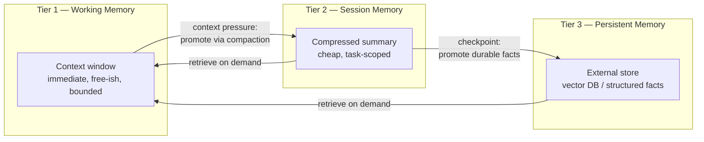

I've built memory into three production agents over the past year, and all three went through the same failure sequence before landing on the same architecture. First pass: everything lives in the context window, because that's the simplest thing that could work. It works right up until a task runs long enough to hit the window limit, at which point either the framework truncates silently or the request fails outright. Second pass, overcorrecting: move everything to an external retrieval store and treat every turn as a fresh retrieval problem. That fixes the length ceiling and breaks something else — the agent loses the tight, immediate coherence of a conversation that's still actively unfolding, because retrieval-based recall is lossy and adds latency on every single turn even when nothing needs recalling. By late 2026, enough teams had hit both failure modes independently that a three-tier model became the default answer, not because anyone designed it top-down but because it's what you converge on after you've felt both edges.



## Why single-tier memory fails in both directions

Pure in-context memory is expensive in a way that's easy to underestimate until you look at a billing dashboard: every token in the window gets re-processed on every turn, so a long-running agent conversation pays a quadratic-ish cost as it grows, on top of eventually just running out of room. The failure isn't graceful either — most frameworks truncate from the oldest message forward with no signal to the agent or the user that anything was dropped, which means the agent can confidently reference a decision it no longer has access to.

Pure external retrieval solves the ceiling problem but introduces its own failure mode: it treats every piece of context as equally worth a retrieval call, which means routine turns pay vector-search latency for information that was one message ago and didn't need retrieving at all. It also tends to flatten conversational structure — a retrieved chunk from an embedding search doesn't preserve the sequencing and cause-and-effect a genuinely ongoing conversation has, so the agent's responses read as slightly disjointed even when the retrieved facts are correct.

The three-tier model exists because working memory and persistent memory are solving different problems, and pretending one tier can do both jobs is where both failure modes come from.

## The three tiers

**Tier 1 — working memory.** This is the literal context window: whatever's in the current prompt. It's the only tier with zero retrieval latency and the only one where the model can reason over relationships between pieces of information without an intermediate lookup step. It's also the most expensive per token held over time and the most tightly bounded — every framework has a hard ceiling, and staying well under it matters for both cost and quality, since model performance on needle-in-haystack style recall measurably degrades as you approach the limit, not just at it.

**Tier 2 — session memory.** A compressed representation of the conversation or task so far, written deliberately before content gets truncated out of working memory — not after. This is the tier most teams get wrong on the first attempt, usually by either skipping it entirely (falling back to naive truncation) or by summarizing reactively only once something has already been lost. The next post in this series is entirely about doing this step correctly. Session memory is cheap to hold and cheap to re-inject, and it's scoped to the current task — it doesn't need to survive past the session unless something in it gets promoted further.

**Tier 3 — persistent memory.** An external store — a vector database, a structured fact table, sometimes both — that survives across sessions entirely. Nothing in this tier is loaded by default; it's retrieved on demand, which is what makes it scale to memory that would never fit in a context window regardless of how well compressed. This is also the tier where memory typing (semantic vs. episodic vs. procedural, covered in post three) and staleness handling (post six) become unavoidable design questions, because unlike the first two tiers, this one is genuinely long-lived and accumulates.

## How the tiers actually interact

The interaction that matters is promotion, not storage. Working memory promotes to session memory under context pressure — when usage crosses a threshold, not when the window is already full, because summarizing under emergency conditions produces worse summaries than summarizing with room to be deliberate. Session memory selectively promotes to persistent memory at natural checkpoints — task completion, an explicit user request to remember something, or a periodic durability pass for long-running agents — and the operative word is *selectively*: most of what lives in session memory is task-scoped noise that has no business surviving the session, and promoting all of it to persistent storage is how you end up with a persistent store nobody trusts, which is exactly the problem post six covers.

Retrieval flows the other direction, and it's demand-driven rather than automatic: working memory pulls from session or persistent memory when the current turn actually needs it, not on every turn by default. Post seven covers the cost argument for why that distinction matters more than it looks like it should.

## A skeleton that makes the structure concrete

```python
from dataclasses import dataclass, field
from typing import Any
import time


@dataclass
class MemoryEntry:
    content: str
    kind: str  # "fact", "episode", "procedure"
    created_at: float = field(default_factory=time.time)
    confidence: float = 1.0


class ThreeTierMemory:
    def __init__(self, promote_threshold_tokens: int = 6000):
        self.working: list[str] = []            # tier 1: raw turns
        self.session_summary: str = ""           # tier 2: compressed
        self.persistent: list[MemoryEntry] = []  # tier 3: external store (stub)
        self.promote_threshold_tokens = promote_threshold_tokens

    def add_turn(self, text: str):
        self.working.append(text)
        if self._estimate_tokens(self.working) > self.promote_threshold_tokens:
            self._compact()

    def _compact(self):
        # Post 2 covers the real summarization prompt. Here: the mechanism.
        to_summarize = self.working[:-4]  # keep the last few turns verbatim
        summary_addition = self._summarize(to_summarize)
        self.session_summary = self._merge_summary(self.session_summary, summary_addition)
        self.working = self.working[-4:]

    def checkpoint(self, durable_facts: list[MemoryEntry]):
        # Called at task completion or on an explicit save request.
        self.persistent.extend(durable_facts)

    def retrieve(self, query: str, k: int = 5) -> list[MemoryEntry]:
        # Stub: real implementation is a vector or hybrid search against tier 3.
        scored = sorted(self.persistent, key=lambda e: e.confidence, reverse=True)
        return scored[:k]

    def assemble_context(self, query: str) -> str:
        parts = [self.session_summary] if self.session_summary else []
        if self._needs_retrieval(query):
            parts += [e.content for e in self.retrieve(query)]
        parts += self.working
        return "\n".join(parts)

    def _needs_retrieval(self, query: str) -> bool:
        # Post 7's classifier lives here in a real system.
        return "remember" in query.lower() or "before" in query.lower()

    def _estimate_tokens(self, turns: list[str]) -> int:
        return sum(len(t) for t in turns) // 4

    def _summarize(self, turns: list[str]) -> str:
        raise NotImplementedError("wire to an LLM summarization call")

    def _merge_summary(self, old: str, new: str) -> str:
        return f"{old}\n{new}".strip()
```

Nothing here is production-ready — `_summarize` is a stub, `retrieve` is a linear scan — but the shape is the point. Every real memory system I've reviewed or built, once you strip the framework-specific naming, reduces to these three tiers and these two operations: promote under pressure, retrieve on demand. The rest of this series is about doing each of those operations well enough that the architecture actually holds up under a workload that doesn't stop growing.
