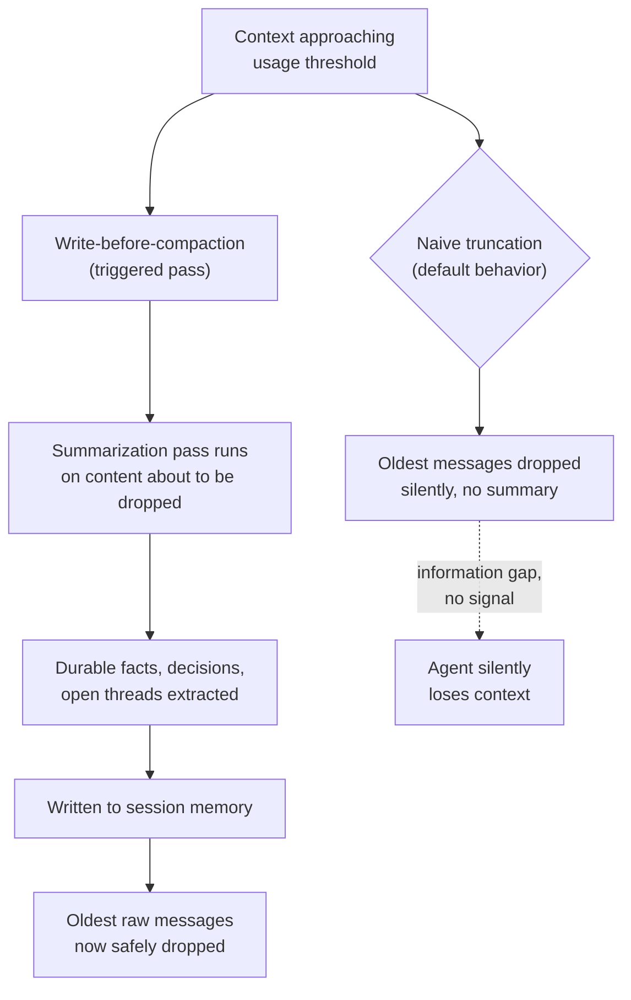

The default behavior of most agent frameworks, when a conversation exceeds the context window, is to drop the oldest messages until it fits. No summary, no flag, no signal to the agent that anything happened — the next turn just runs with less history than the previous one had, and the model has no way to tell the difference between "this was never discussed" and "this was discussed and then quietly removed." I've debugged exactly this failure in production: an agent that re-asked a question the user had answered eleven turns earlier, not because the model was careless, but because the answer had scrolled out of the window on turn twelve and nothing had preserved it. The fix that held up isn't a bigger context window — it's changing when summarization happens, from after truncation to before it.



## The silent loss problem, concretely

The mechanism that makes this dangerous isn't that summarization is hard — it's that truncation looks like it's working. The agent keeps responding fluently, the conversation keeps flowing, and there's no error, no exception, nothing in the logs that says "context was dropped here." The failure only surfaces later, as a symptom disconnected from its cause: the agent contradicts an earlier decision, re-asks a resolved question, or acts on stale information it should have overwritten. By the time someone notices, reconstructing what was actually lost means re-reading a conversation that, by definition, the system itself no longer has access to.

This is worse in agentic workflows than in chat, because an agent's "memory" often includes tool call results, intermediate reasoning about a multi-step plan, and error messages from failed attempts — the kind of content that's exactly the material a later step needs to reference, and exactly the kind of content that tends to be verbose enough to get truncated first.

## Write-before-compaction, as a rule

The pattern is simple to state and easy to skip under deadline pressure: before any content is dropped from the working context, run a summarization pass over it and write the result into session memory first. The trigger should fire on a usage threshold — say 75-80% of the window — not when the window is already full, because a summarization prompt competing for space with the content it's summarizing produces worse output than one run with room to work. This is the promotion step from post one's three-tier model, made specific: working memory doesn't just get discarded under pressure, it gets compressed and handed up a tier before anything is deleted.

## What to preserve versus what's safe to drop

Not everything in a long conversation is equally durable, and treating it all the same either wastes summary budget on things that didn't need preserving or, worse, drops things that did. In practice the split looks like this:

**Durable — worth extracting into the summary:**
- Decisions made and the reasoning behind them ("we're using Postgres, not Mongo, because the schema is genuinely relational")
- Facts established during the conversation that later turns will assume are true
- Unresolved questions or open threads the agent or user still owes an answer to
- Constraints stated explicitly ("don't touch the auth module," "budget is capped at $500/month")

**Safe to compress away:**
- Conversational filler and pleasantries
- Intermediate reasoning that got superseded by a later, better approach — the false start on a design that was abandoned two turns later doesn't need to survive, only the fact that it was tried and why it was rejected, if that's useful
- Back-and-forth that reached resolution — three turns of clarifying questions collapse into the one resulting answer

The judgment call is almost always about intermediate reasoning: keep the conclusion, drop the path to it, unless the path itself is something a later step will need to reference (debugging a decision that turned out wrong, for instance, genuinely benefits from knowing what was tried and ruled out).

## Anchored incremental summarization

The naive implementation re-summarizes the entire history every time the threshold fires, which is both expensive and unstable — an LLM asked to summarize the same material twice, with slightly different surrounding context each time, doesn't produce the same summary twice, and small inconsistencies compound over a long-running task. The fix is anchoring: treat the existing session summary as fixed input, and ask the model only to fold in the newly-dropped content, updating the summary rather than regenerating it.

```python
COMPACTION_PROMPT = """You are updating a running summary of an ongoing task.

EXISTING SUMMARY (do not discard information from this unless it is
explicitly superseded by the new content below):
{existing_summary}

NEW CONTENT TO FOLD IN:
{new_content}

Produce an updated summary that:
1. Preserves every decision, established fact, and open question from the
   existing summary, unless the new content explicitly changes it.
2. Extracts durable facts, decisions (with brief rationale), and unresolved
   questions from the new content.
3. Omits resolved back-and-forth, superseded reasoning, and conversational
   filler from the new content.
4. Stays under {max_tokens} tokens. Prefer dropping detail over dropping
   the existence of a fact — a compressed reference to a decision is better
   than no reference at all.

Return only the updated summary, structured as:
DECISIONS:
FACTS:
OPEN QUESTIONS:
"""


class CompactionManager:
    def __init__(self, llm_client, usage_threshold: float = 0.75, max_summary_tokens: int = 800):
        self.llm = llm_client
        self.usage_threshold = usage_threshold
        self.max_summary_tokens = max_summary_tokens
        self.session_summary = ""

    def maybe_compact(self, working_messages: list[str], context_window_tokens: int) -> list[str]:
        used = self._estimate_tokens(working_messages)
        if used / context_window_tokens < self.usage_threshold:
            return working_messages  # no action needed yet

        keep_recent = working_messages[-4:]
        to_drop = working_messages[:-4]
        if not to_drop:
            return working_messages  # nothing safe to compact yet

        self.session_summary = self._run_compaction(to_drop)
        return keep_recent  # dropped content now lives only in session_summary

    def _run_compaction(self, content: list[str]) -> str:
        prompt = COMPACTION_PROMPT.format(
            existing_summary=self.session_summary or "(none yet)",
            new_content="\n".join(content),
            max_tokens=self.max_summary_tokens,
        )
        return self.llm.complete(prompt)

    def _estimate_tokens(self, messages: list[str]) -> int:
        return sum(len(m) for m in messages) // 4
```

The threshold-based trigger and the keep-last-N-verbatim rule aren't arbitrary — they exist because the most recent turns are almost always the most relevant to the immediate next step, and summarizing them prematurely loses precision the task doesn't need lost yet. Post five goes further into this idea with a full hierarchical scheme, where content ages through multiple compression levels rather than being either fully verbatim or fully summarized. But the floor every agent memory system needs, before any of that sophistication, is this one rule: never let context leave working memory without writing down what it contained first. Everything downstream — session memory, persistent memory, the ability to trust that the agent remembers what it should — depends on that rule holding every single time, not most of the time.
