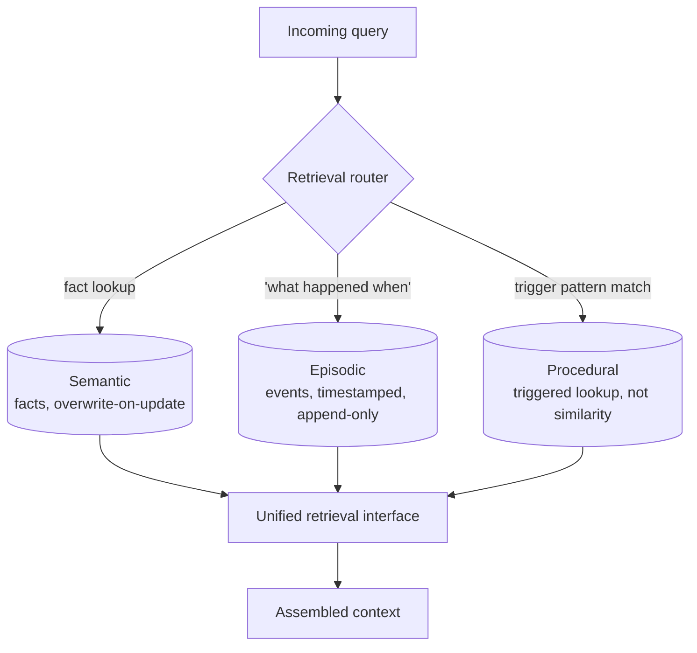

The persistent memory tier from post one is where most teams reach for a vector database, dump everything into a single collection, and call it done. It works in a demo and degrades in production in a specific, recognizable way: retrieval starts returning technically-similar but practically-useless results, because a query about "what does the user prefer" is competing in the same embedding space against "what happened on March 1st" and "what steps to follow for a refund," and cosine similarity has no way to know those are three different kinds of question that need three different retrieval strategies. This isn't a tuning problem you fix with a better embedding model. It's a schema problem — the store is flat when the memory it holds isn't.



## Three kinds of memory, borrowed and adapted

The typology comes from cognitive science, and it maps onto agent memory more cleanly than most borrowed frameworks do because the retrieval characteristics genuinely differ, not just the labels.

**Semantic memory** is facts: "the user's timezone is IST," "this account is on the enterprise tier," "the API rate limit is 100 requests per minute." Facts are timeless in structure even when their value changes — there's exactly one current answer to "what's the user's timezone," and when it changes, the old value is simply wrong, not historically interesting. Semantic memory wants overwrite-on-update semantics: a new write for the same fact key should replace the old one, not accumulate alongside it.

**Episodic memory** is events: "on March 1st the user asked about refund policy X and we resolved it by explaining Y." Episodes are inherently time-ordered and each one is a distinct occurrence — a new episode doesn't overwrite a previous one, it adds to a sequence. Episodic memory wants append-only storage with a timestamp on every record, because both "what happened" and "when it happened relative to other things" are part of what makes an episode useful to retrieve.

**Procedural memory** is learned process: "when handling a refund request, check order status, then payment method, then policy eligibility, in that order." Procedures aren't facts and they aren't events — they're something closer to a cached decision about how to act, and critically, they need to be retrieved reliably every time their trigger condition occurs, not approximately-retrieved based on how semantically similar the current situation happens to look to past ones.

## Why a flat store handles all three poorly

Similarity search is the right retrieval mechanism for exactly one of these three. Facts change and shouldn't accumulate duplicate near-identical entries every time they're restated — a flat vector store has no built-in notion of "this is an update to that," so without extra logic you end up with five embeddings for "user's timezone" at various points in history, and a similarity search has no principled way to know the fifth one is the only one still true. Episodes need chronological retrieval alongside semantic retrieval — "what happened most recently" is a different query shape than "what happened that's similar to this," and a pure similarity index only serves the second. Procedures are the worst fit of the three for similarity search specifically: a procedure needs to fire reliably every time its trigger condition is met, and "reliably" is precisely the property nearest-neighbor search doesn't guarantee — it returns what's close, not what's certain, and a refund procedure that only gets retrieved 80% of the time a refund request comes in is a procedure that's failed its actual job.

## A practical schema

The fix doesn't require three separate database systems — metadata-tagged collections within the same store are usually enough, as long as the write and retrieval logic is genuinely type-specific rather than a shared code path with a tag bolted on.

```python
from dataclasses import dataclass, field
from typing import Optional
import time


@dataclass
class SemanticFact:
    key: str            # e.g. "user.timezone"
    value: str
    confidence: float = 1.0
    updated_at: float = field(default_factory=time.time)


@dataclass
class Episode:
    summary: str
    occurred_at: float = field(default_factory=time.time)
    session_id: Optional[str] = None
    embedding: Optional[list[float]] = None


@dataclass
class Procedure:
    trigger_pattern: str  # matched, not embedded-and-similarity-searched
    steps: list[str]
    last_used_at: Optional[float] = None


class TypedMemoryStore:
    def __init__(self, embed_fn):
        self.embed = embed_fn
        self.semantic: dict[str, SemanticFact] = {}
        self.episodic: list[Episode] = []
        self.procedural: dict[str, Procedure] = {}

    # --- semantic: overwrite-on-update ---
    def write_fact(self, key: str, value: str, confidence: float = 1.0):
        self.semantic[key] = SemanticFact(key=key, value=value, confidence=confidence)

    def get_fact(self, key: str) -> Optional[SemanticFact]:
        return self.semantic.get(key)

    # --- episodic: append-only, timestamped ---
    def log_episode(self, summary: str, session_id: str):
        self.episodic.append(Episode(
            summary=summary,
            session_id=session_id,
            embedding=self.embed(summary),
        ))

    def recent_episodes(self, n: int = 5) -> list[Episode]:
        return sorted(self.episodic, key=lambda e: e.occurred_at, reverse=True)[:n]

    def similar_episodes(self, query: str, k: int = 5) -> list[Episode]:
        q_vec = self.embed(query)
        scored = sorted(
            self.episodic,
            key=lambda e: self._cosine(q_vec, e.embedding),
            reverse=True,
        )
        return scored[:k]

    # --- procedural: keyed on trigger, not similarity ---
    def write_procedure(self, trigger_pattern: str, steps: list[str]):
        self.procedural[trigger_pattern] = Procedure(trigger_pattern=trigger_pattern, steps=steps)

    def get_procedure(self, trigger_pattern: str) -> Optional[Procedure]:
        proc = self.procedural.get(trigger_pattern)
        if proc:
            proc.last_used_at = time.time()
        return proc

    @staticmethod
    def _cosine(a: list[float], b: list[float]) -> float:
        dot = sum(x * y for x, y in zip(a, b))
        na = sum(x * x for x in a) ** 0.5
        nb = sum(y * y for y in b) ** 0.5
        return dot / (na * nb) if na and nb else 0.0
```

The detail worth noticing is `get_procedure`: it's an exact or pattern-matched lookup, not an embedding comparison, on purpose. If your agent framework classifies intent before it retrieves memory — most production ones do, in some form, even if it's just a routing prompt — that classification step is exactly where trigger matching for procedures belongs. Procedures don't get discovered by similarity; they get selected by the situation matching a known trigger, the same way a runbook gets pulled because you recognized the incident type, not because it happened to read similarly to what you're dealing with.

## What this buys you in practice

The separation pays off first at write time, not retrieval time — a semantic write naturally overwrites, an episodic write naturally appends, and a procedural write naturally keys on trigger, so the store never accumulates the kind of ambiguous, half-stale duplicate data a flat store does by default. It pays off again at retrieval time because you can apply type-appropriate logic — recency-weighted for episodes, freshness-weighted for facts, trigger-matched for procedures — instead of a single similarity threshold trying to serve three different notions of relevance at once. None of this is exotic engineering; it's closer to admitting that "memory" was always three different data shapes wearing one name, and building the store to match that instead of pretending it doesn't matter until retrieval quality tells you otherwise.
