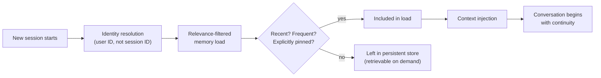

The gap between a session-scoped agent and one with real continuity isn't subtle to a user — it's the difference between explaining your setup for the third time this week and an agent that opens with "still working on the migration from last Tuesday?" Teams that ship the second experience get materially better engagement, and I've seen the metric move enough times to trust it's real. But the naive way to get there — dump the user's entire history into the opening context every session — creates two problems that don't show up in a demo and absolutely show up in production: the context gets expensive and unfocused fast, and users start noticing the agent knows things about them they never explicitly agreed to have remembered.



## Identity resolution: the part that's obvious in theory and missed in practice

The first requirement sounds too basic to write down, and I'm writing it down anyway because I've seen it get missed: cross-session memory has to key on a stable user identity, not a session identifier. This matters more than it sounds like it should, because a lot of early agent scaffolding — including several frameworks that shipped memory features fast in 2026 — defaulted to session-scoped storage for the entire memory layer, and teams building on top of that scaffolding inherited the bug without noticing, because within a single session everything worked fine. The failure only shows up on the second conversation, when the agent has no idea it's talking to the same person, and by then the team has usually shipped and moved on to the next feature.

Getting identity resolution right means deciding, explicitly, what the stable key is — an authenticated user ID in most enterprise contexts, sometimes a device or workspace ID for contexts without individual login — and making sure every write to persistent memory carries that key, not the transient session ID that's regenerated every conversation. This is infrastructure work, not a memory-design decision, and it's worth treating it that way: get it wrong at the schema level and no amount of clever retrieval logic downstream fixes it.

## What to load at session start, and what not to

Loading the full history at the start of every session is the mistake that looks like generosity and behaves like waste. It bloats the opening context with material that's mostly irrelevant to whatever the user is about to ask, it costs tokens on every session regardless of whether any of that history matters this time, and — the part that's easy to underweight — it makes the agent's opening behavior feel presumptuous rather than helpful, surfacing things the user didn't ask about and may not have expected the system to still know.

The alternative is a relevance filter applied at load time, not a raw dump:

- **Recency** — what was discussed in the last few sessions, weighted toward genuinely recent, not everything ever
- **Frequency** — facts or topics that keep coming up across many sessions are probably durable and worth surfacing even if the most recent mention wasn't this week
- **Explicit pins** — anything the user directly asked the agent to remember gets included regardless of recency or frequency scoring, because an explicit request overrides a heuristic

```python
from dataclasses import dataclass
import time


@dataclass
class MemoryCandidate:
    content: str
    last_referenced_at: float
    reference_count: int
    pinned: bool = False


def resolve_identity(auth_context: dict) -> str:
    # Never fall back to session_id here — that's the exact bug this section warns about.
    user_id = auth_context.get("user_id")
    if not user_id:
        raise ValueError("cannot initialize cross-session memory without a stable user id")
    return user_id


def load_session_context(
    user_id: str,
    memory_store,
    max_items: int = 8,
    recency_window_days: int = 14,
) -> list[MemoryCandidate]:
    candidates = memory_store.fetch_for_user(user_id)
    now = time.time()
    cutoff = now - recency_window_days * 86400

    pinned = [c for c in candidates if c.pinned]
    recent = [c for c in candidates if not c.pinned and c.last_referenced_at >= cutoff]
    frequent = sorted(
        (c for c in candidates if not c.pinned and c not in recent),
        key=lambda c: c.reference_count,
        reverse=True,
    )

    selected = pinned + recent + frequent
    return selected[:max_items]


def build_opening_context(user_id: str, memory_store) -> str:
    items = load_session_context(user_id, memory_store)
    if not items:
        return ""
    lines = [f"- {c.content}" for c in items]
    return "Relevant context from prior sessions:\n" + "\n".join(lines)
```

The `max_items` cap is doing real work here, not just tidiness — a session opener that surfaces two or three genuinely relevant things reads as attentive; one that surfaces fifteen reads as either overwhelming or, worse, as evidence the system is hoarding more about the user than feels comfortable.

## Consent and control aren't optional extras

Every persistent memory system that stores anything about a specific user needs a visible, user-facing answer to "what does this agent remember about me," and a working path to correct or delete individual entries — not just a blanket "clear all history" button that throws away things the user still wanted kept. This isn't just good practice; in a growing number of jurisdictions it's a compliance requirement, and building it in after the fact is a much bigger lift than designing the memory schema to support targeted read and delete from day one. If your `TypedMemoryStore` from the previous post doesn't have a `list_facts_for_user` and a `delete_fact` that a settings page can call directly, that's a gap worth closing before this ships to real users, not after.

## The staleness question, briefly

Everything loaded at session start is only as good as how current it is, and a fact that was true three months ago carries the same confident tone as one confirmed yesterday unless the system does something deliberate to distinguish them. I'm flagging it here rather than solving it here, because it deserves its own treatment — post six in this series goes into decay scoring, contradiction detection, and why this is genuinely the least-solved part of agent memory as it stands today. What matters for cross-session continuity specifically is just this: don't build the relevance filter above assuming everything in the store is equally trustworthy just because it made it into persistent memory. Recency in the filter above is a proxy for relevance, not a guarantee of correctness, and conflating the two is exactly how an agent ends up confidently repeating something that stopped being true a while ago.
