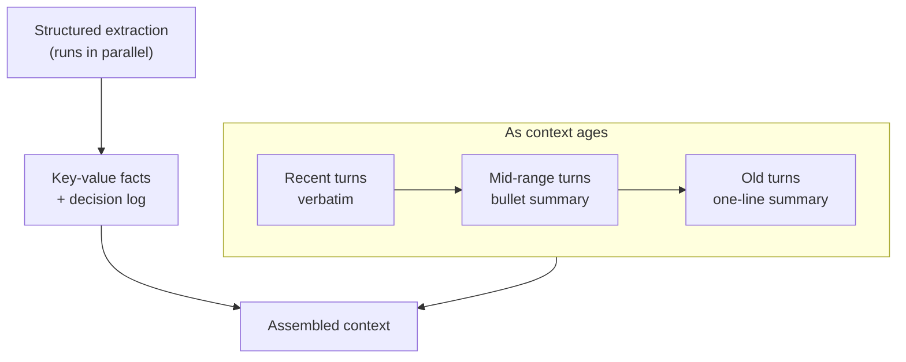

Post two covered write-before-compaction as the floor every memory system needs — summarize before you truncate, don't let context disappear silently. This post is about what happens once you take that floor seriously and start asking a harder question: prose summarization is one compression technique, and it's not always the best one for the job. A running paragraph summary is good at preserving narrative flow and bad at preserving precision — ask a model to summarize "the error was `ConnectionTimeout: 30000ms exceeded on retry 3 of 5`" and you'll often get back "there was a connection error," which is a smaller string and a strictly worse piece of information. Getting compression right means treating it as a small toolkit with different tools for different content, not one summarization call applied uniformly.



## Structured extraction versus prose summarization

Free-form prose is the wrong shape for most of what a summarization pass is actually trying to preserve — decisions, facts, and open questions are inherently structured data, and forcing them through a paragraph loses both density and reliability of later parsing. A structured extraction pass converts the same content into something closer to a compact record:

```python
STRUCTURED_EXTRACTION_PROMPT = """Extract the following from this conversation segment.
Return valid JSON only.

{{
  "facts": [{{"key": "...", "value": "..."}}],
  "decisions": [{{"decision": "...", "rationale": "..."}}],
  "open_questions": ["..."]
}}

CONTENT:
{content}
"""
```

The win isn't just brevity — a structured record is denser per token than the equivalent prose (no connective tissue, no "the user then went on to explain that"), and it's far more reliably machine-parseable downstream, which matters the moment anything besides an LLM needs to read the summary: a dashboard, a rules engine deciding whether to escalate, an eval harness checking whether the agent tracked a decision correctly. Prose summarization is still the right tool when what you're compressing is genuinely narrative — the arc of a multi-step debugging session, say, where the sequence matters as much as the individual facts. Use structured extraction for anything that's fundamentally a fact, a decision, or a question, and prose for anything that's fundamentally a story.

## Hierarchical summarization: not everything ages at the same rate

A flat compaction scheme — everything older than N turns gets summarized to the same degree — throws away a real signal: relevance to the immediate next step correlates strongly with recency, so recent content deserves to stay closer to verbatim and older content can tolerate more aggressive compression without costing the agent much. A hierarchical scheme makes that gradient explicit instead of pretending every past turn deserves equal treatment:

- **Recent tier** (last few turns): kept verbatim, no compression
- **Mid-range tier**: compressed to a bullet-point summary — one line per distinct point, structure preserved, prose stripped
- **Old tier**: compressed further to a single line per topic, or folded entirely into the structured fact/decision log from the extraction pass above

The mid-range and old tiers aren't static once assigned — content ages through them. A turn that's in the mid-range bullet tier today moves to the old one-line tier once enough new content pushes it back, and that re-compression is itself a small summarization call, ideally anchored the same way post two's incremental compaction was, so it isn't re-deriving the bullet summary from raw text every time it ages another step.

```python
from dataclasses import dataclass, field


@dataclass
class Turn:
    text: str
    age_rank: int  # 0 = most recent


class HierarchicalCompressor:
    def __init__(self, llm_client, recent_n: int = 6, mid_n: int = 20):
        self.llm = llm_client
        self.recent_n = recent_n
        self.mid_n = mid_n

    def compress(self, turns: list[Turn]) -> dict:
        ordered = sorted(turns, key=lambda t: t.age_rank)
        recent = ordered[: self.recent_n]
        mid = ordered[self.recent_n : self.recent_n + self.mid_n]
        old = ordered[self.recent_n + self.mid_n :]

        return {
            "verbatim": [t.text for t in recent],
            "bullet_summary": self._bullet_summarize(mid) if mid else "",
            "one_line_summary": self._one_line_summarize(old) if old else "",
        }

    def _bullet_summarize(self, turns: list[Turn]) -> str:
        prompt = (
            "Summarize each distinct point below as one bullet. "
            "Preserve specific numbers, names, and error text verbatim "
            "within each bullet.\n\n" + "\n".join(t.text for t in turns)
        )
        return self.llm.complete(prompt)

    def _one_line_summarize(self, turns: list[Turn]) -> str:
        prompt = (
            "Compress the following into a single sentence per distinct "
            "topic, maximum precision loss acceptable for topics that are "
            "clearly resolved or superseded.\n\n" + "\n".join(t.text for t in turns)
        )
        return self.llm.complete(prompt)
```

## Selective retention: some things should never get summarized

The instruction embedded in both `_bullet_summarize` and the structured extraction prompt above — preserve specific numbers, names, and error text verbatim — isn't decoration, it's the fix for the single most common compression failure I've seen in practice. Exact error messages, stack traces, specific version numbers, precise metrics, code snippets: these are exactly the content types where summarization's normal behavior (paraphrase, generalize, drop detail that seems non-essential) actively destroys the value of the information. "The build failed with a dependency conflict" is a strictly worse fact than "the build failed: `peer dep react@^18 conflicts with react@17.0.2 required by legacy-widget@3.1.0`" — the second version is something a later step can act on directly, and the first is something that requires re-discovering the same error to actually fix.

The practical rule: identify content types that are precision-critical for your domain — error text and version strings for an engineering agent, exact figures and dates for a finance agent, specific clinical terms for a healthcare one — and route them around summarization entirely, carrying them forward as verbatim quoted blocks even when everything around them compresses.

## How much can you actually compress before it costs you

The number that matters here isn't a fixed ratio you can look up — it's specific to your task and your downstream evaluation, and treating "summarize to 20% of original length" as a safe universal target is a guess dressed up as a rule. The way to get a real answer is empirical: take a set of tasks where you know the correct outcome, run them through your agent at several compression ratios (verbatim, light compression, the hierarchical scheme, aggressive one-line-per-turn), and measure task success rate at each point. In two systems I've tuned this way, the quality cliff wasn't gradual — performance held roughly flat until a specific compression ratio and then dropped sharply past it, and that inflection point was different for the two systems by a wide enough margin that guessing at a shared number would have been wrong for one of them regardless of which number I picked. Run the eval on your own workload before you trust any compression ratio, including the ones in this post.
