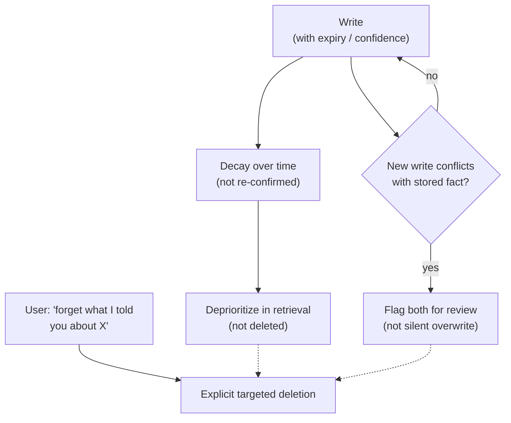

Every other post in this series has been about getting information into memory reliably — compacting before truncation, typing memory correctly, resolving identity, compressing without losing precision. This one is about the opposite problem, and it's the one I'd flag as the least solved of the whole series: a memory store that only ever accumulates and never revises what it holds doesn't get more useful over time, it gets more confidently wrong. A fact written six months ago — "the user is on the free tier" — that quietly became false two months ago when they upgraded doesn't sit there harmlessly waiting to be irrelevant. It gets retrieved, presented with exactly the same confidence as a fact confirmed yesterday, and the agent acts on it. The user experiences that as the agent being wrong about something it should obviously know, and they're right to read it that way.



## Why this is worse than it sounds

The intuitive framing — "stale memory, fix by deleting old stuff" — undersells the actual failure mode, because staleness isn't uniform and isn't always obvious from the data itself. Some facts have a natural expiration (a subscription tier, a project status, a temporary access grant) and some don't (a name, a stated preference for concise answers, a historical decision that's still the reason things are the way they are). Deleting on a timer treats both the same and gets both wrong: delete too aggressively and you lose facts that were still true and just hadn't been re-mentioned recently; delete too conservatively and the store fills with things that are quietly false. And the failure isn't symmetric in cost — an agent that's lost a still-true fact just re-asks a question, mildly annoying. An agent that acts on a false fact with full confidence gives a wrong answer, and depending on the domain that's a support ticket, a compliance problem, or worse.

I want to be direct about where the field actually stands on this, because it's the honest thing to say and the more useful one: as of early 2027, this remains genuinely unsolved. The approaches below reduce how often stale-memory mistakes happen. None of them eliminate the problem, and I'd be skeptical of anyone claiming otherwise.

## Four mitigations, in the order most teams should adopt them

**1. Explicit expiration.** Some fact types have a knowable validity window, and for those, tag the expiry at write time instead of leaving the system to guess later. A subscription tier, a temporary permission grant, a "currently working on" project status — these have a natural shelf life that's usually knowable from the domain, and the cheapest fix available is simply writing that shelf life down when the fact is stored. This handles a meaningful chunk of staleness cases with close to zero inference required, which is exactly why it should be the first thing implemented, not the most sophisticated.

**2. Confidence decay.** For facts without a knowable expiry, confidence should erode over time if the fact hasn't been re-confirmed by anything in recent interaction — not deleted, deprioritized. The distinction matters: full deletion risks losing something that's still true and simply hasn't come up recently, while decayed confidence lets the retrieval layer rank it lower and, importantly, lets the agent express appropriate uncertainty about it ("as of our last conversation, you were on the free tier — has that changed?") instead of stating it flatly.

**3. Contradiction detection.** When a new write conflicts with an existing stored fact, the correct default is flagging both for review, not silently picking a winner. Silent overwrite assumes the new information is always more current and always correct, which is true often enough to be tempting and wrong often enough to cause real damage — a misheard correction, a one-off exception the user mentioned that isn't actually a permanent change, a data entry error somewhere upstream. Silently keeping the old fact and ignoring the new write is obviously worse. Flagging the conflict, whether to a human reviewer for high-stakes facts or to a lightweight resolution pass for low-stakes ones, is the option that doesn't quietly commit to being wrong in either direction.

**4. Explicit user-initiated forgetting.** "Forget what I told you about X" needs to be a real, supported operation, not an aspiration. This is a harder engineering requirement than it sounds, because it means the memory store needs targeted deletion by content or topic, not just by record ID — a user asking to forget something rarely knows or cares about the internal key it was stored under. It also means the deletion needs to actually propagate: if the fact was ever promoted into a session summary or cached at the session level (post one's promotion mechanism, post seven's session-level caching), forgetting it from the persistent store alone leaves stale copies elsewhere that keep surfacing the thing the user explicitly asked to have removed.

## A confidence-decay function and a contradiction check

```python
import time
import math


def confidence_score(
    base_confidence: float,
    last_confirmed_at: float,
    half_life_days: float = 90.0,
) -> float:
    """Exponential decay: confidence halves every `half_life_days` without
    reconfirmation. Facts with a shorter natural shelf life should use a
    shorter half-life, not this default."""
    age_days = (time.time() - last_confirmed_at) / 86400
    decay_factor = 0.5 ** (age_days / half_life_days)
    return base_confidence * decay_factor


def reconfirm(fact: dict) -> dict:
    """Call whenever a fact is re-stated or explicitly re-confirmed by the
    user — resets decay without requiring a fresh write."""
    fact["last_confirmed_at"] = time.time()
    return fact


def check_contradiction(existing_fact: dict, new_value: str, similarity_fn) -> dict:
    """Returns a decision, never a silent overwrite, when values differ."""
    if existing_fact["value"] == new_value:
        return {"action": "reconfirm", "fact": reconfirm(existing_fact)}

    similarity = similarity_fn(existing_fact["value"], new_value)
    if similarity > 0.85:
        # Likely a rephrasing of the same fact, not a real contradiction.
        return {"action": "update", "fact": {**existing_fact, "value": new_value,
                                              "last_confirmed_at": time.time()}}

    return {
        "action": "flag_for_review",
        "existing": existing_fact,
        "proposed": new_value,
        "reason": "conflicting values, low similarity — do not auto-resolve",
    }


def forget(memory_store, topic_query: str, user_id: str) -> list[str]:
    """Targeted deletion by topic, not just record ID — and the caller is
    responsible for propagating this to any session-level cache or summary
    that might have copied the fact elsewhere."""
    matches = memory_store.find_by_topic(user_id, topic_query)
    deleted_ids = [m["id"] for m in matches]
    memory_store.delete_many(deleted_ids)
    return deleted_ids
```

The `check_contradiction` function's middle branch — a high-similarity difference treated as an update rather than a conflict — is doing real judgment work and it's worth being honest that the 0.85 threshold is a starting point, not a validated constant. Tune it against real conflicting-write examples from your own domain before trusting it; a threshold set too low will flag genuine minor updates as review-worthy noise, and one set too high will silently swallow real contradictions the same way naive overwrite would.

## What "solved" would even look like

I don't think this problem gets fully solved by better scoring functions — the actual fix for the hardest cases is closer to giving the agent enough situational awareness to hedge appropriately ("I have this on file from a while back, worth confirming it's still accurate") rather than pretending certainty it doesn't have. That's a harder capability than any of the four mechanisms above, and it's where I'd expect the real progress to come from over the next year rather than from incrementally better decay curves. Until then, the honest posture is: implement expiration and decay because they're cheap and catch the obvious cases, implement contradiction detection because silent overwrite is genuinely dangerous, support explicit forgetting because users will ask for it and deserve it to work — and keep watching for the cases these four don't catch, because there will be some.
