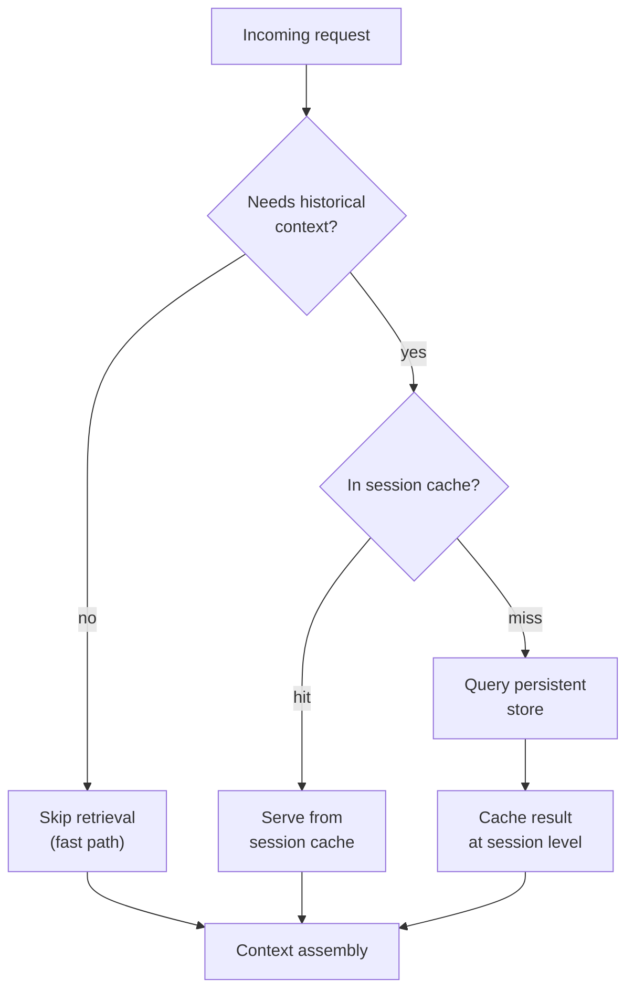

Every post so far in this series has argued for building richer memory into agents, and this one is the necessary counterweight: memory isn't free, and the bill doesn't show up where teams usually look for it first. A memory-augmented agent pays LLM inference cost the same as a stateless one, and on top of that it pays retrieval latency — a vector search, sometimes a graph traversal if you're using the hybrid patterns from the January knowledge management series — on every turn that queries persistent storage, plus the token cost of whatever gets pulled back and stuffed into context. I've seen teams tune their model choice carefully for cost and latency and then wire memory retrieval into every single turn unconditionally, adding 200-400ms and a meaningful token tax to requests that never needed historical context in the first place.



## The retrieval budget question

Not every request benefits from a memory lookup, and the cost of running one unconditionally is easy to underestimate because it's paid in small, distributed increments rather than one visible line item. A follow-up that says "what we discussed before, but for the other account" clearly needs historical context — there's no other way to resolve "the other account" or "before." A fully self-contained request — "summarize this document," with the document attached — doesn't benefit from a memory lookup at all, and running one anyway adds latency and token cost for a lookup whose result the model was never going to use.

The fix is a classification step ahead of retrieval, not a blanket policy in either direction. Classify the request cheaply — this doesn't need a full model call, a lightweight heuristic or a small fast model gets most of the value — and skip retrieval on the fast path when the request is self-contained.

```python
import re

REFERENTIAL_PATTERNS = [
    r"\b(as (we|you) (discussed|mentioned|said))\b",
    r"\b(before|earlier|last time|previously)\b",
    r"\b(the (other|same) (one|account|project))\b",
    r"\b(remember|recall)\b",
    r"\b(you (know|already have)\b)",
]

def needs_historical_context(request_text: str, has_attached_content: bool) -> bool:
    if has_attached_content and not any(
        re.search(p, request_text, re.IGNORECASE) for p in REFERENTIAL_PATTERNS
    ):
        # Self-contained request with everything it needs attached, and no
        # explicit reference to prior context. Fast path.
        return False

    if any(re.search(p, request_text, re.IGNORECASE) for p in REFERENTIAL_PATTERNS):
        return True

    # Default: for genuinely ambiguous requests, err toward retrieving —
    # a missed retrieval costs more (a wrong or generic answer) than an
    # unnecessary one (some added latency).
    return not has_attached_content
```

This classifier is intentionally simple, and simple is defensible here: the cost of a false positive (retrieving when it wasn't needed) is bounded and small, while the cost of a false negative (skipping retrieval when it was needed) is a visibly worse answer. That asymmetry is why the default in the ambiguous case above leans toward retrieving rather than skipping — get the threshold wrong in the other direction and users notice the agent "forgetting" things far more than they notice a slightly slower response.

## Caching what gets asked for repeatedly

A meaningful share of what gets retrieved from persistent memory in any given session is the same handful of facts, over and over — a user's core profile, their stated preferences, the identity of the project they're currently working on. Re-querying the persistent store for the same facts on every turn of a session is pure waste; the fix is a session-level cache, populated once at session start (this is exactly the relevance-filtered load from post four) and consulted before any persistent-store query fires.

```python
class SessionMemoryCache:
    def __init__(self, persistent_store, ttl_seconds: int = 3600):
        self.store = persistent_store
        self.ttl_seconds = ttl_seconds
        self._cache: dict[str, tuple[float, list]] = {}

    def get(self, user_id: str, query: str) -> list:
        key = f"{user_id}:{query}"
        cached = self._cache.get(key)
        if cached:
            cached_at, result = cached
            if time.time() - cached_at < self.ttl_seconds:
                return result

        result = self.store.retrieve(user_id, query)
        self._cache[key] = (time.time(), result)
        return result

    def invalidate(self, user_id: str):
        # Call this whenever a write happens mid-session — the staleness
        # post's contradiction handling and this cache need to agree on
        # when cached facts stop being trustworthy.
        stale_keys = [k for k in self._cache if k.startswith(f"{user_id}:")]
        for k in stale_keys:
            del self._cache[k]
```

The invalidation hook matters as much as the cache itself — a cache that outlives a write to the underlying fact reintroduces exactly the staleness problem post six spent an entire post on, just at a shorter timescale. Any write path that updates persistent memory mid-session needs to call `invalidate`, not just append to the store and assume the cache will catch up on its own TTL.

## A worked comparison

Rough numbers from a support-agent workload I've measured, per request, with a mid-size embedding retrieval step (~150ms) and a modest context addition (~800 tokens) when retrieval fires:

| Approach | Retrieval calls/session (20 turns) | Added latency (avg/request) | Added tokens (avg/request) |
|---|---|---|---|
| Stateless (no memory) | 0 | 0ms | 0 |
| Always-retrieve | 20 | ~150ms | ~800 |
| Classified retrieval + session cache | ~4 | ~30ms | ~160 |

The always-retrieve column isn't hypothetical — it's what a naive "just wire memory into every turn" implementation produces, and it's the version most teams ship first because it's the simplest thing to build. The classified-retrieval column comes from applying the two mechanisms above: skip retrieval on self-contained turns, and serve repeated lookups from the session cache instead of re-querying. Neither mechanism is exotic, and together they cut both added latency and added token cost by roughly 80% on this workload without giving up any of the continuity that made memory worth building in the first place — the turns that genuinely needed a fresh retrieval still get one.

## The actual point

Memory retrieval cost isn't a reason to avoid building the three-tier architecture this series has been arguing for — it's a reason to budget it deliberately instead of wiring it in unconditionally and discovering the cost in a latency dashboard three weeks after launch. The pattern that holds up in practice is small and boring: classify before you retrieve, cache what repeats within a session, and invalidate the cache the moment the underlying fact changes. None of that requires new infrastructure beyond what the earlier posts in this series already assume — it requires treating "does this turn actually need a memory lookup" as a real question with a real answer, rather than a default that's always yes.
