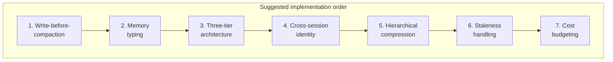

Seven posts, seven pieces of one system: the three-tier architecture, write-before-compaction, typed persistent storage, cross-session identity, hierarchical compression, staleness handling, and cost budgeting. None of them work as well in isolation as they do together — typed memory storage without staleness handling just gives you three flavors of stale data instead of one; write-before-compaction without cost-aware retrieval means you're now paying to summarize content that a classifier would have told you didn't need retrieving in the first place. This closing post is the synthesis: a checklist organized around the same seven areas, and an honest read on which of them most teams actually have working today.

## The checklist

**1. Architecture — three tiers defined, promotion rules explicit**
- [ ] Working, session, and persistent memory are distinct, with clear ownership of what lives in each
- [ ] Promotion from working → session triggers on a usage threshold, not on hitting the hard limit
- [ ] Promotion from session → persistent is selective — happens at defined checkpoints, not automatically for everything
- [ ] Retrieval from session/persistent back into working memory is demand-driven, not unconditional

**2. Compaction — write-before-compaction implemented, not naive truncation**
- [ ] No code path drops context without first writing a summary of what's being dropped
- [ ] Summarization is anchored/incremental, not a full re-summarization of the entire history on every trigger
- [ ] The summarization prompt distinguishes durable content (decisions, facts, open questions) from safe-to-drop content (filler, resolved back-and-forth, superseded reasoning)

**3. Memory typing — semantic/episodic/procedural distinguished, not one flat store**
- [ ] Facts, events, and procedures are stored with type-appropriate write semantics (overwrite, append, keyed lookup respectively)
- [ ] Procedural retrieval is trigger-matched, not purely similarity-based
- [ ] Episodic retrieval supports chronological queries, not only similarity search

**4. Cross-session identity — resolution logic tested, consent/visibility for users**
- [ ] Persistent memory keys on a stable user identity, never a session ID
- [ ] Session-start memory load is relevance-filtered (recency + frequency + explicit pins), not a full history dump
- [ ] Users can see what's remembered about them and correct or delete individual entries — not just clear everything

**5. Compression — hierarchical scheme in place, compression ratio validated empirically**
- [ ] Recent content stays verbatim; older content compresses progressively (bullet summary, then one-line)
- [ ] Precision-critical content (error text, exact figures, code, version strings) is exempted from summarization and carried verbatim
- [ ] Compression ratio is validated against task success rate on your own workload, not assumed from a general rule of thumb

**6. Staleness — expiry or decay scoring implemented, contradiction detection, user-initiated forgetting supported**
- [ ] Facts with a knowable shelf life carry an explicit expiry
- [ ] Facts without a knowable expiry decay in confidence rather than being trusted indefinitely
- [ ] Conflicting writes are flagged for review rather than silently overwritten or silently ignored
- [ ] "Forget what I told you about X" is a real, working, targeted-deletion operation — including propagation to any session-level cache

**7. Cost — retrieval classified, not unconditional**
- [ ] Requests are classified for whether they benefit from historical context before a retrieval call fires
- [ ] Frequently-repeated lookups within a session are served from a session-level cache, not re-queried against the persistent store every turn
- [ ] The cache is invalidated on writes, so it never serves a fact past the point it's been corrected or superseded

## Where most teams actually are

I'd put the honest maturity picture like this: most production agent memory systems I've seen or worked on as of early 2027 implement two to three of these seven areas solidly and treat the rest as acknowledged future work. Architecture and compaction tend to be the two that get built first and built reasonably well, because their failure modes (context overflow, silent truncation) are the ones that break a demo immediately and get fixed before anything ships. Staleness handling is reliably the weakest — it's the area this series was most honest about being unsolved, and that's not a coincidence; it's the piece that only shows up as a problem weeks or months into production use, well after the team that built the memory system has moved on to the next feature, and it tends to get discovered by a user complaint rather than an internal review.

Cost budgeting is the other common gap, but for a different reason — it's not intellectually hard, it's just easy to skip because "make memory work at all" is the pressure during initial build, and "make memory work efficiently" only becomes a visible priority once a latency or billing dashboard forces the conversation. Both gaps are fixable without redesigning the system around them, which is exactly why I'd treat them as backlog items worth scheduling deliberately rather than reasons to hold up a launch.

## Where to start if you're building this from scratch

Two investments earn their cost faster than the rest, and I'd start there rather than trying to build all seven at once:

**Write-before-compaction first**, because it prevents the single most damaging failure mode in this whole list — silent context loss — with implementation effort that's genuinely modest. It's a summarization call gated behind a threshold check. There's no new infrastructure, no new storage system, no schema design; it's a few hours of work that removes an entire class of bug that otherwise surfaces as confusing, hard-to-reproduce agent behavior weeks after launch.

**Memory typing second**, because retrieval quality degraded by mixed memory types is the second most common failure mode, and it's also cheap relative to its payoff — metadata-tagged collections with type-specific write and retrieve logic, not three separate database systems. Teams that skip this tend to discover the problem the same way: retrieval quality that was fine in testing degrades gradually as the store accumulates a mix of facts, events, and procedures that a single similarity search was never going to serve well simultaneously.

Everything else in the checklist — the full three-tier promotion logic, cross-session identity and consent, hierarchical compression tuned empirically, staleness scoring, cost-aware retrieval — is real work worth doing, and this series covered each of them in enough depth to build from. But if the goal is the highest return for the least initial complexity, those two are where I'd point a team starting today: they prevent the failures that are most damaging and most avoidable, for the least amount of code.
