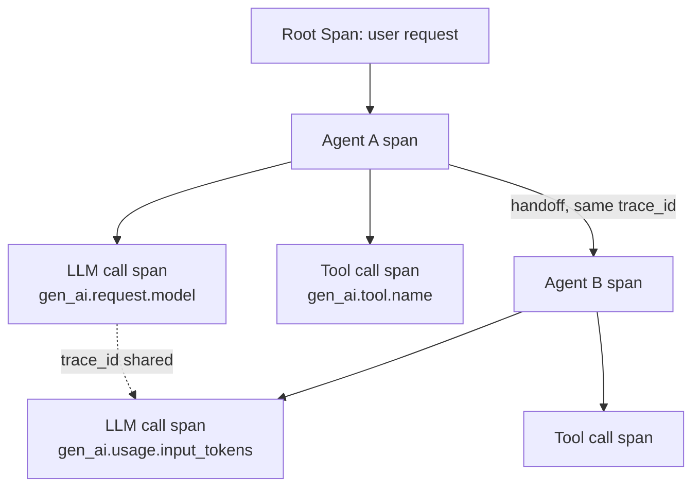

Generic HTTP tracing tells you a request came in, some services were called, and a response went out. That's not the question you're asking when a multi-agent pipeline produces a wrong answer. You're asking: which agent made the decision that led here, what tool did it call and with what arguments, and at which of the six hops in the chain did things go sideways. A span that just says `POST /v1/chat/completions — 200 OK — 1.2s` answers none of that. I covered tracing a specific wrong-answer chain back through four hops back in January — this post is about the instrumentation layer that makes that kind of trace possible in the first place, using a format that isn't tied to one vendor's SDK.



## Why generic tracing conventions fall short

OpenTelemetry's original semantic conventions were built for the world of HTTP services and database calls — `http.method`, `http.status_code`, `db.statement`. Those attributes describe a request-response interaction with a fixed shape. An LLM call isn't that. It has a model, a prompt, a token count on the way in and a different token count on the way out, a temperature setting that affects reproducibility, and a "finish reason" that tells you whether the model stopped naturally, hit a tool call, or got truncated. None of that has a home in the generic conventions, so teams instrumenting agents by hand end up inventing their own attribute names — `model_used`, `llm.model`, `ai.model.name` — and every tool downstream has to special-case each variant.

The `gen_ai.*` semantic conventions (part of OTel's semantic-conventions project, stable enough by 2027 that most agent frameworks and observability backends support them natively) standardize this. The payoff isn't aesthetic — it's that a trace exported from a custom LangGraph agent and a trace exported from a CrewAI pipeline use the same attribute names, so the same dashboard and the same alerting rules work on both.

## The core attributes that matter

```python
GEN_AI_ATTRIBUTES = {
    "gen_ai.system": "anthropic",              # or "openai", "azure_openai", etc.
    "gen_ai.request.model": "claude-sonnet-4-5",
    "gen_ai.request.temperature": 0.2,
    "gen_ai.request.max_tokens": 1024,
    "gen_ai.response.finish_reasons": ["tool_calls"],
    "gen_ai.usage.input_tokens": 842,
    "gen_ai.usage.output_tokens": 156,
}
```

Two things matter beyond the names themselves. First, `gen_ai.usage.input_tokens` and `gen_ai.usage.output_tokens` are what you'll aggregate for cost attribution later in this series — get them on every LLM span from day one, because retrofitting cost visibility onto traces that never captured token counts means you have no historical data to look back at. Second, `gen_ai.system` plus `gen_ai.request.model` together are what let you compare cost and latency across providers and model tiers in the same query, which matters the moment you're running a cheap model for triage and an expensive one for synthesis in the same pipeline.

## Span hierarchy: agent, LLM call, tool call

The nesting is what makes a trace readable as a story instead of a flat list. An agent span is the parent; each LLM call and each tool call the agent makes are children of that agent span, not siblings of it.

```python
from opentelemetry import trace
from opentelemetry.trace import SpanKind

tracer = trace.get_tracer("multi_agent.core")

def run_agent(agent_name: str, task: dict, session_id: str):
    with tracer.start_as_current_span(
        f"agent.{agent_name}",
        attributes={
            "agent.name": agent_name,
            "agent.session_id": session_id,
        },
    ) as agent_span:
        response = traced_llm_call(task["prompt"], model="claude-sonnet-4-5")
        if response.finish_reason == "tool_calls":
            for call in response.tool_calls:
                traced_tool_call(call.name, call.arguments)
        agent_span.set_attribute("agent.outcome", "completed")
        return response

def traced_llm_call(prompt: str, model: str):
    with tracer.start_as_current_span(
        "gen_ai.chat",
        kind=SpanKind.CLIENT,
        attributes={
            "gen_ai.system": "anthropic",
            "gen_ai.request.model": model,
        },
    ) as span:
        response = call_llm(model, prompt)
        span.set_attributes({
            "gen_ai.usage.input_tokens": response.usage.input_tokens,
            "gen_ai.usage.output_tokens": response.usage.output_tokens,
            "gen_ai.response.finish_reasons": [response.finish_reason],
        })
        return response

def traced_tool_call(tool_name: str, arguments: dict):
    with tracer.start_as_current_span(
        f"gen_ai.execute_tool.{tool_name}",
        attributes={
            "gen_ai.tool.name": tool_name,
            "gen_ai.tool.call.arguments": str(arguments)[:1000],
        },
    ) as span:
        try:
            result = execute_tool(tool_name, arguments)
            span.set_attribute("tool.success", True)
            return result
        except Exception as e:
            span.record_exception(e)
            span.set_attribute("tool.success", False)
            raise
```

Because `start_as_current_span` uses a context manager, OTel handles the parent-child linkage automatically through the active span context — you don't manually pass span IDs down. What you do have to manage deliberately is the next part.

## Propagating trace context across agent handoffs

The failure mode I see most often in half-instrumented multi-agent systems: each agent produces a clean, well-formed trace, and every one of those traces has a different trace ID. Agent A's work and Agent B's work show up as two unrelated executions in the backend, and reconstructing "this was one user request that hopped through five agents" requires manually correlating timestamps and session IDs after the fact — exactly the kind of forensic work a trace is supposed to eliminate.

The fix is to propagate OTel's context object across the handoff boundary, not just the business payload.

```python
from opentelemetry import context, trace
from opentelemetry.propagate import inject, extract

def handoff_to_agent(agent_b_name: str, payload: dict):
    carrier = {}
    inject(carrier)  # serializes the current trace context (trace_id, span_id)
    return {
        "payload": payload,
        "otel_context": carrier,  # goes wherever agent B picks up work — queue, HTTP call, function arg
    }

def receive_handoff(message: dict):
    ctx = extract(message["otel_context"])
    token = context.attach(ctx)
    try:
        return run_agent(agent_name="agent_b", task=message["payload"], session_id=message["payload"]["session_id"])
    finally:
        context.detach(token)
```

Whether the handoff happens as a direct function call, a message on a queue, or an HTTP call to a separately deployed agent service, the pattern is the same: serialize the context on the way out, extract and attach it on the way in. Do this at every hop and a single trace ID follows the whole execution — one trace tree, root to leaf, spanning every agent in the chain, regardless of how many separate processes or services those agents actually run in.

## Exporting to a backend

None of the above cares what backend receives the spans — that's the point of using OTLP as the export format.

```python
from opentelemetry.sdk.trace import TracerProvider
from opentelemetry.sdk.trace.export import BatchSpanProcessor
from opentelemetry.exporter.otlp.proto.grpc.trace_exporter import OTLPSpanExporter

provider = TracerProvider()
provider.add_span_processor(
    BatchSpanProcessor(OTLPSpanExporter(endpoint="http://otel-collector:4317"))
)
trace.set_tracer_provider(provider)
```

Point that endpoint at a self-hosted OTel Collector, Jaeger, Grafana Tempo, or a commercial platform's OTLP ingest — the instrumentation code above doesn't change. That portability is the actual argument for standardizing on `gen_ai.*` conventions instead of a vendor SDK's proprietary decorators: the next post in this series is about deciding which of those backends is worth paying for, and the instrumentation investment you make here isn't wasted no matter which way that decision goes.
