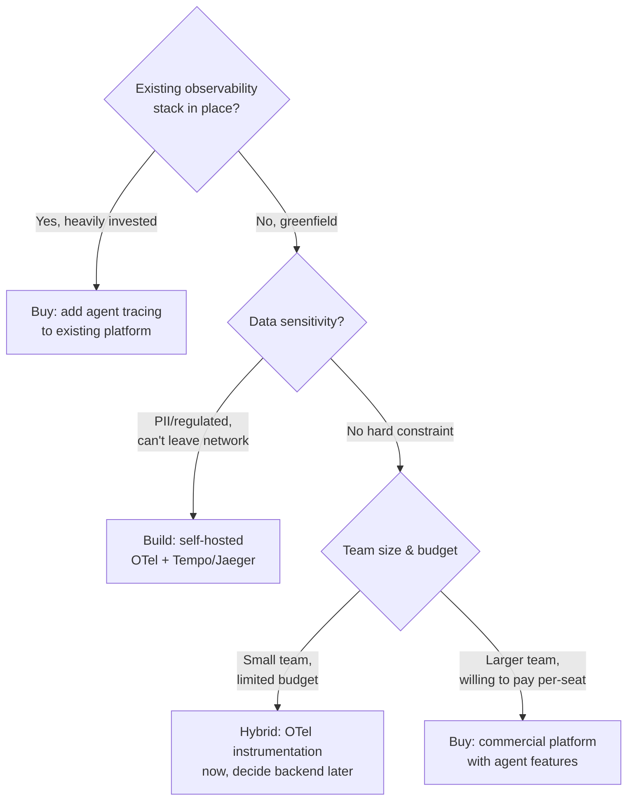

Yesterday's post covered instrumenting agents with OpenTelemetry's `gen_ai.*` conventions — vendor-neutral spans that any OTLP-compatible backend can ingest. That instrumentation is a means, not an end. The actual decision teams get stuck on is what receives those spans: a self-hosted open-source stack you own end to end, or a commercial platform you pay for that does more with the same data than a generic trace viewer does out of the box. I've made this call twice on real teams, gotten it wrong once, and the framework below is what I'd use going in a third time.



## The build option

Building means: the OTel instrumentation from the prior post, an open trace backend (Jaeger, Grafana Tempo, or a self-hosted OTel Collector feeding whatever storage you already run), and dashboards you construct yourself on top of the span data. The appeal is real — no per-span pricing, no vendor lock-in, and you control retention, access, and where the data physically lives.

The cost that gets underestimated is the second half of that sentence: "dashboards you construct yourself." Jaeger and Tempo are excellent at storing and querying trace data. Neither ships with a view that understands "this span is a handoff to another agent" versus "this span is a tool call" versus "this span is a human approval checkpoint" — because those concepts don't exist in generic distributed tracing. You get a correct, complete waterfall of spans and zero agent-specific visualization. Building that view — color-coding by span type, collapsing parallel agent branches into something readable, surfacing tool arguments inline instead of requiring a click into every span — is a real frontend project, not a config file. I'll walk through what that build looks like in the next post in this series; budget it as weeks, not a weekend.

```yaml
# minimal self-hosted OTel Collector config routing to Tempo
receivers:
  otlp:
    protocols:
      grpc:
      http:
exporters:
  otlp/tempo:
    endpoint: tempo:4317
    tls:
      insecure: true
service:
  pipelines:
    traces:
      receivers: [otlp]
      exporters: [otlp/tempo]
```
{: file="otel-collector-config.yaml" }

That config is genuinely five minutes of work. The dashboard on top of it is not.

## The buy option

By 2026, most of the major observability platforms — Honeycomb and Datadog among them — had shipped agent-specific features on top of their existing OTel ingest: timeline visualizations that distinguish reasoning steps from tool calls, cost attribution rolled up per agent and per model automatically once `gen_ai.usage.*` attributes are present, and in some cases an AI-assisted layer that proposes root causes for a failed trace (worth its own honest treatment — that's later in this series). The pitch is straightforward: the instrumentation work from the prior post is the same either way, but the visualization and analysis layer arrives built, instead of being a project you own.

What you're paying for isn't the storage — trace storage is commodity. You're paying for the team of people who built the agent-aware UI so you don't have to, and for them continuing to build it as the norms around what an agent trace should look like keep shifting. That's a legitimate thing to pay for. It's also genuine lock-in: dashboards, saved queries, and alert configurations built on a specific platform's UI don't travel if you switch. The instrumentation does — the dashboards don't.

## The decision axes

**Existing observability investment.** If your team already runs Datadog or Honeycomb for every other service you operate, routing agent traces into the same platform is close to free incrementally — one more OTLP exporter target, one more set of dashboards inside a tool your on-call already lives in. Standing up a separate Jaeger or Tempo instance just for agent traces means your team now context-switches between two observability tools during an incident, which is its own tax that's easy to discount until 2am.

**Data sensitivity.** If agent traces carry PII, PHI, or content your legal or security team has flagged as unable to leave your network boundary, that's frequently the constraint that ends the discussion before cost or convenience even enter it. Self-hosted wins by policy, not by preference. Truncating or hashing sensitive attributes before export is a mitigation, not a substitute for the conversation with whoever owns that policy.

**Budget at scale.** Per-seat and per-span commercial pricing is easy to justify at pilot volume and can get expensive fast once a multi-agent system is handling real production traffic — a single user request that fans out across five agents can generate dozens of spans, and that multiplies against your actual request volume, not your headcount. Model the cost at your expected production trace volume before committing, not at the trial-tier volume the sales conversation was priced against.

**Team size.** A two-person platform team building and maintaining a custom Tempo-based dashboard on top of everything else they own is a real opportunity cost — that's engineering time not spent on the product. A larger platform org with dedicated observability engineers can absorb that build and may prefer the control it buys them.

## The hybrid pattern most teams actually land on

Given the choice isn't really binary in practice. The instrumentation layer — OTel spans using `gen_ai.*` conventions, propagated correctly across agent handoffs — is the vendor-neutral part, and it costs the same to build regardless of where the data ends up. Route that instrumentation to a commercial backend now, while the team is small and the priority is shipping, with the explicit understanding that you can point the same OTLP exporter at a self-hosted collector later if data sensitivity requirements change, if the per-span bill grows past what it's worth, or if you outgrow what the commercial platform's agent features cover.

```python
import os
from opentelemetry.exporter.otlp.proto.grpc.trace_exporter import OTLPSpanExporter

# Backend is a config value, not a code change
exporter = OTLPSpanExporter(
    endpoint=os.environ["OTEL_EXPORTER_OTLP_ENDPOINT"],
    headers={"api-key": os.environ.get("OTEL_EXPORTER_API_KEY", "")},
)
```

That one environment variable is the entire cost of keeping this decision reversible — as long as the instrumentation itself stays disciplined about using standard conventions instead of a vendor SDK's proprietary decorators. The mistake worth avoiding isn't picking build or buy. It's letting your agent code get wired directly to one vendor's SDK such that the instrumentation itself has to be rewritten if the backend decision changes. Keep the two decoupled and this stops being a one-way door.
