I mentioned in the last post that a generic Jaeger or Tempo waterfall gives you a correct trace and no agent-specific visualization. Worth being precise about what that actually costs you, because "correct but hard to read" undersells the problem. A standard waterfall view is optimized for one question: how long did each span take, and what's nested inside what. That's the right question for a microservice call graph. It is not the question an engineer is actually asking when a multi-agent pipeline misbehaves — which is closer to "what was this agent thinking, what did it actually do, and where did the two agents running in parallel diverge from each other."

```mermaid
gantt
    title Multi-agent execution timeline (color = span type)
    dateFormat X
    axisFormat %Ls
    section Agent A (reasoning)
    LLM call — plan          :active, a1, 0, 800
    section Agent A (tool)
    web_search               :crit, a2, 800, 2600
    section Agent B (reasoning, parallel)
    LLM call — draft         :active, b1, 800, 1400
    section Agent B (tool)
    db_query                 :done, b2, 1400, 1700
    section Handoff
    A to C context pass      :milestone, 2600, 0
    section Agent C (checkpoint)
    human approval wait      :crit, c1, 2600, 5200
```



## What a waterfall view shows and what it hides

A generic distributed-tracing waterfall does two things well: duration and nesting. Every span gets a bar proportional to how long it took, indented under its parent. That's genuinely useful — it's exactly how you'd spot that one span dominates total latency. What it doesn't give you, because the concept doesn't exist in generic tracing, is any visual distinction between span *kinds*. An LLM reasoning call, a tool invocation, a handoff to another agent, and a paused human-approval checkpoint all render as the same gray bar with a name label. You can tell one took 3 seconds and another took 30. You cannot tell at a glance which one was the model thinking and which one was waiting on a person, and that distinction is exactly what an engineer needs first when triaging a slow or failed run.

The other gap is concurrency. Multi-agent systems increasingly run agents in parallel — a research agent and a drafting agent working off the same input simultaneously, converging later. A standard waterfall represents concurrent spans as parallel bars at the same vertical level, which is technically correct and practically unreadable once you have more than two or three concurrent branches, because there's no visual grouping that says "these three spans are one agent's parallel work and that's a different agent running alongside it."

## What a good agent timeline actually needs

Three things, none of them exotic:

**Visual distinction by span type.** Reasoning (LLM call), tool call, handoff, and human checkpoint each need a distinct color or shape, not just a text label you have to read one span at a time. This is the single highest-leverage change — once color tells you span type, scanning a 40-span trace for "where did we wait on a tool versus a human" becomes a glance instead of a read.

**Grouped parallel branches.** Concurrent agents should visually cluster as siblings under whatever spawned them, with the branch structure legible without expanding every node. The goal is answering "did agent B start before or after agent A finished" without clicking into either.

**Inline content, not just labels.** A tool call span that says `tool.web_search` tells you a search happened. It doesn't tell you what was searched for. The actual argument value — truncated, but present — needs to render in the timeline itself or on hover, not require a separate click-through for every span you're inspecting. This is the difference between reading a trace in thirty seconds and reading it in five minutes.

## What shipped commercially by 2026

Several observability vendors added agent-timeline features through 2026 on top of their existing OTel ingest — color-coded span-kind rendering, cost and token counts surfaced inline on LLM spans, and collapsible groupings for parallel agent branches. The specifics vary by vendor and are moving fast enough that naming exact feature sets here would be stale within a quarter. The pattern worth taking away, independent of which vendor you use, is that the `gen_ai.*` attributes from the first post in this series — `gen_ai.system`, `gen_ai.tool.name`, the usage counters — are what any of these visualizations key off of. Instrument well and the vendor's timeline view (or your own, if you're self-hosting) has the data it needs to render span-type distinctions and inline content automatically, without any vendor-specific decoration in your agent code.

## Building a minimal version yourself

If you're on the self-hosted side of the build-vs-buy decision, you don't need a full custom frontend to get most of the value — Grafana's Tempo data source supports coloring by span attribute, which gets you most of the way to "visually distinguish span type" without writing a UI.

```python
# tag every span with a normalized span.kind attribute at creation time —
# this is the one thing a Grafana color-by-attribute panel needs to exist
SPAN_KIND_REASONING = "reasoning"
SPAN_KIND_TOOL = "tool_call"
SPAN_KIND_HANDOFF = "handoff"
SPAN_KIND_CHECKPOINT = "human_checkpoint"

def traced_llm_call(prompt: str, model: str):
    with tracer.start_as_current_span(
        "gen_ai.chat",
        attributes={"span.kind.custom": SPAN_KIND_REASONING, "gen_ai.request.model": model},
    ) as span:
        ...

def traced_handoff(from_agent: str, to_agent: str):
    with tracer.start_as_current_span(
        f"handoff.{from_agent}_to_{to_agent}",
        attributes={"span.kind.custom": SPAN_KIND_HANDOFF},
    ) as span:
        ...
```

With `span.kind.custom` consistently set, a Grafana Tempo panel can color spans by that attribute — reasoning in blue, tool calls in amber, handoffs in purple, checkpoints in gray — and you've recovered most of the visual distinction a commercial agent-timeline feature gives you, for the cost of a consistent tagging convention rather than a frontend build. It won't get you inline tool-argument rendering without more work on top, but span-type color coding alone fixes the most common source of confusion when reading a trace cold.

## A debugging example this actually helps with

A pipeline that normally completed in under 10 seconds started intermittently taking 40. Application logs showed nothing unusual — no errors, no retries logged. In a plain waterfall, the long run just showed one span with a long bar, and the label alone didn't say whether that was the model taking longer to reason or a downstream API being slow. With span-type coloring in place, the long bar was unambiguously amber — a tool call, not reasoning — and the tool name attribute pointed straight at a third-party enrichment API that had started rate-limiting under load. Without the color distinction, the natural first guess would have been "the model is being slow," which would have sent the investigation toward prompt tuning and model selection — exactly the wrong direction, and a plausible enough wrong guess that it could easily have burned an afternoon before someone thought to check the tool call itself.

That's the actual payoff of timeline visualization done right: it doesn't just make traces prettier, it steers the first hypothesis in a debugging session toward the right subsystem instead of the wrong one.
