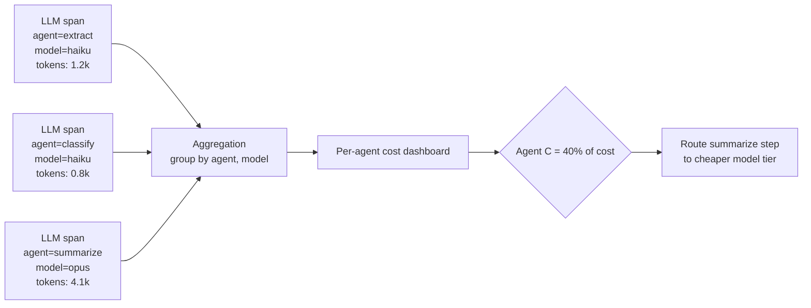

Every team I've worked with can answer "what did our AI spend look like last month" within a few minutes — it's a number on an invoice or a gateway dashboard. Almost none of them can answer "which agent in our five-agent pipeline is responsible for most of that number" without a special investigation, because that requires attribution at a granularity most teams never instrumented for. I covered LLM gateway cost tracking earlier on this blog at the team and feature level; this is the same problem one level down, inside a single multi-agent request, where the aggregate number hides which specific hop is actually expensive.



## The blind spot

The gap isn't a lack of data — every LLM call already returns token counts in its response, and most gateways log total spend somewhere. The gap is that the token counts and the agent identity live in different places by the time anyone goes looking. The gateway sees a request come from "the pipeline service" and logs a cost against that service. It has no idea that request was agent C's summarization step versus agent A's initial extraction step, because that distinction lives inside your application code, not in the HTTP request the gateway actually saw. Answering "which agent costs the most" after the fact means correlating gateway logs with application logs by timestamp and hoping nothing else was happening concurrently. That doesn't scale and it isn't reliable.

## Instrumenting at the span level

The fix is the same discipline from the first post in this series: tag every LLM call span with the attributes you'll need for aggregation, at the point where you have them, rather than trying to reconstruct them later.

```python
from opentelemetry import trace

tracer = trace.get_tracer("multi_agent.cost")

MODEL_PRICING = {
    # $ per 1M tokens, input / output — keep this table close to where spans are tagged
    "claude-haiku-4-5": {"input": 0.80, "output": 4.00},
    "claude-sonnet-4-5": {"input": 3.00, "output": 15.00},
    "claude-opus-4-5": {"input": 15.00, "output": 75.00},
}

def traced_llm_call(agent_name: str, prompt: str, model: str):
    with tracer.start_as_current_span(
        "gen_ai.chat",
        attributes={
            "agent.name": agent_name,           # the attribution key
            "gen_ai.request.model": model,
        },
    ) as span:
        response = call_llm(model, prompt)
        cost = estimate_cost(response.usage, model)
        span.set_attributes({
            "gen_ai.usage.input_tokens": response.usage.input_tokens,
            "gen_ai.usage.output_tokens": response.usage.output_tokens,
            "cost.usd": cost,
        })
        return response

def estimate_cost(usage, model: str) -> float:
    rates = MODEL_PRICING[model]
    return (usage.input_tokens / 1_000_000 * rates["input"]
            + usage.output_tokens / 1_000_000 * rates["output"])
```

`agent.name` is the entire trick. Once every LLM span carries which agent made the call, which model it used, and a computed cost, aggregation is a straightforward group-by against your trace store instead of a cross-system correlation exercise.

## Aggregating by agent and model

If your spans land in a queryable store — ClickHouse behind Langfuse, Tempo with a metrics-generator, or a plain warehouse table you export spans into — the aggregation is a query, not a project.

```sql
-- cost by agent, over the last 7 days
SELECT
    attributes['agent.name']          AS agent_name,
    attributes['gen_ai.request.model'] AS model,
    COUNT(*)                           AS call_count,
    SUM(CAST(attributes['cost.usd'] AS FLOAT64)) AS total_cost_usd,
    SUM(CAST(attributes['gen_ai.usage.input_tokens'] AS INT64))
      + SUM(CAST(attributes['gen_ai.usage.output_tokens'] AS INT64)) AS total_tokens
FROM spans
WHERE span_name = 'gen_ai.chat'
  AND start_time >= TIMESTAMP_SUB(CURRENT_TIMESTAMP(), INTERVAL 7 DAY)
GROUP BY agent_name, model
ORDER BY total_cost_usd DESC;
```

Run that weekly and you have a ranked list: which agent, on which model, is driving spend. In practice the distribution is rarely even — one or two agents in a pipeline usually account for the majority of cost, and it's not always the one you'd guess. A summarization step that ingests the full accumulated context from four prior agents and runs it through a high-tier model for a final polish pass is a common example: it looks like the cheapest, simplest step in the pipeline and is frequently the most expensive one, because it's paying the input-token cost of everything upstream.

## Flagging anomalies, not just totals

A weekly total is useful for planning. What catches problems early is the trend, not the snapshot — a specific agent's cost *share* growing week over week is often the first visible symptom of a bug that isn't a cost bug at all.

```python
def flag_cost_share_anomaly(current_week: dict, prior_baseline: dict, threshold_pct: float = 15.0):
    """current_week and prior_baseline: {agent_name: total_cost_usd}"""
    current_total = sum(current_week.values())
    baseline_total = sum(prior_baseline.values())
    anomalies = []
    for agent, cost in current_week.items():
        current_share = cost / current_total if current_total else 0
        baseline_share = prior_baseline.get(agent, 0) / baseline_total if baseline_total else 0
        if current_share - baseline_share > threshold_pct / 100:
            anomalies.append({
                "agent": agent,
                "baseline_share_pct": round(baseline_share * 100, 1),
                "current_share_pct": round(current_share * 100, 1),
            })
    return anomalies
```

I've seen this catch a retry loop before the on-call alerting did — one agent's cost share crept from 12% to 34% of total pipeline spend over four days with no corresponding change in request volume, and the root cause turned out to be a tool call that was silently failing and being retried three extra times per invocation. Nothing threw an exception, error rate didn't move, but the cost share told the story before a user ever complained.

## From dashboard to decision

The point of all this isn't a prettier chart — it's turning "our AI costs feel high" into a specific, actionable claim. When you can say "agent C's summarization step is 40% of total pipeline cost and it's running on our highest tier model for a task that doesn't need frontier-level reasoning," that's a concrete optimization: route that step to a cheaper model, measure whether output quality holds up on your eval set, and ship the change. Without span-level attribution, the same conversation stays stuck at "costs feel high, not sure why" indefinitely — which is a much harder problem to act on than the one you actually have.
