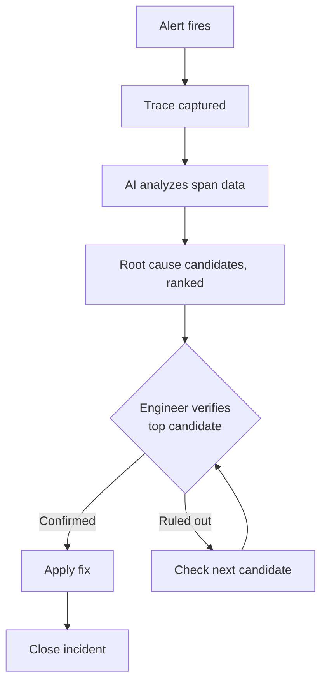

There's a specific moment in an incident that everyone who's been on call knows: the alert fired, you've opened the trace, and it's forty spans deep across six agent hops, and you don't yet know which of those forty spans is the one that matters. That moment — scanning a large trace for the handful of spans worth actually reading closely — is exactly the kind of task an LLM is well suited to, and it's why AI-assisted investigation became a standard feature on observability platforms through 2026. It's also a feature I've watched get misused, so this one comes with a stronger caveat than most posts in this series.



## Why this is a good fit for the problem

Trace data is structured, high-volume, and exactly the shape of thing an LLM scans faster than a human scrolling through a UI: span names, durations, attributes, parent-child relationships, error messages. A human debugging a 40-span trace reads roughly sequentially, or jumps around based on intuition about where problems usually hide. An LLM given the same span data as structured input can compare every span's attributes against expected ranges simultaneously — flagging the tool call whose duration is 8x the historical median for that tool, the LLM span whose `finish_reason` is `length` when every other span in the trace shows `stop`, the agent hop that's the third retry of an identical tool call. None of that requires understanding what the pipeline does; it's pattern matching against the trace's own statistical shape, which is a task LLMs are legitimately good at.

## What this looks like in practice

```python
import json

def summarize_trace_for_investigation(spans: list[dict]) -> str:
    """Reduce a large trace to the anomalous spans, not every span,
    before handing it to an LLM — this matters for cost and for signal."""
    anomalies = []
    for span in spans:
        if span.get("attributes", {}).get("tool.success") is False:
            anomalies.append({"span": span["name"], "issue": "tool_error",
                               "error": span["attributes"].get("tool.error")})
        if span.get("attributes", {}).get("gen_ai.response.finish_reasons") == ["length"]:
            anomalies.append({"span": span["name"], "issue": "context_truncation"})
        if span["duration_ms"] > span.get("baseline_p50_ms", 0) * 5:
            anomalies.append({"span": span["name"], "issue": "latency_outlier",
                               "duration_ms": span["duration_ms"]})
    return json.dumps(anomalies, indent=2)

def propose_root_causes(trace_id: str, anomaly_summary: str) -> str:
    prompt = f"""You are investigating a production incident in a multi-agent system.
Below is a list of anomalous spans extracted from trace {trace_id}.
Propose the 2-3 most likely root causes, ranked, with your reasoning for each.
State explicitly what evidence would confirm or rule out each candidate.

Anomalies:
{anomaly_summary}
"""
    return call_llm(model="claude-sonnet-4-5", prompt=prompt)
```

Two design choices in that snippet matter more than they look like they do. First, pre-filtering to anomalous spans before the LLM call — handing a model every span in a large trace burns tokens on spans that were fine and dilutes the signal the anomaly-flagging already surfaced. Second, and more important: the prompt explicitly asks the model to state what evidence would confirm or rule out each candidate. That's not a nicety — it's the difference between a hypothesis you can act on and a plausible-sounding guess you can't check.

## The honest limitation

An AI-proposed root cause is a hypothesis, generated by pattern-matching against span data, not a verified diagnosis. Treat it as authoritative and you will, eventually, chase the wrong fix — confidently, because the model's explanation reads as coherent and specific even when it's wrong. This isn't a hypothetical risk. I've seen a root-cause suggestion point at "rate limiting on the third-party API" when the actual cause was a malformed retry policy that made three sequential calls look like rate-limit backoff in the span timing. The suggestion wasn't unreasonable given the data it had — the timing pattern really did look like rate limiting — but it was wrong, and an engineer who applied a rate-limit mitigation instead of fixing the retry policy would have "resolved" the alert without touching the actual bug.

The tell for where this works well versus where it doesn't is whether the failure mode has a shape the model has effectively seen before. Context truncation, retry storms, tool errors with a known error string, latency spikes that correlate with a specific downstream dependency — these are common enough failure shapes that an LLM's proposal is usually a reasonable starting hypothesis. A genuinely novel failure mode, or one where the actual cause is business context that isn't present anywhere in the trace — a pricing rule changed, a customer's data has a shape nobody's seen — is exactly where the model will confidently propose something plausible and wrong, because it's pattern-matching against trace shapes, not reasoning about your business.

## Building a lightweight version if you're not using a platform's built-in feature

If your observability backend doesn't ship this and you're not buying one that does, the pattern above is roughly a day of work: export the trace, run the anomaly-flagging pass, prompt for ranked candidates with required evidence statements, surface the result in whatever tool your on-call already uses (a Slack message linking the trace, not a separate dashboard nobody checks during an incident).

```python
def investigate_alert(trace_id: str, spans: list[dict]) -> dict:
    anomaly_summary = summarize_trace_for_investigation(spans)
    if not anomaly_summary or anomaly_summary == "[]":
        return {"status": "no_anomalies_detected", "trace_id": trace_id}
    candidates = propose_root_causes(trace_id, anomaly_summary)
    return {
        "status": "candidates_proposed",
        "trace_id": trace_id,
        "candidates": candidates,
        "note": "Unverified — confirm against evidence before applying a fix.",
    }
```

That `note` field isn't decoration. Whatever surfaces these candidates to an engineer — Slack message, ticket, dashboard panel — should carry that caveat every time, not just in the documentation nobody reads during an incident.

## Where this belongs in the on-call workflow

The right framing is triage accelerant, not oracle. It cuts the time to a first, plausible hypothesis on a large trace from "read forty spans in order" to "read the two spans the model flagged, with reasoning attached." What it doesn't do, and shouldn't be asked to do, is replace the engineer's own verification step before a fix ships. The workflow that's worked for the teams I've seen do this well: AI proposes ranked candidates, an engineer checks the top one against the stated evidence, confirms or rules it out, and moves to the next candidate only if the first doesn't hold up. That loop is faster than starting from a blank trace. It is not faster than starting from a blank trace *and skipping the verification step* — because that version isn't actually faster, it's just wrong more often, and wrong-and-fast is a worse outcome in an incident than slow-and-right.
