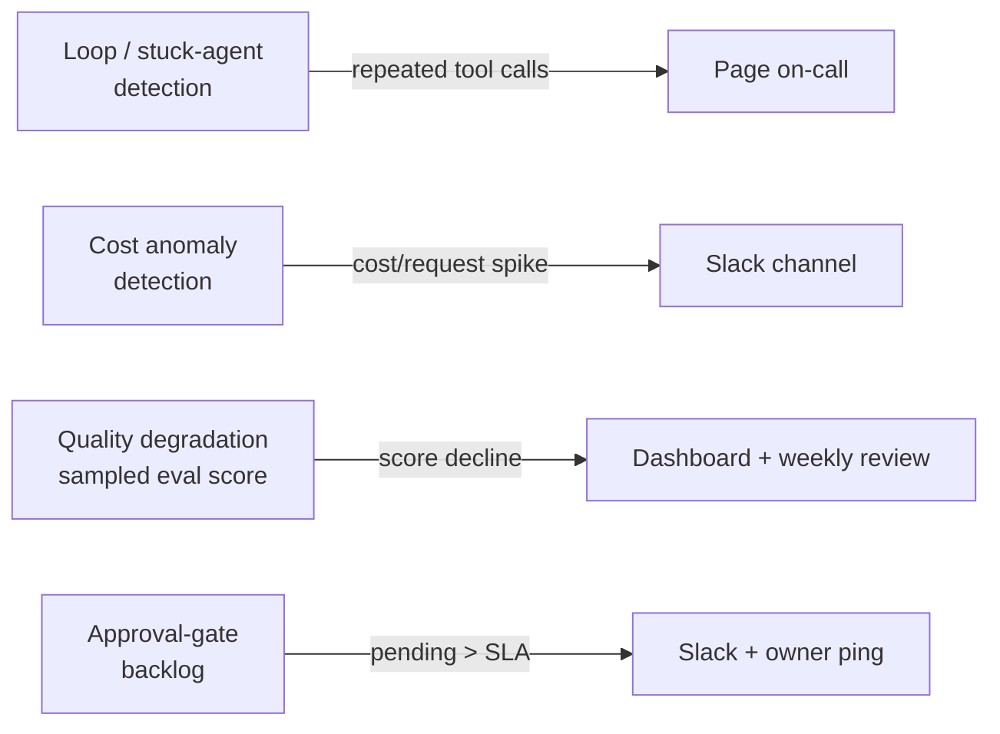

Every alerting setup I've inherited on an agent system started as a copy of whatever alerted on the last non-agent service — 5xx rate, P99 latency, maybe a queue depth. All reasonable, all necessary, and all blind to the failure modes that actually happen to agents in production. An agent stuck calling the same tool eight times in a row doesn't throw an exception — it returns 200 every time. An agent whose answers have quietly gotten worse over the past week doesn't show up in an error-rate dashboard at all. You need a second category of alert built around what actually goes wrong with agents, layered on top of the infrastructure alerting you already have, not instead of it.



## Why traditional alerting under-catches agents

Standard SRE alerting assumes a failure has a signature: an exception, a non-2xx status, a latency spike past a threshold. Agent failure modes routinely don't produce any of those. A retry loop where an agent calls the same tool with the same arguments five times because it doesn't recognize the tool's output as a success condition — I covered this exact pattern as a debugging target back in July — completes "successfully" from the infrastructure's point of view. The request finishes, returns 200, and costs five times what it should have while taking five times as long, and none of your existing alerts notice because nothing errored.

Quality regression is the other blind spot, and it's the more dangerous one because it's silent by default. An agent that starts giving subtly worse answers — a summarization step that starts dropping key details, a classification agent whose accuracy drifts after an upstream data format changes — returns 200 every single time. Nothing in a standard monitoring stack distinguishes a good 200 from a bad one. You need a signal that actually samples output quality, not just whether a response was produced.

## Four alert categories worth building deliberately

**1. Loop / stuck-agent detection.** Alert when an agent exceeds an expected step count for its task type, or when it calls the same tool with materially identical arguments more than N times within one session.

```python
from collections import defaultdict
import hashlib

def detect_stuck_loop(session_spans: list[dict], repeat_threshold: int = 3) -> dict | None:
    """Watches a session's tool-call spans for identical repeated calls."""
    call_signatures = defaultdict(int)
    for span in session_spans:
        if span["name"].startswith("gen_ai.execute_tool"):
            sig = hashlib.sha256(
                f"{span['attributes']['gen_ai.tool.name']}:{span['attributes'].get('gen_ai.tool.call.arguments', '')}".encode()
            ).hexdigest()
            call_signatures[sig] += 1
            if call_signatures[sig] >= repeat_threshold:
                return {
                    "alert": "stuck_loop",
                    "tool": span["attributes"]["gen_ai.tool.name"],
                    "repeat_count": call_signatures[sig],
                    "session_id": span["attributes"].get("agent.session_id"),
                }
    return None
```

This one pages on-call. A stuck agent burns cost and latency in real time and usually indicates a live bug affecting every session hitting the same code path — it's not something that should wait for a morning review.

**2. Cost anomaly detection.** Building directly on the per-agent cost attribution from two posts back — alert when cost-per-request, or a specific agent's cost share, moves meaningfully past its rolling baseline.

```python
def check_cost_anomaly(current_cost_per_request: float, baseline_p50: float, baseline_p95: float) -> dict | None:
    if current_cost_per_request > baseline_p95 * 1.5:
        return {
            "alert": "cost_anomaly",
            "current": current_cost_per_request,
            "baseline_p95": baseline_p95,
            "severity": "moderate",
        }
    return None
```

This one goes to a Slack channel, not a page. A cost spike is worth investigating within the day — it's rarely an active outage, and paging someone at 2am over a budget line item trains your team to ignore pages, which is a worse outcome than a slightly delayed cost investigation.

**3. Quality degradation.** This is the sampled-eval-score monitoring from the continuous quality monitoring approach I covered in December, applied specifically to agent output rather than general production QA — sample a percentage of live agent outputs, score them against an LLM-as-judge or a rule-based rubric, and alert on a sustained decline in the rolling average score, not on any single low-scoring sample.

```python
def check_quality_trend(recent_scores: list[float], baseline_mean: float, std_threshold: float = 2.0) -> dict | None:
    import statistics
    recent_mean = statistics.mean(recent_scores)
    recent_stdev = statistics.stdev(recent_scores) if len(recent_scores) > 1 else 0
    if recent_mean < baseline_mean - std_threshold * (recent_stdev or 1):
        return {"alert": "quality_degradation", "recent_mean": recent_mean, "baseline_mean": baseline_mean}
    return None
```

This one goes to a dashboard with a weekly review, not a page and often not even a same-day Slack message — a single sample dipping isn't a signal, and quality regressions are rarely urgent in the way an outage is. They're important to catch before they compound, not before lunch.

**4. Approval-gate backlog.** For pipelines with human-in-the-loop checkpoints — the LangGraph `interrupt()` pattern I covered in January — alert when pending approvals exceed an SLA, because a silently growing approval queue is functionally an outage for whatever business process is waiting on those approvals, even though nothing in the agent pipeline itself is failing.

```python
def check_approval_backlog(pending_approvals: list[dict], sla_hours: int = 4) -> dict | None:
    from datetime import datetime, timezone
    now = datetime.now(timezone.utc)
    overdue = [a for a in pending_approvals
               if (now - a["created_at"]).total_seconds() / 3600 > sla_hours]
    if overdue:
        return {"alert": "approval_backlog", "overdue_count": len(overdue), "sla_hours": sla_hours}
    return None
```

This one goes to Slack plus a direct ping to whoever owns that approval queue — it's urgent for the business process, but it's not an engineering incident, and paging on-call for a staffing/workflow problem misroutes the alert to someone who can't fix it.

## Alert fatigue is the failure mode of the alerting strategy itself

None of the four categories above are useful if the thresholds are guessed. "Alert if cost per request exceeds $0.50" sounds reasonable until you realize your P95 cost per request has always been $0.62 because some requests are legitimately larger, and now you're paging on your own normal. Every threshold in this post should come from a rolling baseline computed from your own historical data — p50/p95 over the trailing two to four weeks — not a number someone picked in a planning meeting. Recompute baselines periodically as the system's normal behavior shifts (a new agent added to the pipeline changes the cost and step-count baselines for the whole system, and last month's thresholds go stale).

Route by actual urgency, matched to who can act on it and how fast that action is needed — a stuck loop pages on-call because it's live and getting worse; a cost anomaly goes to Slack because it's worth investigating, not interrupting sleep over; quality degradation goes to a dashboard because it's a trend, not an event; an approval backlog goes to the process owner because engineering can't fix a staffing gap. Get that routing wrong in either direction and the alerting strategy fails on its own terms — either your team starts ignoring pages because half of them aren't urgent, or a genuinely urgent stuck-loop bill lands unnoticed on a dashboard nobody checked until the invoice arrived.
