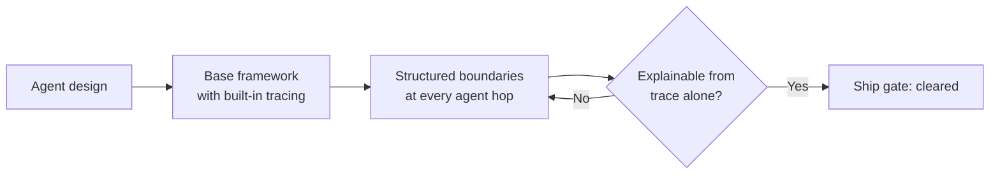

This series has covered instrumentation format, build-vs-buy, timeline visualization, cost attribution, AI-assisted investigation, and alerting — six posts that all assume the underlying agent system was built in a way that produces good trace data in the first place. That assumption doesn't hold as often as it should. The teams I've seen struggle hardest with agent observability aren't the ones missing a good backend or a fancy dashboard — they're the ones that built the agent system first, shipped it, and only reached for tracing once something broke in production badly enough to force the issue. By then the key decision points were never instrumented, and there's no way to go back and capture data about an incident that already happened with logging that didn't exist yet.



## The retrofitting problem, concretely

Retrofitting observability isn't just "add some `tracer.start_span` calls later" — it's expensive in a specific way: you don't know what you needed to capture until after the incident that revealed you needed it, and by then the incident is over and the data's gone. A team I worked with had a multi-agent pipeline running in production for four months with only application-level logging — string messages, not structured spans. When a customer-facing output was wrong, engineering spent the better part of two days trying to reconstruct which agent had made the bad decision, because the logs recorded that things happened but not the structured inputs and outputs at each boundary that would have let anyone check. The fix wasn't complicated once instrumentation existed — the actual retrofit was a day of work, adding OTel spans using the `gen_ai.*` conventions from the first post in this series. The expensive part was the two days lost on the incident that happened before that work got prioritized, and the fact that the specific run that caused the incident was gone forever — no amount of instrumentation added afterward recovers data about a request that already completed.

## Design habits that make observability cheap to add — or free, if built in from the start

**Structured intermediate output at every agent boundary.** This habit paid off for reliability reasons in the multi-agent error-propagation post back in January — banning free-form prose between agents in favor of typed, validated objects — and it pays off again here for exactly the same underlying reason. A structured `TicketClassification` object with a `category`, a `confidence`, and `evidence_quotes` isn't just easier to validate programmatically; it's also directly loggable as span attributes with no translation step. Free-form prose between agents means someone has to write a summarization or extraction step just to make the handoff data traceable at all. Structured output makes the reliability win and the observability win the same design decision, not two separate investments.

**Name agents and tools descriptively and consistently, from the start.** This sounds trivial and it isn't. Trace readability depends entirely on span names meaning something to the person reading them cold, during an incident, without the code open. `agent.classify_support_ticket` and `agent.step_3` are the same amount of code to write. Only one of them is useful in a trace six months from now, read by an engineer who didn't write it and is trying to figure out what went wrong at 2am. Pick a naming convention for agents and tools before the second agent gets built, not after the tenth, because renaming spans after they've been running in production for months means historical traces and new traces use different names — right when you need to compare "does this look like it did before this regression."

**Build tracing into the base agent class, not as a per-agent opt-in.** The single highest-leverage structural decision in this whole list. If every new agent has to remember to add its own tracing, some fraction of new agents won't, and you're back to partial coverage — exactly the gap that made the retrofitting example above so painful.

```python
from opentelemetry import trace
from abc import ABC, abstractmethod

tracer = trace.get_tracer("multi_agent.core")

class TracedAgent(ABC):
    """Every agent in the system inherits from this — tracing is not optional per-agent."""

    def __init__(self, agent_name: str):
        self.agent_name = agent_name

    def run(self, task: dict, session_id: str):
        with tracer.start_as_current_span(
            f"agent.{self.agent_name}",
            attributes={
                "agent.name": self.agent_name,
                "agent.session_id": session_id,
                "agent.task_type": task.get("type", "unknown"),
            },
        ) as span:
            try:
                result = self._execute(task)
                span.set_attribute("agent.outcome", "completed")
                return result
            except Exception as e:
                span.set_attribute("agent.outcome", "failed")
                span.record_exception(e)
                raise

    @abstractmethod
    def _execute(self, task: dict):
        """Subclasses implement business logic here — tracing wraps it automatically."""
        ...

class TicketClassifierAgent(TracedAgent):
    def __init__(self):
        super().__init__(agent_name="classify_support_ticket")

    def _execute(self, task: dict):
        return classify_ticket(task["ticket_text"])
```

A new engineer building `TicketClassifierAgent` gets a correctly named, correctly attributed span with zero additional effort — they can't accidentally skip it, because skipping it would mean not inheriting from `TracedAgent` at all, which would be an obvious code review flag rather than a silent gap that only shows up during an incident.

**Treat "explainable from the trace alone" as an explicit acceptance criterion.** Before a new agent ships, ask: can an engineer who didn't write this code look at a trace of one run and explain what the agent did and why, without opening the source? If the answer is no — the trace shows an LLM call happened but not what it decided, or a tool was called but the arguments aren't visible — that's a gap to close before shipping, not after the first incident makes it obvious. This is a cheap check to run in design review, and it catches exactly the class of gap that turns a routine "what happened here" question into a two-day forensic investigation.

## A design-review checklist

- Does every agent inherit tracing from a shared base class, or does each one implement it separately?
- Are agent-to-agent handoffs passed as structured, validated data — or free-form text that has to be re-parsed to become traceable?
- Are agent and tool names descriptive enough to be read cold, in an incident, by someone who didn't write the code?
- Does every LLM call span carry `gen_ai.usage.*` token counts, from day one — not added after the first cost surprise?
- Can someone explain what this agent did on a given run using only the trace, with the source code closed?

## Closing the series

The thread running through all seven posts here is the same idea in different clothes: observability for agent systems isn't a separate initiative you bolt on once something breaks badly enough to justify the sprint. It's a property of how the system is built — the span format you standardize on, the backend you route it to, the way you visualize it, the granularity you attribute cost at, how carefully you verify what an AI investigator proposes, what you choose to page on, and whether the agent was designed from its first commit to be explainable from its own trace. Teams that treat it as infrastructure they'll add later almost always add it later than they needed to, and pay for the gap in exactly the kind of incident that instrumentation exists to prevent.
