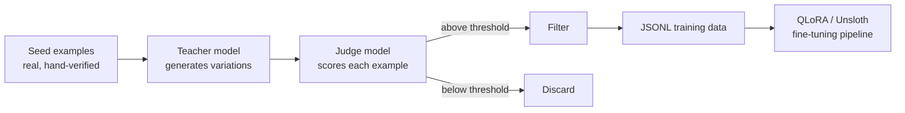

Back in December I wrote about [training data preparation for fine-tuning](/posts/training-data-preparation-llm-fine-tuning/) as a mostly manual exercise — collect real examples, clean them, dedupe them, split them. That post held up fine for a few hundred examples. It falls apart at the volume a modern QLoRA run actually wants, which is thousands to tens of thousands of examples if you want the fine-tune to generalize past the handful of patterns your manually-curated set happened to cover. Nobody is hand-writing ten thousand examples. What replaced that this past year is a standard pipeline: a small set of real seed examples, a frontier model generating variations at scale, a second model judging what got generated, and a filter that only lets the good stuff through. This post is that pipeline, end to end.



## Why the pipeline looks like this

The seed set is small and deliberately high quality — 20 to 100 examples that a human has actually looked at and would sign off on as correct, well-formed, representative of the task. It's not the training data. It's the specification for what the training data should look like, expressed as examples instead of a description, because a frontier model conditioned on five or ten concrete examples produces far more consistent output than one conditioned on a prose instruction alone.

The teacher model then does the volume work. Given the seeds plus a generation instruction, it produces new examples that vary the surface details — different entities, different phrasing, different edge conditions — while preserving the underlying task shape. This is the step that actually gets you from 50 examples to 5,000.

The judge step is where most of the engineering effort should go, and where teams that skip it get burned. Raw generation from a teacher model is not uniformly good. In my own runs, judge-scored generations across various tasks routinely land somewhere between 15% and 35% below the quality bar — wrong answers, malformed output, examples that technically follow the format but don't actually represent the task well. Training on that unfiltered set drags the fine-tune's quality down toward the generated distribution's average, not its ceiling. The judge model — often the same frontier model in a different role, sometimes a cheaper model tuned specifically for scoring — evaluates each generated example against explicit criteria and returns a structured score.

## Implementation

Here's the shape of it in Python, using the Anthropic API as both teacher and judge, with structured output for the judge step so filtering is deterministic rather than eyeballed.

```python
import json
import anthropic

client = anthropic.Anthropic()

def load_seeds(path: str) -> list[dict]:
    with open(path) as f:
        return [json.loads(line) for line in f]

def generate_batch(seeds: list[dict], task_description: str, n: int = 20) -> list[dict]:
    seed_block = "\n\n".join(
        f"Input: {s['input']}\nOutput: {s['output']}" for s in seeds
    )
    prompt = f"""Task: {task_description}

Here are {len(seeds)} verified examples of this task:

{seed_block}

Generate {n} NEW examples following the same task and format. Vary the
entities, phrasing, and difficulty. Do not repeat the seed examples.
Return a JSON array of objects with "input" and "output" keys only."""

    response = client.messages.create(
        model="claude-opus-4-5",
        max_tokens=4096,
        messages=[{"role": "user", "content": prompt}],
    )
    return json.loads(response.content[0].text)

def judge_example(example: dict, task_description: str) -> dict:
    prompt = f"""Task: {task_description}

Evaluate this training example on a 1-10 scale for:
- correctness: is the output actually right for the input?
- format: does it match the expected structure exactly?
- naturalness: does the input read like a real request?

Input: {example['input']}
Output: {example['output']}

Return JSON: {{"correctness": int, "format": int, "naturalness": int, "reasoning": str}}"""

    response = client.messages.create(
        model="claude-opus-4-5",
        max_tokens=512,
        messages=[{"role": "user", "content": prompt}],
    )
    return json.loads(response.content[0].text)

def build_dataset(seed_path: str, task_description: str,
                   rounds: int = 50, threshold: float = 7.5) -> list[dict]:
    seeds = load_seeds(seed_path)
    kept = []
    for _ in range(rounds):
        batch = generate_batch(seeds, task_description, n=20)
        for ex in batch:
            scores = judge_example(ex, task_description)
            avg = (scores["correctness"] + scores["format"] + scores["naturalness"]) / 3
            if avg >= threshold:
                ex["_judge_score"] = avg
                kept.append(ex)
    return kept

if __name__ == "__main__":
    dataset = build_dataset(
        seed_path="seeds.jsonl",
        task_description="Classify customer support tickets into one of 8 categories and extract the urgency level.",
        rounds=50,
        threshold=7.5,
    )
    with open("training_data.jsonl", "w") as f:
        for ex in dataset:
            f.write(json.dumps({"input": ex["input"], "output": ex["output"]}) + "\n")
    print(f"Kept {len(dataset)} examples above threshold")
```

Fifty rounds of twenty generations is 1,000 candidate examples; expect 650–850 to survive a 7.5 threshold depending on task difficulty. Push `rounds` up for more volume — the pipeline scales linearly with API spend, not with your time.

## Cost math

Generating and judging at scale costs real money — you're making two API calls per candidate example, one to generate (batched, so amortized cost per example is low) and one to judge (a smaller, cheaper call). For a 5,000-example dataset with a capable judge model, expect the pipeline to run somewhere in the low hundreds of dollars depending on model choice and example length. Compare that to human annotation at even a conservative $2–5 per labeled example for a moderately complex task, and the same dataset runs into five figures with a multi-week turnaround. The synthetic pipeline isn't free, but it's the difference between a dataset you can afford to build twice — once to prototype, once refined — and one you get exactly one shot at.

The output here is a plain JSONL file with `input`/`output` pairs, formatted to slot directly into the QLoRA/Unsloth fine-tuning pipeline from December's series without any further transformation. What this post doesn't cover is how to shape that output for reasoning tasks, where the answer alone isn't enough — that's next.
