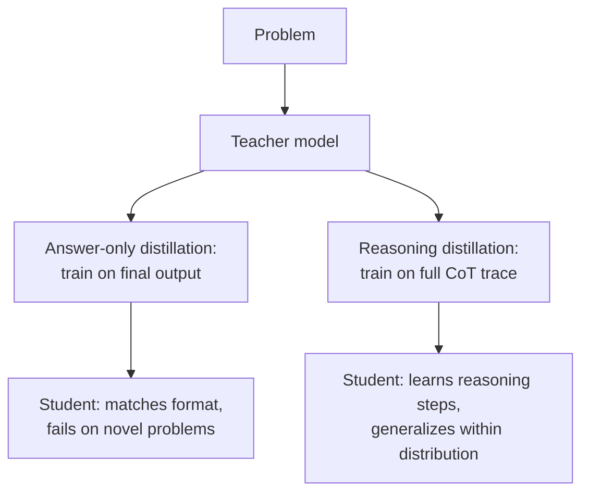

The pipeline from [yesterday's post](/posts/synthetic-data-generation-pipeline/) generates input/output pairs — a question and an answer, a ticket and a category, a request and a response. That's the right shape for most tasks. It's the wrong shape if the task requires the model to reason through multiple steps to get there, because training a small model to match a large model's final answer teaches it what the answer looks like without teaching it how to arrive at one. The fix, popularized at scale by DeepSeek-R1 and the wave of small reasoning models that followed it through 2026, is to distill the full chain-of-thought trace, not just the answer at the end of it.



## Why answer-only distillation underperforms

If you train a small model purely on `(question, final_answer)` pairs from a large teacher, the student learns a very literal mapping: this kind of question produces this kind of answer. It has no exposure to the intermediate steps that got the teacher there, so it can't reconstruct that process for a problem that doesn't closely resemble something in the training set. On held-out problems drawn from the same narrow distribution as training, answer-only distillation can look deceptively good — the student memorized the pattern. Nudge the problem structure even slightly and accuracy drops sharply, because there was never a reasoning process to fall back on, only a lookup table with fuzzy matching.

This is the same failure mode as overfitting in any supervised setting, but it's easy to miss in LLM fine-tuning because "the model gives correct answers on the eval set" reads as success right up until production traffic includes a problem shape the eval set didn't.

## The reasoning-distillation recipe

The fix is mechanically simple and computationally more expensive: capture the teacher's full reasoning trace, not just its conclusion, and train the student on the whole thing.

1. **Generate full traces.** Prompt the teacher model to think step by step and preserve the entire trace — not a summary of it — across a diverse set of problems. If the teacher model has an extended-thinking or reasoning mode, capture that output directly rather than asking it to "explain your reasoning" after the fact, which tends to produce post-hoc rationalization rather than the actual reasoning path.
2. **Format traces for training.** The student needs to see `(question) → (full reasoning trace) → (final answer)` as one continuous training target, so it learns to generate the reasoning tokens before committing to an answer at inference time too.
3. **Fine-tune the student on the full sequence** using the QLoRA approach from December — no change to the training mechanics, only to what's in the training examples.

```python
import json
import anthropic

client = anthropic.Anthropic()

def generate_reasoning_trace(problem: str) -> dict:
    response = client.messages.create(
        model="claude-opus-4-5",
        max_tokens=4096,
        thinking={"type": "enabled", "budget_tokens": 2048},
        messages=[{
            "role": "user",
            "content": f"Solve this step by step, showing your full reasoning:\n\n{problem}"
        }],
    )
    thinking_block = next(
        (b.text for b in response.content if b.type == "thinking"), ""
    )
    answer_block = next(
        (b.text for b in response.content if b.type == "text"), ""
    )
    return {
        "problem": problem,
        "reasoning": thinking_block,
        "answer": answer_block,
    }

def format_for_training(trace: dict) -> dict:
    # The student sees reasoning and answer as one continuous completion —
    # it must learn to produce the reasoning before the answer at inference time.
    completion = f"<reasoning>\n{trace['reasoning']}\n</reasoning>\n\n{trace['answer']}"
    return {"input": trace["problem"], "output": completion}

def build_reasoning_dataset(problems: list[str], out_path: str):
    with open(out_path, "w") as f:
        for problem in problems:
            trace = generate_reasoning_trace(problem)
            if not trace["reasoning"]:
                continue  # skip if no trace was captured — don't train on answer-only fallback
            example = format_for_training(trace)
            f.write(json.dumps(example) + "\n")

if __name__ == "__main__":
    problems = [
        "A train travels 240 miles in 4 hours, then 180 miles in the next 2 hours. What is its average speed for the whole trip?",
        # ... hundreds to thousands more, ideally covering a spread of difficulty
    ]
    build_reasoning_dataset(problems, "reasoning_traces.jsonl")
```

Every trace should still go through the judge-and-filter step from the pipeline post — score not just the final answer's correctness but whether the reasoning steps are internally consistent, since a trace that reaches the right answer via a broken argument is worse training data than no trace at all.

## Where this is worth it, and where it isn't

Reasoning distillation earns its extra cost on tasks where the path matters: math, multi-step code generation and debugging, logical reasoning chains, tasks with dependent sub-steps where an error early on compounds. It's overkill for classification, extraction, and other tasks where the teacher's final answer already captures everything the student needs — for those, answer-only distillation is not just sufficient, it's cheaper to generate and faster to train on, since you're not paying for or storing long reasoning traces you don't need.

## The honest caveat

A reasoning-distilled small model closes a lot of the gap to its teacher on the specific problem distribution it was trained against. It does not close the gap on genuinely novel problem types the teacher itself was never shown examples of during distillation. The student learned a reasoning style, not the teacher's full reasoning capability — it's imitating a process it saw demonstrated thousands of times, not deriving that process from first principles the way the larger model can. Treat a distilled reasoning model as specialized for the problem shapes in its training distribution, run it through the December eval methodology against a held-out set that includes some deliberately off-distribution problems, and don't assume distillation bought you general reasoning ability on the cheap.
