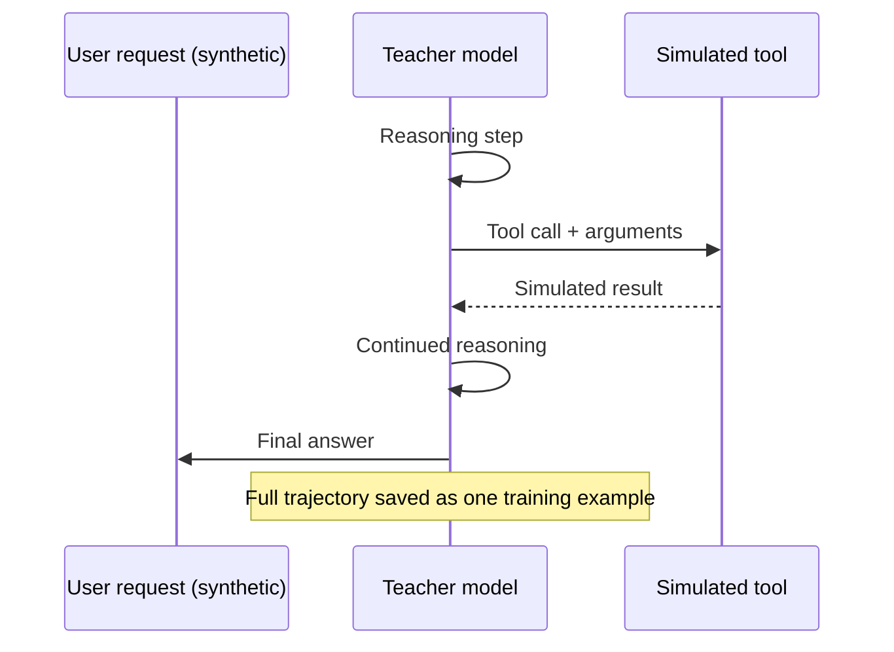

Everything in this series so far has generated single-turn examples: one input, one output. Fine-tuning for tool use needs a different shape entirely. A model that's going to call functions in production isn't producing a single response — it's producing a trajectory: read the request, reason about which tool applies, call it with specific arguments, read the result, decide whether to call another tool or answer, and eventually terminate with a final response. Training data built as flat input/output pairs doesn't teach any of that structure. It has to look like the trajectory the model will actually execute.



## Starting from your actual tool schemas

The generation process starts from the real tool definitions your agent will use in production — the same JSON schemas you'd pass to the model's tool-use API — not from an abstract description of what the agent does. Feed those schemas to a teacher model and ask it to generate realistic user requests that would plausibly require each tool, then generate the full trajectory that a competent agent would produce in response: reasoning, tool call with well-formed arguments matching the schema, a simulated tool result, and continued reasoning through to a final answer.

The simulated tool result step is the part teams get wrong most often. It's tempting to have the teacher model just make up a plausible-looking result and move on. That works for the common case but doesn't build in a critical property: the trajectory should reflect what actually happens when a tool call succeeds, fails, returns empty, or returns something the reasoning step needs to handle. Simulate results deliberately, not just plausibly.

## Injecting edge cases on purpose

Naturally-occurring tool-use data — real production logs, if you have them — skews heavily toward the happy path: one tool, valid arguments, a clean result, a clean answer. That's exactly the traffic the model needs the least help with, because it's easy. What breaks a fine-tuned tool-use model in production is the long tail: a tool that returns an error, a request that's ambiguous enough that the right move is to ask a clarifying question instead of guessing at arguments, a task that genuinely requires chaining two or three tools where an argument from the first call feeds the second. Because these cases are underrepresented in real logs, they need to be deliberately over-represented in the synthetic set — generate them as their own category with explicit instructions to the teacher model, not left to chance.

```python
import json
import anthropic

client = anthropic.Anthropic()

TOOLS = [
    {
        "name": "search_orders",
        "description": "Search customer orders by customer ID or order status",
        "input_schema": {
            "type": "object",
            "properties": {
                "customer_id": {"type": "string"},
                "status": {"type": "string", "enum": ["pending", "shipped", "delivered", "cancelled"]},
            },
        },
    },
    {
        "name": "issue_refund",
        "description": "Issue a refund for an order",
        "input_schema": {
            "type": "object",
            "properties": {
                "order_id": {"type": "string"},
                "amount": {"type": "number"},
                "reason": {"type": "string"},
            },
            "required": ["order_id", "amount", "reason"],
        },
    },
]

EDGE_CASE_TYPES = [
    "happy_path",       # single tool, clean result
    "tool_error",       # tool call returns an error, agent must recover
    "ambiguous_request", # agent should ask a clarifying question, not guess arguments
    "multi_tool_chain",  # output of one tool call is needed as input to the next
]

def generate_trajectory(case_type: str) -> dict:
    prompt = f"""You have access to these tools: {json.dumps(TOOLS)}

Generate a realistic synthetic customer support trajectory of type "{case_type}".

Produce, as JSON:
{{
  "user_request": "...",
  "steps": [
    {{"type": "reasoning", "content": "..."}},
    {{"type": "tool_call", "tool": "...", "arguments": {{...}}}},
    {{"type": "tool_result", "content": "... (simulate a realistic result, including an" 
      " error or empty result if case_type calls for it)"}},
    {{"type": "reasoning", "content": "..."}},
    {{"type": "final_answer", "content": "..."}}
  ]
}}

For "tool_error": the tool_result must contain a realistic failure (invalid ID, timeout,
permission denied), and the trajectory must show the agent recovering sensibly.
For "ambiguous_request": the user_request must be underspecified, and the trajectory
must show the agent asking a clarifying question INSTEAD of a tool_call with guessed
arguments.
For "multi_tool_chain": at least two tool_call steps must occur, where an argument
in the second call is derived from the result of the first."""

    response = client.messages.create(
        model="claude-opus-4-5",
        max_tokens=2048,
        messages=[{"role": "user", "content": prompt}],
    )
    trajectory = json.loads(response.content[0].text)
    trajectory["case_type"] = case_type
    return trajectory

def judge_trajectory(trajectory: dict) -> bool:
    """Filter for valid tool call arguments and coherent reasoning."""
    prompt = f"""Evaluate this agent trajectory for training suitability:

{json.dumps(trajectory, indent=2)}

Check: (1) tool call arguments match the tool's schema and are plausible values,
(2) reasoning steps are coherent and actually justify the next action,
(3) for ambiguous_request cases, the agent asks rather than guesses,
(4) for tool_error cases, the recovery is sensible, not a crash or repeat of the same call.

Return JSON: {{"valid": bool, "reasoning": str}}"""
    response = client.messages.create(
        model="claude-opus-4-5",
        max_tokens=256,
        messages=[{"role": "user", "content": prompt}],
    )
    return json.loads(response.content[0].text)["valid"]

def build_tool_use_dataset(n_per_type: int, out_path: str):
    with open(out_path, "w") as f:
        for case_type in EDGE_CASE_TYPES:
            kept = 0
            attempts = 0
            while kept < n_per_type and attempts < n_per_type * 3:
                attempts += 1
                traj = generate_trajectory(case_type)
                if judge_trajectory(traj):
                    f.write(json.dumps(traj) + "\n")
                    kept += 1

if __name__ == "__main__":
    build_tool_use_dataset(n_per_type=100, out_path="tool_use_trajectories.jsonl")
```

Note the deliberately uneven weighting available here — `n_per_type` lets you set `happy_path` lower than the edge-case types relative to what you'd see in real traffic, correcting for the natural-data skew described above rather than reproducing it.

## Feeding this into adapter training

The trajectory format above needs one more transformation before it's QLoRA-ready: flattening each trajectory into the same conversation-turn format your serving stack uses for tool calls, so the fine-tuned model learns tool use in the exact structure it'll see at inference time. Once that's done, this connects directly to [the LoRA adapter production deployment post](/posts/lora-adapter-production-deployment/) from December — a tool-use-specialized adapter, trained on trajectories like these, swapped in for workloads that lean heavily on a specific tool set rather than baked into the base model.

The trap to avoid is training a tool-use adapter purely on happy-path data because that's what was easiest to collect from logs, then being surprised when the model in production doesn't know how to recover from a tool error it never saw during training. Generate the edge cases on purpose. They're cheap to synthesize and expensive to discover for the first time in production.
