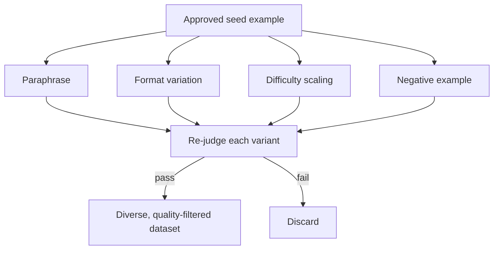

Run the pipeline from earlier this week against a small seed set and you'll get a dataset that's larger than what you started with, but it's easy for it to still be narrower than production traffic will be. A teacher model conditioned on ten seed examples tends to generate variations that stay close to those seeds' phrasing, structure, and framing — new entities plugged into a familiar mold, rather than genuinely new ways of expressing the same underlying request. The fine-tuned model ends up good at recognizing the training distribution's specific style and worse than it should be at recognizing the same intent phrased differently, which is exactly what happens the moment real users don't write like your seed set.



## Four augmentation techniques

**Paraphrasing.** Take an approved example and generate several alternative phrasings of the same underlying request — different vocabulary, different sentence structure, different level of formality — while keeping the intent and the correct output identical. This is the most direct fix for the overfitting-to-phrasing problem, and the cheapest to run since you're augmenting examples that already passed the judge once.

**Format variation.** The same information arrives in production in different shapes — a user might describe a request as a bulleted list, a paragraph of prose, a half-filled-out form, or a table pasted from a spreadsheet. If every training example presents information the same way, the model learns to expect that one format and degrades on the others. Generating format variants of approved examples closes that gap directly.

**Difficulty scaling.** Left alone, a generated dataset tends to cluster around whatever difficulty level the seed examples happened to represent. Deliberately generating easier and harder variants — fewer constraints versus more, a clean case versus one with conflicting requirements — builds a difficulty curve instead of a flat distribution, which matters because production traffic isn't flat either.

**Negative examples.** Examples of what the model should *not* do are as valuable as examples of what it should. A request that looks like it matches a common pattern but should actually be declined, redirected, or handled with a caveat prevents the model from over-generalizing a rule it learned from too-uniform positive examples. Without negatives, a model fine-tuned heavily on "when X, do Y" tends to apply that rule to superficially similar cases where it doesn't actually hold.

## Don't skip the judge on augmented data

The trap here is treating augmentation as free quality — reasoning that because the source example already passed the judge, its paraphrase or format variant must be fine too. It isn't automatically. A paraphrase can drift the meaning of the request just enough to make the paired output wrong; a format variant can garble structured information in the process of reformatting it; a "harder" difficulty variant can accidentally become unanswerable rather than just harder. Every augmented example is a new example and needs to go through the same judge-and-filter step from the [pipeline post](/posts/synthetic-data-generation-pipeline/) as anything generated from scratch. Skipping this step because the source was already approved is how quality quietly erodes across a few rounds of augmentation.

```python
import json
import anthropic

client = anthropic.Anthropic()

def paraphrase(example: dict, n: int = 3) -> list[dict]:
    prompt = f"""Generate {n} paraphrased versions of this request. Keep the intent
and the correct output IDENTICAL — only vary phrasing, vocabulary, and formality.

Original input: {example['input']}
Correct output: {example['output']}

Return JSON array of {{"input": "...", "output": "..."}}"""
    response = client.messages.create(
        model="claude-opus-4-5", max_tokens=1024,
        messages=[{"role": "user", "content": prompt}],
    )
    return json.loads(response.content[0].text)

def vary_format(example: dict) -> list[dict]:
    prompt = f"""Rewrite this request in two different input formats — one as a
bulleted list, one as an unstructured paragraph — while the correct output stays
the same.

Original input: {example['input']}
Correct output: {example['output']}

Return JSON array of {{"input": "...", "output": "..."}}"""
    response = client.messages.create(
        model="claude-opus-4-5", max_tokens=1024,
        messages=[{"role": "user", "content": prompt}],
    )
    return json.loads(response.content[0].text)

def generate_negative(example: dict) -> dict:
    prompt = f"""This is a valid example of the task:

Input: {example['input']}
Output: {example['output']}

Generate ONE new example that looks superficially similar but is a case the
model should handle differently — decline, ask for clarification, or apply a
different rule. Be explicit in the output about why this case differs.

Return JSON: {{"input": "...", "output": "..."}}"""
    response = client.messages.create(
        model="claude-opus-4-5", max_tokens=512,
        messages=[{"role": "user", "content": prompt}],
    )
    return json.loads(response.content[0].text)

def judge(example: dict, task_description: str) -> float:
    prompt = f"""Task: {task_description}
Score this example 1-10 for correctness and coherence.
Input: {example['input']}
Output: {example['output']}
Return JSON: {{"score": number}}"""
    response = client.messages.create(
        model="claude-opus-4-5", max_tokens=128,
        messages=[{"role": "user", "content": prompt}],
    )
    return json.loads(response.content[0].text)["score"]

def augment_and_filter(approved: list[dict], task_description: str,
                        threshold: float = 7.5) -> list[dict]:
    augmented = []
    for ex in approved:
        candidates = paraphrase(ex) + vary_format(ex) + [generate_negative(ex)]
        for cand in candidates:
            if judge(cand, task_description) >= threshold:
                augmented.append(cand)
    return augmented

if __name__ == "__main__":
    with open("training_data.jsonl") as f:
        approved = [json.loads(line) for line in f]

    extra = augment_and_filter(
        approved,
        task_description="Classify customer support tickets into 8 categories with urgency.",
    )
    with open("training_data_augmented.jsonl", "a") as f:
        for ex in extra:
            f.write(json.dumps(ex) + "\n")
    print(f"Added {len(extra)} augmented examples that passed the judge")
```

## The tension is the point

Augmentation and quality control pull in opposite directions by design — augmentation wants volume and variety, judging wants to reject anything that doesn't clear the bar, and running both means accepting a lower yield than pure generation would give you. That's the correct tradeoff. A dataset that's diverse but noisy trains a model that's inconsistent; a dataset that's clean but narrow trains a model that's brittle outside its exact training distribution. Running every augmented variant back through the judge is what keeps the diversity gains from becoming a quality regression, and it's the step most tempting to shortcut once a pipeline is already producing more data than a team feels like it needs.
