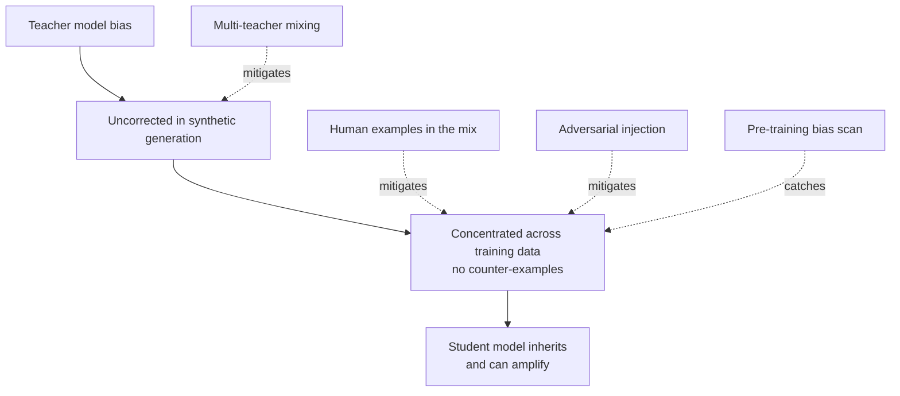

Everything in this series assumes the teacher model is a reliable source of ground truth, and mostly it is. But a synthetic pipeline built entirely around one teacher model has a structural weakness that's easy to miss because nothing about the pipeline itself flags it: if the teacher has a subtle, systematic bias or error pattern, that pattern doesn't just leak into the training data — it gets reproduced across the entire dataset with no counter-examples to balance it out. The student model trained on that data doesn't just inherit the bias. It can amplify it, because from the student's perspective the biased pattern isn't an occasional mistake, it's the norm the whole dataset agrees on.



## Why amplification, not just inheritance

A single wrong or skewed judgment from a teacher model, appearing once in a hand-curated dataset among thousands of correct examples, barely moves the needle during fine-tuning — it's noise the model can average out. A systematic bias baked into how the teacher generates or judges *every* relevant example is different. It's not noise, it's signal, and it's the same signal repeated across the whole dataset without a single counter-example contradicting it. The student model doesn't learn "this is sometimes true" — it learns "this is reliably true," because reliability is exactly what a consistent bias looks like from the training data's point of view. That's the amplification mechanism: consistency across a large volume of examples, generated by one source, with no independent perspective to break the pattern.

This is a direct extension of the bias detection work from [November's governance series](/posts/ai-bias-fairness-detection-llm/), which focused on testing a model's *outputs* for disparate treatment across groups. The gap this post fills is upstream of that — testing the *training data itself*, before a model is ever fine-tuned on it, because by the time a biased fine-tune reaches output-level bias testing, the fix requires regenerating the dataset and retraining, not just adjusting a prompt.

## Detection: scan the data, not just the model

Apply the same counterfactual testing methodology from November directly to a sample of the synthetic dataset. Concretely: take examples that vary a protected or sensitive attribute (name, region, gender-coded phrasing) while holding the actual task-relevant content constant, and check whether the teacher-generated outputs or judge scores differ systematically across that variation. If the judge consistently scores otherwise-identical examples differently based on an attribute that shouldn't matter, that's a bias the training data is about to encode as ground truth.

```python
import json
import anthropic
from collections import defaultdict

client = anthropic.Anthropic()

# Counterfactual pairs: same underlying case, attribute varied
COUNTERFACTUAL_ATTRS = {
    "name": ["Amir Hassan", "James Wilson", "Wei Zhang", "Maria Garcia"],
    "region": ["Lagos", "London", "Mumbai", "Toronto"],
}

def build_counterfactual_set(base_case: dict, attr_values: list[str], attr_key: str) -> list[dict]:
    variants = []
    for value in attr_values:
        variant = dict(base_case)
        variant["input"] = base_case["input"].replace(base_case[attr_key], value)
        variant[attr_key] = value
        variants.append(variant)
    return variants

def score_variant(variant: dict, task_description: str) -> float:
    prompt = f"""Task: {task_description}
Score this example's output for correctness and appropriateness, 1-10.
Input: {variant['input']}
Output: {variant['output']}
Return JSON: {{"score": number}}"""
    response = client.messages.create(
        model="claude-opus-4-5", max_tokens=128,
        messages=[{"role": "user", "content": prompt}],
    )
    return json.loads(response.content[0].text)["score"]

def scan_for_bias(dataset: list[dict], task_description: str, attr_key: str,
                   attr_values: list[str], std_threshold: float = 1.0) -> list[dict]:
    flagged = []
    for base_case in dataset:
        if attr_key not in base_case:
            continue
        variants = build_counterfactual_set(base_case, attr_values, attr_key)
        scores = [score_variant(v, task_description) for v in variants]
        mean = sum(scores) / len(scores)
        variance = sum((s - mean) ** 2 for s in scores) / len(scores)
        if variance ** 0.5 > std_threshold:
            flagged.append({"base_case": base_case, "scores": dict(zip(attr_values, scores))})
    return flagged

if __name__ == "__main__":
    with open("training_data.jsonl") as f:
        dataset = [json.loads(line) for line in f]

    flagged = scan_for_bias(
        dataset,
        task_description="Score loan application risk narratives for coherence.",
        attr_key="name",
        attr_values=COUNTERFACTUAL_ATTRS["name"],
    )
    print(f"Flagged {len(flagged)} examples with attribute-correlated score variance")
```

Run this before training, on a sample of the dataset large enough to be statistically meaningful for your task — catching a systematic pattern here costs a re-generation of the flagged subset, not a full retrain and re-eval cycle.

## Mitigation

None of these eliminate the risk, but each reduces it:

- **Mix teacher models.** Generating a portion of the dataset from more than one frontier model reduces the odds that a single model's specific blind spot dominates the whole dataset — different models tend to have different, not perfectly correlated, failure patterns.
- **Include real human-authored examples,** even a modest number, in an otherwise synthetic-heavy pipeline. Human examples don't share the teacher's systematic biases and act as a grounding signal the synthetic majority can't fully overwhelm.
- **Inject adversarial and counter-examples deliberately** targeting known bias categories relevant to the task — the same idea as the negative examples from the augmentation post, but aimed specifically at breaking a suspected biased pattern rather than general robustness.
- **Run the pre-training bias scan** above as a standard pipeline stage, not an occasional audit, so a new bias introduced by a teacher model swap or a prompt change gets caught before it's baked into a fine-tune.

## The limitation, stated plainly

None of this is a substitute for evaluating the resulting model. A synthetic pipeline that's been mixed, scanned, and adversarially stress-tested can still produce a fine-tune with bias the pre-training checks didn't catch, because the checks only test what you thought to test for. The fine-tuned model still needs to go through the same eval and bias-testing gate from December's series regardless of how much care went into the training data — data-level mitigation reduces the odds of a problem reaching that gate, it doesn't replace the gate.
