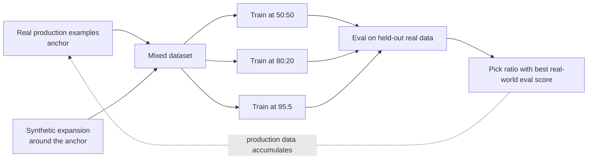

Two posts ago I described how a synthetic dataset generated from a small seed set can drift narrower than production traffic actually is. Yesterday's post covered how a synthetic dataset built entirely on one teacher model can concentrate that teacher's biases with no counter-signal to catch them. Both problems share a root cause: 100% synthetic data has nothing real anchoring it to what your system will actually see in production. The opposite extreme has its own problem — 100% real data is usually too small and too expensive to reach the volume a stable fine-tune needs. The practical answer is neither extreme. It's a mixing ratio, and the right ratio isn't a number you should pick by convention.



## Anchor first, expand second

The mistake to avoid is generating a synthetic dataset from a handful of hand-written seed examples with zero production grounding, then treating that as the whole dataset. If you have any real production examples at all — even a few hundred, pulled from logs, support tickets, or an earlier manual pass — use those as the seed set the synthetic pipeline expands around, not a separately invented set of examples that only approximate what real usage looks like. The synthetic data's job is to multiply coverage around a real anchor, not to substitute for one. A dataset anchored in even a modest number of real examples tends to track production phrasing, edge cases, and distribution shape far more closely than one built from scratch by a teacher model imagining what users might ask.

## There's no universal ratio

Teams ask for a rule of thumb here — "is 80:20 synthetic-to-real about right?" — and the honest answer is that it depends on how good your real anchor is, how narrow or broad the task is, and how well the teacher model's synthetic generations track your actual production distribution for this specific task. A ratio that works well for a narrow classification task with a handful of clean categories can be badly wrong for an open-ended generation task with a long tail of edge cases. Treat the ratio as a hyperparameter to search, not a constant to assume.

The way to find it is to actually run the search: train separate fine-tunes at a few candidate ratios, evaluate each against a held-out set of *real* data using the eval methodology from [December's fine-tuning evaluation post](/posts/fine-tuning-evaluation-methodology/), and pick the ratio that wins on real-world eval performance — not the ratio that was cheapest or fastest to assemble.

```python
import json
import random
import subprocess

def load_jsonl(path: str) -> list[dict]:
    with open(path) as f:
        return [json.loads(line) for line in f]

def build_mixed_dataset(real: list[dict], synthetic: list[dict],
                         synthetic_ratio: float, target_size: int) -> list[dict]:
    n_synthetic = int(target_size * synthetic_ratio)
    n_real = target_size - n_synthetic

    real_sample = random.sample(real, min(n_real, len(real)))
    # allow oversampling real data if it's scarce relative to target size
    while len(real_sample) < n_real:
        real_sample.append(random.choice(real))

    synthetic_sample = random.sample(synthetic, min(n_synthetic, len(synthetic)))
    mixed = real_sample + synthetic_sample
    random.shuffle(mixed)
    return mixed

def run_ratio_sweep(real_path: str, synthetic_path: str, real_eval_path: str,
                     ratios: list[float], target_size: int = 5000):
    real = load_jsonl(real_path)
    synthetic = load_jsonl(synthetic_path)
    results = {}

    for ratio in ratios:
        mixed = build_mixed_dataset(real, synthetic, ratio, target_size)
        train_path = f"train_ratio_{int(ratio*100)}.jsonl"
        with open(train_path, "w") as f:
            for ex in mixed:
                f.write(json.dumps(ex) + "\n")

        # hands off to the QLoRA/Unsloth training pipeline from December
        subprocess.run([
            "python", "train_qlora.py",
            "--data", train_path,
            "--output", f"adapter_ratio_{int(ratio*100)}",
        ], check=True)

        # eval against a held-out set of REAL data only — this is what matters
        eval_result = subprocess.run([
            "python", "run_eval.py",
            "--adapter", f"adapter_ratio_{int(ratio*100)}",
            "--eval-set", real_eval_path,
        ], capture_output=True, text=True, check=True)
        score = json.loads(eval_result.stdout)["overall_score"]
        results[ratio] = score
        print(f"ratio={ratio:.2f} synthetic -> real eval score={score:.3f}")

    best_ratio = max(results, key=results.get)
    print(f"Best ratio: {best_ratio} (score={results[best_ratio]:.3f})")
    return results

if __name__ == "__main__":
    run_ratio_sweep(
        real_path="real_examples.jsonl",
        synthetic_path="synthetic_examples.jsonl",
        real_eval_path="held_out_real_eval.jsonl",
        ratios=[0.5, 0.8, 0.95],
    )
```

The critical detail in that eval step is `real_eval_path` — the held-out set the sweep judges against must be real data, not a held-out split of the synthetic set. Evaluating against held-out synthetic data just tells you which ratio best matches the teacher model's own distribution, which is a different question from which ratio performs best against what production will actually send it.

## Re-anchoring as production data accumulates

The ratio you land on isn't permanent. Once a fine-tuned model is live and production traffic starts accumulating, that traffic is a better anchor than whatever real examples you started with — it reflects current usage, not usage as it looked at the time of the original seed collection. Periodically refresh the real anchor with recent production examples and regenerate the synthetic expansion around it, rather than letting a synthetic pipeline keep expanding indefinitely around seeds that get staler relative to actual usage patterns every month. This is the same drift problem covered generally in the earlier posts in this series, applied specifically to the real:synthetic boundary — the synthetic half doesn't drift on its own, but it inherits whatever staleness sits in the real anchor it's built around.
