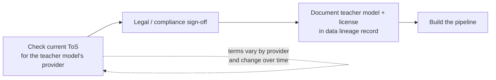

Every post in this series so far has been technical: build the pipeline, distill the reasoning, mix the ratio. This one isn't. Before any of that gets built against a specific provider's API, there's a question engineering teams routinely skip past — whether the terms of service for the model you're using as a teacher actually permit using its outputs to train a separate model. This is not legal advice, I'm not a lawyer, and nothing in this post should substitute for actual legal review of your specific situation. It's a checklist for what to raise with legal counsel before a distillation pipeline goes anywhere near production, written because in my experience most engineering teams never think to raise it at all.



## Why this is different from normal API usage

Using a frontier model's API to serve a product — answering user questions, powering a chat feature, running a classification task in a live application — is uncontroversial and exactly what these APIs are built for. Using that same API's outputs specifically to generate training data for a *different* model is a materially different use, and it's the one that tends to draw more specific and more restrictive terms from providers. The concern from a provider's point of view is straightforward: if their model's outputs can be freely used to train a competing or substitute model, that's a direct path around the investment that went into building the original model. Different providers have handled this differently, and the specifics have been an actively evolving area — I'm deliberately not stating what any particular provider's terms say as of this post, because those terms vary by provider and change over time. What was true when a pipeline was first built against a given API may not be true by the time that pipeline is still running a year later.

## What this means for distillation specifically

The pipelines in this series — teacher model generates, judge model scores, student model trains on the result — are exactly the pattern that provider terms of service around this issue tend to target. If the teacher model in your pipeline is a commercial API, the question of whether its output can be used this way isn't a formality. It's a real constraint on what you can legally build, and it needs to be resolved before the pipeline is anything more than an internal prototype that never leaves a sandbox.

## Practical steps for an engineering team

1. **Read the current terms of service for the specific provider before building anything against their API as a teacher model** — not after the pipeline is already producing training data. Terms that permit ordinary API usage don't necessarily extend to using outputs for training, and terms change, so "we checked this eighteen months ago" isn't the same as knowing where things stand now.
2. **Get written sign-off from legal or compliance before a distillation pipeline goes past prototype.** A quick internal experiment to see whether reasoning distillation improves a small model is a different risk profile than a production pipeline generating training data at scale on an ongoing basis. Treat the transition between those two as a gate that requires sign-off, not a milestone you notice in hindsight.
3. **Document which teacher model or models generated which training dataset,** and keep that documentation as part of the same data lineage and audit trail practice covered in [November's audit trail post](/posts/ai-audit-trail-what-to-log/). If a provider's terms change, or if a question comes up later about how a particular fine-tuned model's training data was sourced, you want an answer that doesn't require reconstructing history from scattered notebooks and Slack threads.
4. **Consider open-weight models as teachers when licensing certainty matters more than teacher capability.** Open-weight model licenses are typically more explicit and more permissive about downstream training use than commercial API terms of service, precisely because they're published as static, versioned documents rather than terms that can be revised by the provider. The tradeoff is usually teacher capability — an open-weight model may not match the reasoning quality of the top commercial frontier models — but for teams where the licensing question is a hard blocker rather than a risk to manage, that tradeoff is often worth taking.

```python
# Not a compliance tool — a lightweight lineage record, so "which teacher model
# generated this dataset, under what terms, and who signed off" is answerable
# without archaeology six months later.

import json
import datetime

def log_dataset_provenance(dataset_path: str, teacher_model: str,
                            provider_tos_reviewed_date: str,
                            legal_signoff_ref: str, notes: str = ""):
    record = {
        "dataset_path": dataset_path,
        "teacher_model": teacher_model,
        "provider_tos_reviewed_date": provider_tos_reviewed_date,
        "legal_signoff_ref": legal_signoff_ref,
        "logged_at": datetime.datetime.utcnow().isoformat(),
        "notes": notes,
    }
    with open("data_lineage_log.jsonl", "a") as f:
        f.write(json.dumps(record) + "\n")
    return record

if __name__ == "__main__":
    log_dataset_provenance(
        dataset_path="training_data_v3.jsonl",
        teacher_model="teacher-model-identifier-and-version",
        provider_tos_reviewed_date="2027-03-01",
        legal_signoff_ref="LEGAL-2027-0142",
        notes="Reasoning distillation dataset for support-ticket triage model.",
    )
```

## Treat this as a starting checklist, not a finish line

The four steps above are the minimum, not a complete legal review. What they're meant to do is stop the most common failure mode I've seen, which isn't a team deliberately ignoring licensing risk — it's a team building a synthetic data pipeline as a purely technical exercise, having it work well, and only thinking about whether they were allowed to build it that way after it's already generating the training data for a model heading toward production. Raise the question at prototype stage, get it answered before the pipeline scales, and keep the paper trail. Everything else in this checklist is downstream of getting that sequence right.
