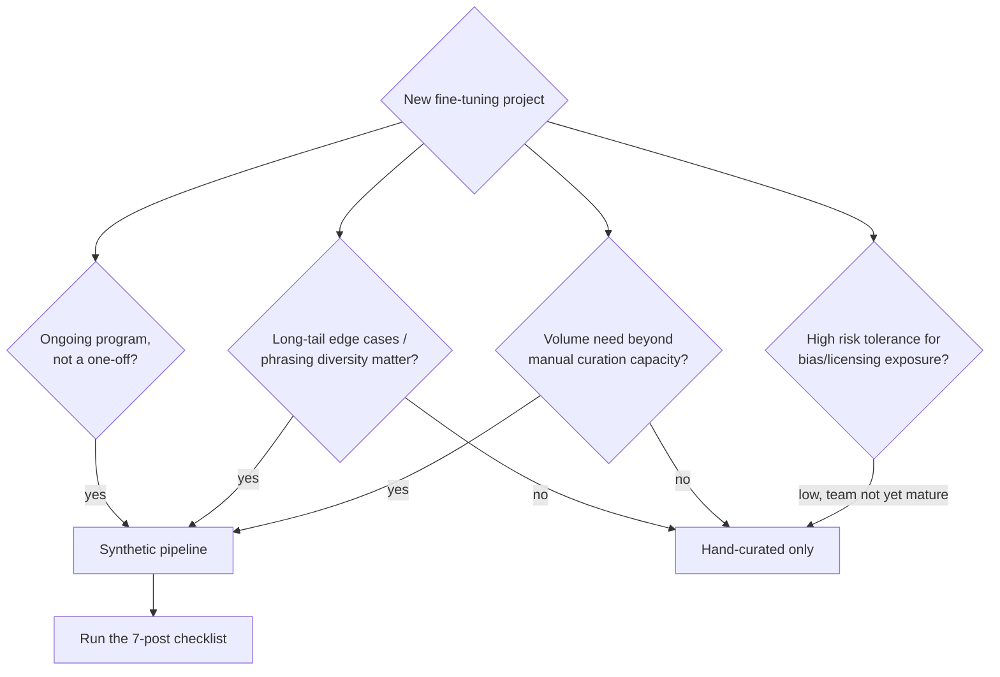

This week covered a full synthetic data pipeline — seed, generate, judge, filter, distill, augment, de-bias, mix, and check the licensing before any of it goes to production. That's a lot of machinery, and machinery has a cost independent of whether the task in front of you needs it. The question this closing post answers is the one that should come before any of the technical posts get applied: does this specific fine-tuning project justify building a synthetic data pipeline at all, or is a small hand-curated dataset — the approach from [December's training data preparation post](/posts/training-data-preparation-llm-fine-tuning/) — the better call.

## The core decision

Building the pipeline from this series — teacher generation, judge scoring, augmentation, bias scanning, ratio tuning, licensing review — is real engineering investment. It pays off when the task genuinely needs volume, diversity, or an ongoing supply of training data that a hand-curated set can't provide in reasonable time. It's overhead you don't need when the task is narrow enough that a few hundred well-chosen real examples, reviewed by a person who understands the task, already covers the pattern space the model needs to learn.

**Signals favoring a synthetic pipeline:**

- The task needs training volume in the thousands, and manually curating that many examples would take weeks a team doesn't have.
- The task has a genuine long tail — edge cases, unusual phrasings, rare-but-important scenarios — that a small hand-picked set is structurally unlikely to cover, no matter how carefully it's chosen.
- This is an ongoing fine-tuning program, not a one-off — a pipeline built once gets reused across multiple training runs as the task evolves, and the upfront engineering cost amortizes across all of them.

**Signals favoring hand-curated only:**

- The task is narrow and well-understood, with a small, stable number of clear patterns a person can enumerate and write examples for directly.
- This is a one-off fine-tune with no expectation of repeated iterations, where building reusable pipeline infrastructure doesn't pay for itself.
- The team's maturity around the risks covered this week — bias amplification, licensing exposure, the discipline to actually run judge-and-filter on every batch — isn't there yet, and taking on a synthetic pipeline's risk surface isn't justified by what a hand-curated set would already achieve for this task.

That last point is worth sitting with. Nothing about a synthetic pipeline is mandatory just because it's now the common default. A team that hasn't built the muscle to catch a biased judge or track teacher-model licensing shouldn't take on that risk for a task a hand-curated dataset already handles well.

## The checklist, if synthetic is the call

Pulling together the full week into one sequence:

1. **Pipeline stages** — seed with real, verified examples; generate at scale with a teacher model; judge every generated example against explicit criteria; filter to a quality threshold. Don't skip the judge step to save API cost — it's the single highest-leverage stage in the whole pipeline.
2. **Match distillation type to task type** — reasoning distillation (full chain-of-thought traces) for multi-step reasoning tasks like math and code; answer-only distillation for classification and extraction, where it's cheaper and sufficient.
3. **Apply augmentation without skipping re-judging** — paraphrase, vary format, scale difficulty, inject negatives, but treat every augmented variant as a new example that needs its own judge pass, not a free extension of an already-approved one.
4. **Pre-screen for bias before training** — run counterfactual scans against the synthetic dataset itself, not just the resulting model's outputs, and mix in multiple teacher models or real human examples where a single-teacher pipeline risks concentrating one model's blind spots.
5. **Choose the synthetic:real mixing ratio empirically** — anchor with whatever real data exists, sweep candidate ratios, and pick the one that wins on a held-out set of real eval data, not the ratio that was cheapest to assemble.
6. **Complete licensing review before the pipeline scales** — check the current terms of service for the teacher model's provider, get legal sign-off before moving past prototype, and document which teacher model generated which dataset as part of your data lineage record.

None of these steps is optional once you've decided synthetic is the right call — skipping any one of them is how a pipeline that looks efficient on paper produces a fine-tune that fails an eval, fails a bias check, or turns into a legal problem the team didn't see coming.

## Closing framing

Synthetic data generation and distillation became the default scaling primitive for fine-tuning through 2026 for good reason — it's the only practical way to hit the training volumes modern fine-tuning benefits from without a proportional increase in manual annotation cost. But "default" describes what most teams reach for first, not what's automatically correct for every project. The decision guide in this post exists so that choice gets made deliberately, weighed against the actual shape of the task in front of you, rather than reached for out of habit because it's what the last five projects did. Whichever way that decision goes, the fine-tuned model still has to clear the same eval bar from December's series before it ships — the data pipeline changes how you get to a candidate model, not whether that candidate still has to prove itself.
