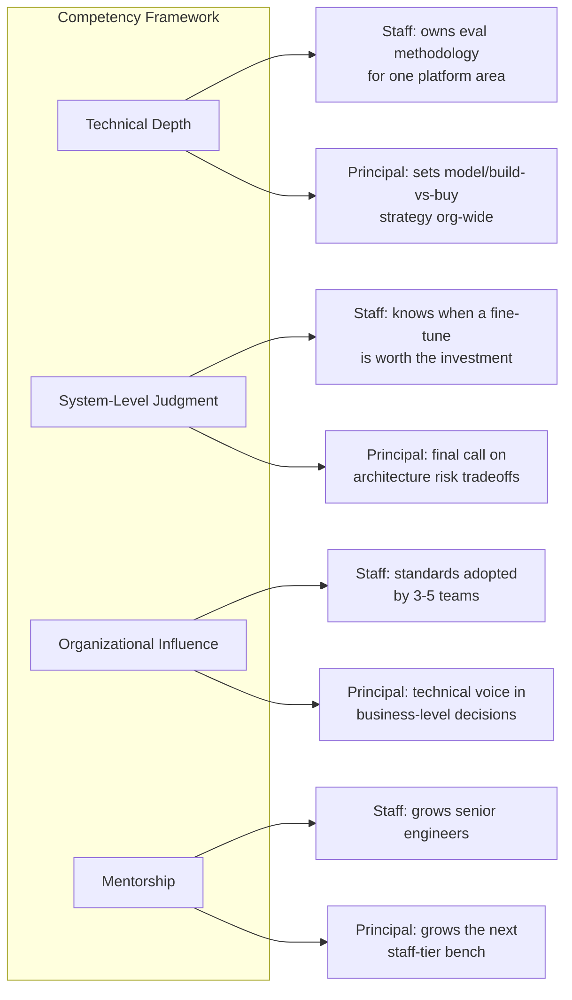

Two years ago, "Senior AI Engineer" was the practical ceiling at most companies — past that, you either moved into management or your title stopped meaning much. That's changed. Enough enterprises have now run AI in production long enough, and hit enough scaling problems that a single senior engineer couldn't solve alone, that Staff and Principal AI Engineer have become real, recognized IC tiers. Not an AI-flavored reskin of the general Staff Engineer ladder — a role with its own scope and its own judgment requirements that the general rubric doesn't capture.

## What's genuinely different here

The December post on [the AI engineering skill stack](/posts/ai-engineering-skill-stack-2026/) covered what skills matter day to day — evals, retrieval quality, prompt architecture, systems thinking at integration points. This is a different question: once an engineer has those skills at a high level, what does the *next* tier of the career actually ask of them?

A general Staff Engineer rubric is built around deterministic systems. It asks: can this person make architecture decisions that hold up under scale, can they navigate ambiguous requirements, can they influence technical direction across teams. All of that still applies to a Staff AI Engineer. What it doesn't capture is a category of judgment that's specific to working with probabilistic components — and that category is most of what separates a strong senior AI engineer from a staff one.

**Knowing when an eval score is trustworthy.** A senior engineer can build an eval pipeline. A staff engineer can look at someone else's eval results and tell you, often within minutes, whether the eval set actually represents production traffic or whether it's quietly measuring something else — training-distribution overlap, a metric that correlates with the wrong thing, a sample size too small to support the confidence the team is putting in it. This is pattern-matched skepticism built from having been burned by bad evals before, and it doesn't show up on a rubric written for CRUD services.

**Knowing when a fine-tune is worth it.** This requires weighing engineering cost, data quality realities, ongoing maintenance burden, and the actual quality delta against prompt engineering or RAG — and doing that weighing honestly, without defaulting to "fine-tune it" because it's the more technically interesting answer. The distillation and fine-tuning series on this blog from December through March covered the mechanics; the staff-level judgment is deciding whether to reach for those mechanics at all.

**Knowing when an agent architecture is over-engineered.** Multi-agent systems are seductive to build and expensive to operate and debug. A staff engineer can look at a proposed three-agent pipeline with a supervisor and two workers and correctly say "this is one well-scoped tool call with a retry policy" — and be right often enough that people stop second-guessing the call.

None of this is exotic knowledge. It's pattern recognition built from volume of exposure to things going wrong, applied to a class of system that doesn't fail the way deterministic software fails.

## Scope: influence, not just depth

A senior engineer is expected to be deeply competent in the systems they own. A staff or principal AI engineer is expected to move that competence across systems they don't own directly — setting the eval methodology other teams adopt, defining the prompt versioning standard the org uses, making the call on which model tier a given class of task should route to. The scope boundary shifts from "how good is your system" to "how much better did every system around you get because you were involved."

## Concrete impact artifacts

Titles are cheap; here's what actually distinguishes this level in practice, drawn from real promotion cases I've seen or been part of:

- Designed the eval methodology that a whole org — not just one team — now uses as the default for shipping AI features.
- Made the build-vs-buy call on a platform component (a vector database, a gateway, a fine-tuning pipeline) that avoided a meaningful chunk of cost or engineering time, and could defend that call with real numbers when challenged.
- Diagnosed a systemic reliability problem that looked like several unrelated incidents until someone connected them to a shared root cause — usually something at an integration boundary, per the pattern the December skill-stack post already flagged as the most common failure location.
- Mentored two or three engineers who are now themselves operating at senior level with genuine AI-specific judgment, not just tool fluency.

Each of those is a project or a decision, not a job description. That's deliberate — "responsible for AI strategy" on a resume means nothing; "the eval framework I designed cut our false-ship rate by half and is now used by eight teams" means something.

## The honest caveat

Most companies are still writing this rubric as they go. "Staff Engineer" took the industry the better part of a decade to standardize into something roughly comparable across companies, and "Staff AI Engineer" is nowhere near that level of consensus in early 2027. You'll find real variance: some companies use "Staff AI Engineer" as a genuine distinct ladder rung with its own leveling doc, others just bolt "AI" onto an existing staff rubric and hope the judgment differences get evaluated informally by whoever's on the promo committee. If you're navigating this as an engineer, don't assume the title means the same thing at your next company that it meant at your last one — ask for the actual competency doc, and if there isn't one, that's useful information too.

The framework above — technical depth, system-level judgment, organizational influence, mentorship — is a reasonable starting point if your org is building this rubric from scratch. It's not a finished standard. Nobody's is yet.
