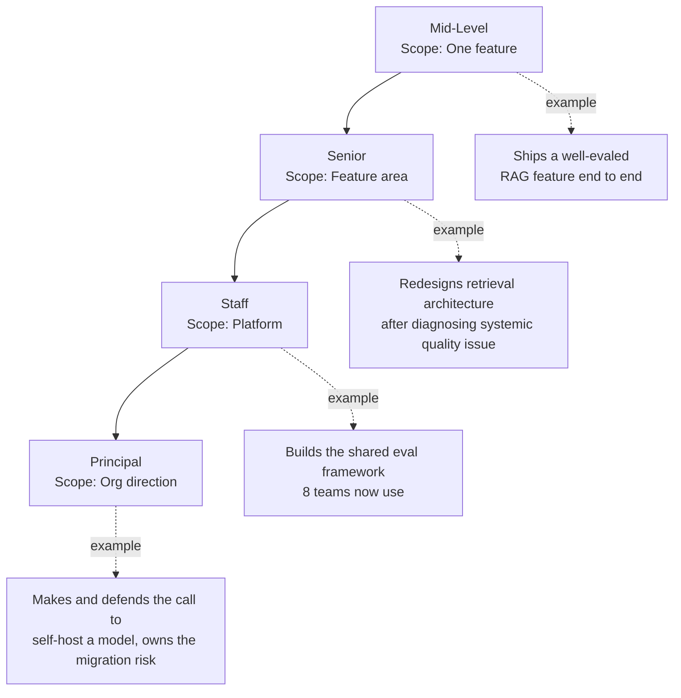

Yesterday's post laid out what Staff and Principal AI Engineer actually require. This one is about the path there — and the most common mistake I see engineers make on that path is treating promotion as "do the thing I already do, but better." That works for one level transition, maybe two. Past that, the job genuinely changes shape. What changes is scope: the boundary of what you're responsible for widens from a single feature to a feature area to a platform to an org's technical direction, and each widening requires skills the previous level didn't ask for.

## Mid-level: owns one feature, end to end

At mid-level, the job is to take one AI feature — a RAG-backed support assistant, a classification pipeline, an extraction tool — and own its full lifecycle: build it, eval it, ship it, keep it running. The scope boundary is the feature itself. Success looks like: the feature works, it's evaluated properly before ship (not after — see antipattern #7 from [December's antipatterns post](/posts/ai-engineering-antipatterns-2026/)), and it doesn't quietly degrade once it's live because nobody's watching it.

**Promotion-worthy example:** Shipped a RAG feature with a proper eval suite built alongside it, not bolted on afterward — retrieval precision/recall tracked, a held-out eval set that wasn't drawn from the same distribution as the demo data, and a monitoring dashboard that would catch quality regression before a user complaint does.

## Senior: owns a feature area, makes architecture calls

The scope widens from one feature to a cluster of related features, and with it comes the expectation of making architecture decisions that affect more than one thing you personally built. A senior engineer starts mentoring mid-level engineers specifically on the judgment calls in eval design and prompt architecture — not because mentorship is a checkbox on the promo packet, but because at this scope you literally cannot personally review every decision anymore; you need other people making good calls without you in the room.

The differentiator from mid-level isn't "codes faster" or "knows more prompting tricks." It's diagnosing a systemic problem rather than patching a symptom. A mid-level engineer notices one feature's retrieval quality is bad and fixes that feature's chunking strategy. A senior engineer notices three features have degraded retrieval and traces it to a shared indexing pipeline problem that's been quietly corrupting embeddings for a month.

**Promotion-worthy example:** Redesigned the retrieval architecture for an entire feature area after diagnosing that inconsistent chunking across teams was the actual root cause of a quality problem that had been misdiagnosed as a prompting issue for months.

## Staff: owns platform-level concerns

This is the widening covered in yesterday's post. The scope stops being "systems I personally touch" and becomes "systems other teams depend on that I'm accountable for" — the shared LLM gateway, the eval framework used org-wide, the cross-team standard for how prompts get versioned and reviewed. Influence extends to teams the engineer isn't embedded in day to day, which means the job increasingly runs through documentation, standards-setting, and review rather than direct code ownership.

**Promotion-worthy example:** Built the org's shared eval framework, now adopted by eight teams, replacing eight inconsistent ad hoc approaches that made it impossible to compare quality claims across teams.

## Principal: sets direction at the org level

At this scope, the job is less about building things directly and more about making — and defending — the highest-stakes technical calls, often ones with real business tradeoffs attached. Principal engineers are frequently the final technical escalation point for a genuinely hard reliability or architecture problem that's stumped everyone below them. The work looks less like shipping code and more like a defensible recommendation memo that a VP will read and act on.

**Promotion-worthy example:** Made the call to self-host a specific open-source model instead of continuing to pay API rates for a high-volume, latency-insensitive workload, backed the recommendation with real cost modeling, and owned the technical risk of the migration end to end — including the fallback plan for when the self-hosted version underperformed on a subset of traffic.

## The trap: staying in the mode that got you here

The most common way engineers stall is continuing to optimize for the thing that earned the last promotion instead of deliberately taking on the next scope. A senior engineer who keeps writing more code and shipping more features, without ever taking on a platform-level problem that isn't strictly "their" job, will plateau at senior regardless of how good the code is — because staff-level scope isn't demonstrated by depth alone, it's demonstrated by breadth of influence that the engineer has to actively go seek out. Nobody hands you a platform-scope problem; you have to notice one nobody's solved and volunteer to own it.

The inverse trap also exists: engineers who chase scope-sounding titles — "I led the eval standardization initiative" — without the underlying technical depth to back it up. A staff title with no artifact like the ones above attached to it doesn't survive a rigorous promo committee, and it shouldn't. Scope and depth compound; neither substitutes for the other.
