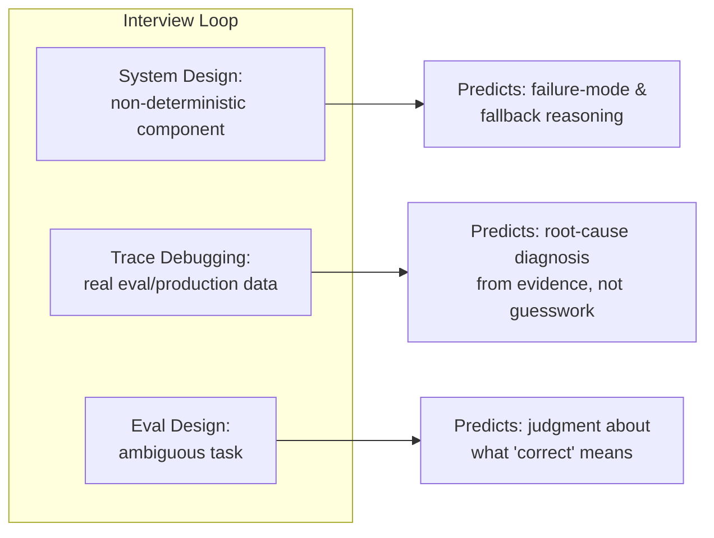

I've sat on both sides of enough AI engineering interview loops now to say this with confidence: most of them are still testing for the wrong thing. Teams either quiz ML theory that has almost no bearing on daily production work, or they've bolted a "write a clever prompt" round onto an otherwise standard software loop and called it done. Neither predicts what actually separates a strong AI engineer from a mediocre one on the job.

## Why the common approaches miss

**ML theory trivia** — attention mechanisms, transformer internals, backprop math — correlates poorly with production AI engineering competence, for the same reason the December [skill stack post](/posts/ai-engineering-skill-stack-2026/) found deep ML math mattered less than expected: most engineers building production AI features never touch that layer. The API abstraction is thick enough that knowing how attention works doesn't help you design a better system prompt or catch a bad eval set. Quizzing it screens for research aptitude, which is a different job than the one being hired for in the vast majority of these loops.

**"Write a clever prompt" exercises** test something real — prompt architecture is a legitimate skill — but a narrow one, and they tend to over-index on exactly the lever this blog's antipatterns post warned against relying on too heavily: [prompt engineering as the only optimization tool](/posts/ai-engineering-antipatterns-2026/). A candidate who's great at prompt-crafting under interview pressure but has never diagnosed a retrieval problem or built an eval will struggle the first time the actual bug is upstream of the prompt. Testing the lever that's easiest to demo in 45 minutes isn't the same as testing the lever that matters most.

## What actually predicts success

### 1. System design with a non-deterministic component

Give the candidate a system design problem that includes an LLM call as one piece — not the whole system, one piece, the way it actually shows up in production. A support ticket triage feature. A document extraction pipeline. Then watch how they reason about it differently from a deterministic microservice design.

The signal you're looking for: do they ask about failure modes specific to probabilistic output (what happens when the model is confidently wrong, not just when it times out)? Do they design an evaluation strategy as part of the system, not as an afterthought? Do they think about fallback behavior — what happens when confidence is low, is there a human-in-the-loop path, is there a deterministic backstop for the cases that matter most? A candidate who designs this exactly like a CRUD service, with retries and circuit breakers and nothing else, is missing the category of failure that actually dominates AI systems in production.

### 2. Trace debugging with real (sanitized) data

Hand the candidate an actual trace or eval output from a real, sanitized production incident — a RAG pipeline that's underperforming, a set of retrieved chunks next to a query and a bad answer. Ask them to diagnose it. This is the single highest-signal exercise I've run, because it tests something no amount of theory prep can fake: can this person read evidence and reason backward to a root cause, versus guessing at plausible-sounding explanations and hoping one sticks.

Strong candidates narrow the hypothesis space methodically — checking whether the right chunks were even retrieved before assuming the problem is generation quality, checking whether the query itself was malformed before assuming the retrieval index is bad. Weak candidates jump straight to "the prompt needs work" without looking at what was actually retrieved. That gap is exactly the gap between someone who's read about RAG and someone who's debugged it at 2am.

### 3. Eval design for an ambiguous task

Give the candidate a genuinely ambiguous task — summarize a legal document, triage an ambiguous support request, classify sentiment on mixed-signal text — and ask them to design an eval for it. Not implement one, necessarily; a take-home or a 30-minute pairing session on the reasoning is enough.

This tests one of the highest-leverage and most under-tested skills in the field: can this person operationalize "correct" for a task where correctness is genuinely a judgment call. Do they think about inter-rater agreement if humans are labeling ground truth? Do they consider what a false positive costs versus a false negative, and weight the metric accordingly? Do they think about distribution shift — will this eval set still be representative in six months? A candidate who defaults to "just use an LLM-as-judge and call it done" without interrogating what the judge is actually measuring is giving you a preview of exactly the antipattern this blog flagged in December: eval scores that improve while nobody checks whether they're measuring the right thing.

## What to deliberately not over-weight

LeetCode-style algorithm rounds still have a place — general engineering competence matters, and there's nothing wrong with confirming a candidate can write correct, efficient code. But they shouldn't dominate an AI-specific loop, because they select for a skill that's necessary but nowhere near sufficient. Similarly, deep trivia about specific model architectures is fine to include if the role is genuinely research-adjacent — training custom models, contributing to model-level work — but for the large majority of AI engineering roles building on top of API-accessed models, it's testing for a job the candidate isn't being hired to do.

## A sample rubric

| Exercise | Mid-level bar | Senior bar | Staff bar |
|---|---|---|---|
| System design (non-deterministic) | Identifies failure modes exist | Designs explicit fallback + eval strategy | Reasons about org-wide reuse of the pattern |
| Trace debugging | Reaches correct diagnosis with hints | Reaches it independently, explains reasoning | Diagnoses and identifies the systemic root cause |
| Eval design | Proposes a reasonable metric | Justifies metric choice against task tradeoffs | Designs eval methodology that could generalize across teams |

Map the bar to the level from the [scope progression framework](/posts/ic-scope-progression-ai-engineering/) from yesterday's post — the exercises don't change much across levels, but the depth and generality of the answer should.
