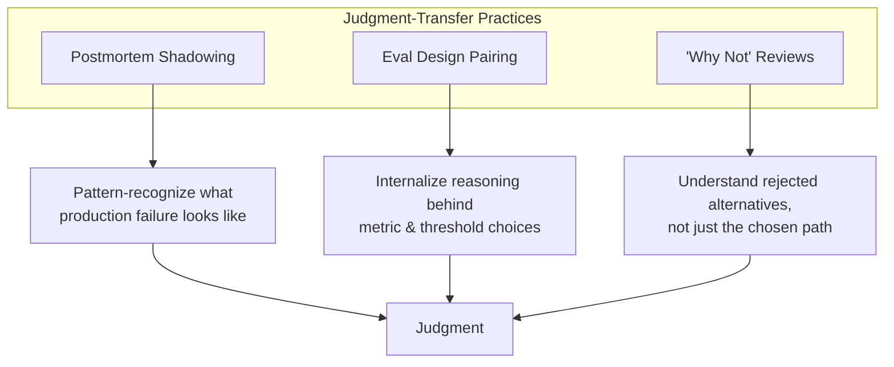

Standard mentorship — pairing sessions, code review comments, the occasional "how's it going" 1:1 — transfers tool knowledge fine. It transfers judgment badly. And judgment, per the last three posts in this series, is most of what actually separates the levels in AI engineering: knowing when an eval score is trustworthy, knowing when a fine-tune is worth it, knowing when an agent architecture is over-built for the problem. That kind of pattern recognition comes from having watched enough things go wrong to recognize the smell early — and code review comments on a pull request don't transfer that smell, because by the time code review happens, most of the judgment call has already been made off-screen.

## Why generic mentorship under-transfers this specific thing

A junior engineer reading a senior's code review comment — "this eval set is too narrow, add adversarial cases" — gets the correction but not the reasoning process that produced it. They don't see the senior engineer mentally running through the checklist: does this cover production distribution, is there an out-of-distribution slice, what's the sample size, does the metric actually correlate with the thing we care about. They see the conclusion, not the derivation. Over enough repetitions this can eventually build intuition by osmosis, but it's slow and it's lossy — most of what made the senior engineer's judgment good never gets externalized in a way the junior engineer can actually study.

The three practices below are deliberately structured to externalize that reasoning instead of leaving it implicit.

## 1. Postmortem shadowing

Have junior engineers sit in on real production AI incident postmortems — with appropriate context and redaction where sensitive data is involved — specifically to build pattern recognition for what production AI failure actually looks like. This matters because production failure looks nothing like the tutorials. Tutorials show you a working RAG pipeline. They don't show you the pipeline that worked perfectly in every test and then quietly served stale embeddings for three weeks because an indexing job silently failed, or the agent that took a plausible-looking but wrong action because a tool description was ambiguous in a way nobody caught until it mattered.

The value here isn't the specific incident — it's accumulating a mental library of failure shapes. An engineer who's shadowed ten real postmortems has ten more failure patterns pre-loaded than one who's only read about RAG architecture. When they hit something that smells like incident #4, they'll recognize it faster than someone who's never seen incident #4 happen.

Practical note: this only works if the postmortem culture is blameless and the redaction is done thoughtfully enough that junior engineers get the real signal (what broke, why, how it was caught) without exposure to things that shouldn't leave the room.

## 2. Eval design pairing

Have a junior engineer design an eval for a real task, with a senior engineer reviewing — critically — not the resulting code, but the reasoning behind the metric choices and the threshold-setting. This is different from a normal code review in a specific way: the interesting part of an eval isn't the implementation, it's the decisions upstream of the implementation — what counts as "correct" for this task, why this threshold and not a stricter or looser one, what's excluded from the eval set and why that exclusion is defensible.

Run this as a real conversation, not a rubber stamp. Ask the junior engineer to defend each choice out loud before you offer your own view. "Why 0.85 and not 0.9?" "What happens to a case that scores 0.84?" "What's in your eval set that looks like production traffic and what's in there because it was convenient to generate?" This is slower than just fixing the eval yourself, and that's the point — the goal is transferring the reasoning process, not producing a correct eval as fast as possible.

## 3. "Why not" reviews

Explicitly walk through why a simpler approach wasn't sufficient — or was sufficient and got chosen — for a real decision the team already made. Why a single agent instead of a multi-agent pipeline. Why prompt engineering instead of fine-tuning for a given task. Why the team didn't build a custom retrieval reranker and used an off-the-shelf one instead.

This is worth doing deliberately because understanding the rejected alternatives teaches judgment faster than only ever seeing the path that got chosen. A junior engineer who only sees "we built X" learns that X works. A junior engineer who also sees "we considered Y and Z, and here's specifically why they were worse for this case" learns the actual decision framework — which transfers to the next decision, on a different system, in a way that just knowing "X works here" doesn't.

## A lightweight structured program

You don't need a heavyweight program to run this — you need consistency and protected time. A workable outline:

- **Cadence:** one postmortem shadow per month (opportunistic, tied to whatever incidents actually happen), one eval design pairing session per quarter per junior engineer, one "why not" review per major architecture decision the team makes.
- **Format:** 45–60 minutes, senior engineer leads the questions rather than lecturing, junior engineer does the talking and the defending.
- **What to track:** not attendance — track whether the junior engineer's own subsequent eval designs or architecture proposals show the reasoning pattern coming through. That's the actual signal the program is working.

## The honest limitation

This takes real senior engineer time, and it has to be explicitly protected — scheduled, calendared, defended against the pull of "just this once, skip it, we have a deadline." Mentorship at this depth doesn't survive being squeezed into whatever's left over after sprint work, because sprint work always expands to fill the time available and mentorship is the first thing cut under pressure. If your org wants staff-tier judgment to actually propagate down through the team — connecting back to the mentorship dimension in the [Staff/Principal competency framework](/posts/staff-principal-ai-engineer-role-defined/) — someone has to decide this time is non-negotiable, not aspirational.
