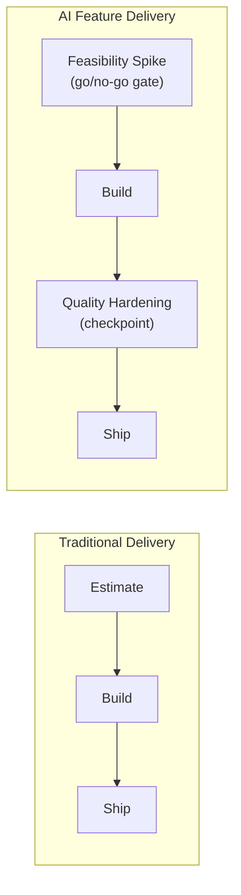

I've watched good engineering managers — people who ran traditional teams well for years — struggle the first time they manage an AI-focused team, not because they lack management skill but because two of their core planning assumptions stop holding. The first is that you can scope a solution and estimate implementation time. The second is that "done" is a stable target once the requirements are set. Neither is reliably true for AI feature work, and pretending otherwise produces missed deadlines and quality corners cut under deadline pressure, in that order.

## The estimation problem

Traditional estimation assumes the hard question is already answered: we know what a correct solution looks like, and the remaining work is implementation. Estimating "how long to build X" is a reasonable question when X's feasibility isn't in doubt.

A lot of AI feature work doesn't have that property. The real open question often isn't "how long will this take to build" — it's "can this approach hit the quality bar the use case requires, at all." That's a genuinely different kind of uncertainty, and traditional sprint planning doesn't have a slot for it. A manager who commits to a ship date before that question is answered is committing to a date that depends on an unresolved unknown, and when the quality bar turns out to be harder to hit than expected — which happens constantly — the team is now choosing between missing the date or shipping something under-baked.

The fix isn't better estimation. It's a planning structure that puts an explicit investigation phase before the commitment, with a real go/no-go decision point at the end of it — not a rubber-stamp checkpoint everyone assumes will pass. A feasibility spike that's allowed to conclude "this approach doesn't hit the bar, here's what we learned, here's what we'd try next" is doing its job. A spike that always concludes "proceed" regardless of what was found isn't a spike, it's a delay before the same commitment gets made anyway.

## The moving-quality-target problem

A traditional feature is done when it passes its tests — the acceptance criteria were set up front and they don't drift. An AI feature's acceptable quality bar is much more often a judgment call, and it's a judgment call that legitimately shifts as the team learns more about real user needs and the actual shape of edge cases in production traffic. Ninety percent accuracy on a task looked acceptable during scoping; three weeks into real usage, the team learns the failure cases cluster in a way that's much more damaging to trust than the aggregate number suggested, and the bar has to move.

This creates a specific management pressure: the temptation to declare victory at whatever point the sprint needs to close, rather than at the point the feature is genuinely ready. Resisting that pressure is a management job, not an engineering one — it requires a manager willing to tell their own stakeholders "the quality bar isn't met yet, here's the evidence, here's what closing the gap looks like" instead of letting a sprint boundary silently redefine what "done" means.

## The connection to eval-skipping under deadline pressure

December's [antipatterns post](/posts/ai-engineering-antipatterns-2026/) named "building evals after ship" as a failure mode. Worth being explicit here: that failure is frequently a management and prioritization failure, not an engineering oversight. Engineers rarely skip eval work because they don't understand its value — they skip it because a deadline made it the thing that was safe to cut without an immediate, visible consequence. The consequence shows up three months later as a quality regression nobody can measure against a baseline, by which point the person who made the tradeoff has often moved to the next project.

If your team keeps under-investing in evals, look at the prioritization signal you're sending before you look at the engineers' judgment. Protecting eval and quality-hardening work explicitly on the roadmap — not as "nice to have if there's time," but as a phase with its own checkpoint — is the actual fix.

## The three-phase framework

A practical structure that accommodates both problems: treat AI feature delivery as three phases with explicit checkpoints, rather than one estimate-and-ship milestone.

1. **Feasibility spike.** Time-boxed investigation into whether the approach can hit the quality bar at all, ending in an explicit go/no-go decision — not an assumed "go." Output is evidence (early eval numbers on a representative sample), not a demo.
2. **Build.** Standard implementation work, now scoped against an approach that's already been validated as feasible, which is where traditional estimation practices actually start working again.
3. **Quality hardening.** A dedicated phase — not an afterthought — for eval coverage, edge case handling, and monitoring setup before ship. This is where the "evals after ship" antipattern gets structurally prevented: hardening isn't optional cleanup, it's a phase with its own exit checkpoint the feature can't skip.

This is more overhead than a single-estimate delivery timeline, and it's worth it specifically because the alternative — committing to a date before feasibility is known, then cutting quality work to hit that date anyway — costs more in incidents, rework, and trust than the extra planning phases cost in calendar time.

## Team composition, day to day

The org-level pattern for structuring AI platform teams was covered in December's retrospective content. The day-to-day management question within a single AI-focused team is different: balancing feature-building ICs against the eval and quality-focused work that's easy to deprioritize under deadline pressure and expensive to skip later, and protecting genuinely exploratory time for engineers to build the kind of judgment covered in [the mentorship post](/posts/building-ai-mentorship-program/) — time that gets squeezed first when the roadmap gets tight, unless a manager deliberately defends it. Both of those are prioritization calls a manager makes explicitly, not defaults a team drifts into by not deciding.
