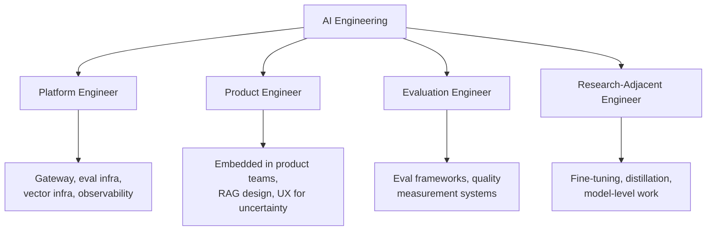

The December [2027 predictions post](/posts/ai-engineering-2027-predictions/) called this at medium confidence: the "AI engineer" title fragmenting into specializations, the way "web developer" fragmented into frontend, backend, and full-stack over the 2010s. Three months into 2027, it's visible enough to map concretely. Not as rigid formal titles everywhere — most companies still don't have all of these as distinct job ladders — but as real, distinguishable day-to-day work with different skill emphasis, and engineers benefit from knowing the map exists before they end up in one track by accident.

## The four tracks

**AI Platform Engineer.** Owns the shared infrastructure other teams build on top of — the LLM gateway, the shared eval framework, vector database infrastructure, model routing, observability. This is deep systems and infra work; model-specific specialization matters less than strong distributed systems fundamentals plus fluency in the AI-specific failure modes covered throughout this blog's platform engineering series. The reward is leverage — build something once, eight teams benefit — and the cost is distance from any single product's user, which some engineers find energizing and others find abstract to the point of unsatisfying.

**AI Product Engineer.** Embedded in a product team, building AI features end to end, closer to traditional product engineering with an AI-specific skill layer on top: prompt architecture, RAG design, and UX for uncertainty — designing interfaces that communicate confidence, handle graceful degradation, and set correct user expectations when the underlying system is probabilistic rather than deterministic. This track stays closest to users and to the immediate feedback loop of shipping something and watching how it performs, and it's currently the most common profile because most companies need this before they need dedicated platform infrastructure.

**Evaluation Engineer.** A newer, narrower specialization focused specifically on building rigorous eval frameworks and quality measurement systems. This is genuinely scarce, and this blog's own content has repeatedly flagged it as underrated — the December skill stack post called evaluation design "the biggest differentiator," and this hiring post from earlier this week built an entire interview loop around it. An Evaluation Engineer isn't building the feature; they're building the instrument that tells everyone else whether the feature actually works, and doing that well requires a mix of statistical literacy, domain judgment about what "correct" means for ambiguous tasks, and enough systems knowledge to know where evals lie to you. Few companies have this as a standalone title yet, but the work exists everywhere production AI exists, usually done informally by whoever on the team cares most about it.

**Research-Adjacent / Applied ML Engineer.** Closer to fine-tuning, distillation, and model-level work — the territory covered in this blog's December and March fine-tuning and synthetic data series. Less common in most enterprises, where managed APIs cover the large majority of needs, but present and valuable at AI-heavy companies running custom models at real volume, or companies with domain-specific requirements a general-purpose model doesn't serve well. This track requires the deepest technical curiosity about models themselves, and it's the one track where some of the ML depth that the December skill-stack post found "mattered less than expected" for most AI engineers actually pays off.

## How to choose

Match the track to what genuinely engages you, not to whichever track happens to be most visible or best-compensated at your current company:

- Drawn to systems thinking, leverage, and building things once that many teams depend on? **Platform.**
- Drawn to user-facing craft, fast feedback loops, and owning the full path from idea to shipped feature? **Product.**
- Drawn to rigor, measurement, and the discipline of defining "correct" precisely for ambiguous problems? **Evaluation.**
- Drawn to deep technical curiosity about how models themselves work and behave? **Research-adjacent.**

This matters because drifting into a track by default — taking whatever project lands on your desk — tends to produce a career that's broad but shallow across all four, which is a real liability once you're competing for staff-level roles that reward depth in a specific direction (see the [scope progression post](/posts/ic-scope-progression-ai-engineering/) earlier this week — staff-level impact artifacts are specific and deep, not generalist).

## The honest caveat

These tracks aren't rigid, and most companies don't have all four as formal titles yet — you'll often find one engineer doing platform and evaluation work together on a small team, or a product engineer who's picked up enough eval design skill to functionally be doing evaluation engineering under a product engineer title. That's fine. The value of naming the tracks isn't to force a company to adopt four job ladders tomorrow; it's to give individual engineers a vocabulary for what kind of work they actually want more of, so they can ask for it deliberately instead of accumulating whatever comes their way.

Movement between tracks over a career is common and often valuable rather than a sign of indecision. An engineer who spent three years doing product engineering and then moved into platform work brings a grounded sense of what product teams actually need from platform infrastructure — a perspective a platform engineer who's never sat in a product team lacks. The tracks are a map for thinking about where you are and where you might go next, not a cage.
